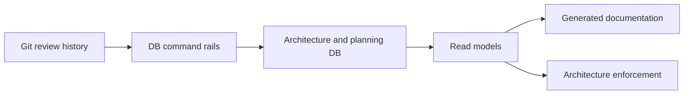
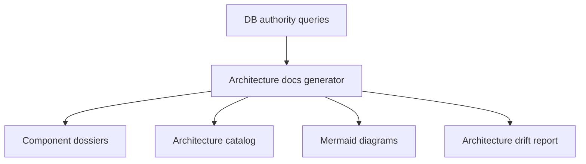

# DB-first architecture authority and generated documentation Fowler analysis

## Thesis

DVT should keep moving engineering truth into the planning and architecture database. The target is not to store prose as the model. The target is to model architecture, component ownership, relations, evidence, drift and generated documentation as queryable operational facts.

```text
Operational architecture in DB -> generated documentation -> Git review history
```

## Repo-validated current state

The engine start-run pilot is already DB-first work. Known DB-authored children under `SYS-RUNTIME-ENGINE-START-RUN` are:

- `SYS-RUNTIME-ENGINE-START-RUN-ADMISSION`
- `SYS-RUNTIME-ENGINE-START-RUN-INTENT`
- `SYS-RUNTIME-ENGINE-START-RUN-EXECUTION`
- `SYS-RUNTIME-ENGINE-START-RUN-FAILURE-POLICY`

Relevant evidence:

- `docs/evidence/ed-20260514-dhm-db-first-engine-components.md`
- `docs/evidence/ed-20260514-dhm-effective-component-ownership.md`
- `buzon/20260514-codex-fowler-dhm-effective-component-ownership-analysis.md`

The effective ownership follow-up corrected the split between DB-authored component semantics and generated file ownership. DB component claims now participate in `component_engineering.file_ownership_query`.

Remaining start-run drift is mainly test and fixture ownership. That is the next valuable closure point because proof ownership must converge with component ownership.

The `architecture` schema also exists. Important surfaces include `architecture.design`, `architecture.design_scope`, `architecture.component`, `architecture.component_relation`, `architecture.evidence` and `architecture.component_health_check`.

Implemented command rails include `architecture-design create`, `architecture-component record`, `architecture-relation record` and `component create`.

The missing lifecycle is approval, evidence recording, implementation binding and drift reconciliation.

## Target model



## Documentation generation model



Generated files should include generator name, query surfaces used, input fingerprints, stable source refs, generator version or content hash, regeneration command and a clear generated-file header. Tracked generated files must not include wall-clock generation timestamps; timestamps belong in untracked run logs or evidence records when operational timing matters.

## Proposed roadmap

1. Close engine start-run proof ownership for tests and fixtures.
2. Fix DB surface inventory drift for already implemented architecture rails.
3. Add `RecordArchitectureEvidence`.
4. Add `ApproveArchitectureDesign`.
5. Add implementation binding between changed paths and approved design scope.
6. Generate component dossiers from DB read models.
7. Add an architecture enforcement gate.

## Hard Fowler analysis

### God command script

`scripts/planning-db-operate.cjs` is carrying too many command families. This is acceptable as bootstrap, but it is a Large Class and Divergent Change risk. Keep one CLI entrypoint, but split use cases into command modules and shared validation, audit and DB helpers.

### Database as document graveyard

Moving everything to the DB can become storing prose bodies in rows. That would be Primitive Obsession and an Anemic Domain Model. Use typed tables for canonical concepts. Use JSON fields only for audit snapshots, plugin metadata and compatibility payloads.

### Partial authority illusion

DVT can create designs and record components or relations, but approval, evidence, implementation binding and drift reconciliation are not yet closed. Without those rails, DB-first architecture is an advanced catalog, not full authority.

Priority rails:

1. `ApproveArchitectureDesign`
2. `RecordArchitectureEvidence`
3. `BindImplementationToDesign`
4. `ReconcileArchitectureDrift`

### Governance inventory drift

The governance inventory can lag behind implemented command rails. Generate the implementation-status sections from a command catalog or command introspection query. Keep human-written sections for policy and rationale.

### Hierarchy without relation semantics

Hierarchy answers where things live. It does not answer what may call what, under which contract and with which failure mode. Non-trivial components should record explicit relations such as `depends_on`, `calls`, `reads`, `writes`, `implements_port`, `publishes`, `consumes` and `guards`.

### Ambiguous proof ownership

A component split is weak if tests and fixtures remain parent-owned. Assign tests to the invariant owner. Create a verification component only for real cross-component flow proof.

### Generated docs without provenance

Generated docs must include query names, input fingerprints, stable source refs, generator metadata, regeneration command and a clear generated-file warning. They must avoid wall-clock timestamps in tracked output so regenerated architecture docs remain deterministic under the repo docs gates.

## Final recommendation

```text
Move engineering truth to the DB. Generate documentation from that truth.
```

The next best slice is to close engine start-run proof ownership and then add `RecordArchitectureEvidence`.
