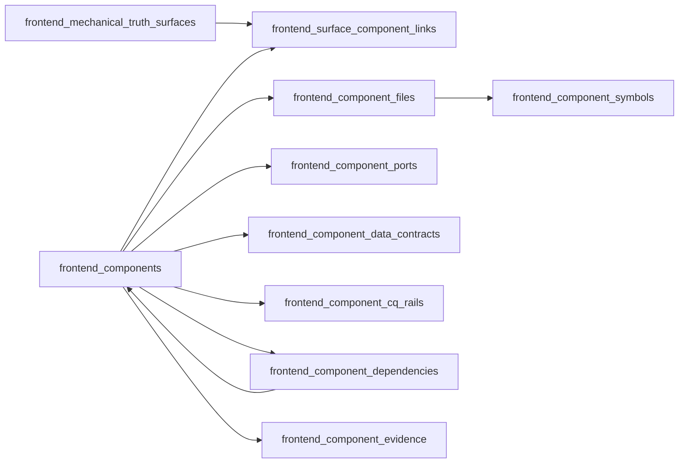

# DVT+ — Recomendación revisada: componentes frontend con reflejo real en la app

> Intake disposition: this study is preserved as inbox analysis. The governed
> proposal is
> `docs/planning/proposals/mandatory/frontend-and-ux/frontend-component-reflection-inventory-plan-20260604.md`.

**Fecha:** 2026-06-04  
**Repositorio:** `dunay2/dvt`  
**Ámbito:** `apps/web`, planning DB, gobernanza frontend, command/query rails  
**Decisión:** los componentes frontend deben persistirse como entidades trazables contra la app real: archivos, símbolos, funciones, puertos, entradas, salidas, comandos, queries, endpoints, rutas y evidencias.

---

## 1. Corrección de criterio

La propuesta anterior era correcta al separar:

```text
frontend_mechanical_truth_surfaces = qué superficie ve el usuario
frontend_component_inventory       = qué componentes construyen esa superficie
frontend_command_query_rails       = qué comandos/queries soportan esa superficie
```

Pero era insuficiente si `frontend_component_inventory` se limita a una fila descriptiva por componente.

Para que aporte ingeniería real, cada componente debe tener reflejo consultable en la app:

```text
Componente
 ├─ superficies donde aparece
 ├─ archivos fuente relacionados
 ├─ símbolos/exportaciones reales
 ├─ funciones/hooks relevantes
 ├─ puertos consumidos o expuestos
 ├─ entradas
 ├─ salidas
 ├─ comandos
 ├─ queries
 ├─ endpoints backend asociados
 ├─ stores/cache keys
 ├─ dependencias con otros componentes
 └─ evidencia de tests/docs/build
```

La BBDD no debe ser solo documentación. Debe ser un **índice técnico verificable**.

---

## 2. Diagnóstico actual del repo

### 2.1 Estructura técnica observada

El repo es un monorepo `pnpm` con:

```text
packages/*
apps/*
packages/@dvt/*
```

El front principal está en:

```text
apps/web
```

La app `@dvt/web` usa:

- React 18;
- Vite;
- React Router;
- React Flow (`@xyflow/react`);
- Monaco;
- TanStack Query;
- TanStack Table;
- Zustand;
- Radix;
- MUI;
- Cypress;
- Vitest.

La shell real se compone desde `RootShell` con:

```text
RootShell
 ├─ AppShellFrame
 ├─ TopAppBar
 ├─ LeftNavigation
 ├─ ShellHealthBanner
 ├─ BottomConsoleDrawer
 └─ Outlet
```

La navegación de producto no debe entenderse como lista fija: se proyecta desde plugins declarados en `PluginContributions`.

### 2.2 Registro de plugins actual

El contrato `PluginContributions` ya define el punto fuerte del front. Permite declarar:

```text
views
routeHeaderContributions
commandPaletteContributions
bottomDiagnosticsContributions
overlays
inspectorPanels
nodeBadges
nodeRenderers
nodeKinds
canvasKinds
connectionRules
produces
consumes
sourceImport
runAdapter
```

Plugins cargados actualmente:

```text
dbt
dvt.warehouse-source
dvt
monitoring
cost
```

Esto implica que el inventario de componentes no debe inventar otra taxonomía. Debe reflejar esa arquitectura.

---

## 3. Estudio actual externo aplicado

### 3.1 Backstage Software Catalog

Backstage modela software con `Component`, `API` y `Resource`; además usa `System` y `Domain` para ocultar detalles internos y reducir acoplamiento entre consumidores y productores.

Referencia: https://backstage.io/docs/features/software-catalog/system-model/

Aplicación a DVT+:

- `frontend_components` equivale a `Component`.
- `frontend_component_ports` y `frontend_component_cq_rails` equivalen a límites/API.
- `frontend_component_files` y `frontend_component_symbols` son el anclaje a código real.
- `frontend_surface_component_links` modela qué componentes forman cada superficie visible.

### 3.2 Storybook / component-driven UI

Storybook se define como un entorno para construir componentes y páginas en aislamiento y documentar estados difíciles de reproducir sin ejecutar toda la app.

Referencia: https://storybook.js.org/docs

Aplicación a DVT+:

- El inventario debe admitir estados: `loading`, `empty`, `error`, `degraded`, `read-only`, `permission-denied`.
- Cada componente debe poder apuntar a evidencia visual o pruebas equivalentes.
- No es obligatorio implantar Storybook ahora; sí es necesario que el modelo DB deje sitio a `story_refs` o `visual_evidence_refs`.

### 3.3 React Flow

React Flow trabaja con nodos, edges, handles, viewport, componentes internos, custom nodes/edges y control de interactividad.

Referencia: https://reactflow.dev/learn/concepts/terms-and-definitions

Aplicación a DVT+:

- Canvas no debe persistirse como una pantalla plana.
- Debe dividirse en viewport, toolbar, explorer, inspector, overlays, node renderers, edge interaction y modales.
- `nodeKinds`, `nodeRenderers`, `canvasKinds`, `connectionRules`, `produces` y `consumes` deben poder consultarse desde DB.

### 3.4 OpenTelemetry

OpenTelemetry estructura observabilidad con logs, spans, traces y metrics. La telemetría describe el comportamiento del sistema, no solo su estado visual.

Referencia: https://opentelemetry.io/docs/concepts/observability-primer/

Aplicación a DVT+:

- Un componente como `RunsWorkbench`, `RunTimelinePanel` o `BottomConsoleDrawer` debe declarar qué eventos/diagnósticos consume.
- Los componentes de ejecución deben enlazar con `runId`, `planId`, `stepId`, `attemptId`, `traceId` o log pointers si aplican.
- El inventario debe permitir saber qué UI queda afectada si cambia un evento, una query o un endpoint.

### 3.5 TypeScript Compiler API / ts-morph

TypeScript expone un Compiler API con `Program`, `CompilerHost` y `SourceFile` para analizar la aplicación y su AST. `ts-morph` es un wrapper sobre el TypeScript Compiler API orientado a navegación y manipulación programática de código.

Referencias:

- https://github.com/microsoft/TypeScript/wiki/Using-the-Compiler-API
- https://github.com/dsherret/ts-morph

Aplicación a DVT+:

- Fase 1: inventario semiestructurado mantenido en Markdown e importado a DB.
- Fase 2: extractor AST para validar exports, funciones, hooks, imports y dependencias reales.
- Fase 3: gate de drift: si el componente declara `CanvasToolbar.tsx` pero el archivo/export ya no existe, falla el check.

---

## 4. Modelo recomendado

### 4.1 No usar una sola tabla gigante

No recomiendo un único `frontend_component_inventory` lleno de JSONB. Eso serviría para pintar informes, pero no para hacer ingeniería consultable.

La recomendación es un modelo relacional mínimo con tablas hijas.



---

## 5. Tablas propuestas

### 5.1 `frontend_components`

Entidad principal.

```sql
create table if not exists planning_query_store.frontend_components (
  component_id text primary key,
  component_name text not null,
  component_kind text not null,
  component_status text not null,
  reuse_decision text not null,
  frontend_owner text not null,
  responsibility text not null,
  package_name text not null default '@dvt/web',
  route_scope text,
  plugin_scope text,
  source_path text not null,
  source_content_sha256 text not null,
  raw_component jsonb not null,
  imported_at timestamptz not null default now()
);
```

Valores recomendados para `component_kind`:

```text
shell-frame
shell-bar
navigation
health-banner
console-drawer
route-workbench
route-toolbar
context-panel
primary-surface
state-view
canvas-viewport
canvas-overlay
canvas-inspector
canvas-explorer
node-renderer
modal
form
query-view
table
tab-strip
tab-panel
icon-wrapper
```

Valores recomendados para `component_status`:

```text
current
needed
planned
partial
experimental
retire
```

Valores recomendados para `reuse_decision`:

```text
reuse
extract
create
harden
standardize
retire
```

### 5.2 `frontend_surface_component_links`

Vincula componente con superficie visible.

```sql
create table if not exists planning_query_store.frontend_surface_component_links (
  component_id text not null references planning_query_store.frontend_components(component_id) on delete cascade,
  surface_id text not null references planning_query_store.frontend_mechanical_truth_surfaces(surface_id) on delete cascade,
  route_path text,
  placement_kind text not null,
  placement_order integer,
  raw_link jsonb not null default '{}'::jsonb,
  primary key (component_id, surface_id, placement_kind)
);
```

Ejemplos de `placement_kind`:

```text
shell
top-bar
left-navigation
route-header
route-toolbar
workbench-tab
left-panel
primary-surface
right-panel
bottom-drawer
modal
overlay
context-menu
command-palette
```

### 5.3 `frontend_component_files`

Archivos relacionados con cada componente.

```sql
create table if not exists planning_query_store.frontend_component_files (
  component_id text not null references planning_query_store.frontend_components(component_id) on delete cascade,
  file_path text not null,
  file_role text not null,
  exported_symbol text,
  source_hash text,
  raw_file jsonb not null default '{}'::jsonb,
  primary key (component_id, file_path, file_role)
);
```

`file_role` recomendado:

```text
component
view
hook
store
port
adapter
query
model
view-model
tokens
test
architecture-test
e2e-test
documentation
```

### 5.4 `frontend_component_symbols`

Funciones, componentes React, hooks, types, contratos y exports.

```sql
create table if not exists planning_query_store.frontend_component_symbols (
  symbol_id text primary key,
  component_id text not null references planning_query_store.frontend_components(component_id) on delete cascade,
  file_path text not null,
  symbol_name text not null,
  symbol_kind text not null,
  export_kind text not null,
  signature_text text,
  signature_hash text,
  start_line integer,
  end_line integer,
  raw_symbol jsonb not null default '{}'::jsonb
);
```

`symbol_kind` recomendado:

```text
react-component
function
hook
type
interface
constant
store
port
adapter
view-model
query-hook
command-handler
event-handler
```

### 5.5 `frontend_component_ports`

Puertos consumidos o expuestos por un componente.

```sql
create table if not exists planning_query_store.frontend_component_ports (
  component_id text not null references planning_query_store.frontend_components(component_id) on delete cascade,
  port_name text not null,
  port_kind text not null,
  direction text not null,
  port_status text not null,
  contract_path text,
  adapter_path text,
  backend_surface text,
  raw_port jsonb not null default '{}'::jsonb,
  primary key (component_id, port_name, direction)
);
```

`port_kind` recomendado:

```text
service-port
query-port
command-port
plugin-contract
store-port
runtime-port
api-adapter
```

`direction`:

```text
consumes
provides
adapts
projects
```

### 5.6 `frontend_component_data_contracts`

Entradas y salidas.

```sql
create table if not exists planning_query_store.frontend_component_data_contracts (
  contract_id text primary key,
  component_id text not null references planning_query_store.frontend_components(component_id) on delete cascade,
  contract_name text not null,
  direction text not null,
  contract_kind text not null,
  type_ref text,
  producer_ref text,
  consumer_ref text,
  required boolean not null default true,
  raw_contract jsonb not null default '{}'::jsonb
);
```

`direction`:

```text
input
output
input-output
```

`contract_kind`:

```text
props
callback
query-result
mutation-payload
store-state
store-action
route-param
url-search-param
file-input
rendered-state
navigation-event
domain-event
plugin-capability
```

### 5.7 `frontend_component_cq_rails`

Comandos y queries relacionados.

```sql
create table if not exists planning_query_store.frontend_component_cq_rails (
  component_id text not null references planning_query_store.frontend_components(component_id) on delete cascade,
  rail_name text not null,
  rail_kind text not null,
  rail_status text not null,
  frontend_surface text,
  frontend_port text,
  query_hook text,
  command_handler text,
  backend_surface text,
  endpoint_method text,
  endpoint_path text,
  raw_rail jsonb not null default '{}'::jsonb,
  primary key (component_id, rail_name)
);
```

`rail_kind`:

```text
command
query
projection
local-command
local-query
command-probe
```

`rail_status`:

```text
implemented-api
implemented-local
implemented-projection
partial-ui
fail-closed
gap-needed
not-front-default
```

### 5.8 `frontend_component_dependencies`

Dependencias entre componentes.

```sql
create table if not exists planning_query_store.frontend_component_dependencies (
  component_id text not null references planning_query_store.frontend_components(component_id) on delete cascade,
  depends_on_component_id text not null references planning_query_store.frontend_components(component_id) on delete cascade,
  dependency_kind text not null,
  required boolean not null default true,
  raw_dependency jsonb not null default '{}'::jsonb,
  primary key (component_id, depends_on_component_id, dependency_kind)
);
```

`dependency_kind`:

```text
renders
wraps
composes
calls
uses-hook
uses-store
uses-port
projects
```

### 5.9 `frontend_component_evidence`

Evidencia de validación.

```sql
create table if not exists planning_query_store.frontend_component_evidence (
  evidence_id text primary key,
  component_id text not null references planning_query_store.frontend_components(component_id) on delete cascade,
  evidence_kind text not null,
  evidence_ref text not null,
  evidence_status text not null,
  raw_evidence jsonb not null default '{}'::jsonb
);
```

`evidence_kind`:

```text
unit-test
presentation-test
architecture-test
canvas-test
monaco-test
workspace-service-test
e2e-test
build
typecheck
lint
documentation
visual-proof
storybook-story
```

---

## 6. Consultas que debe permitir

El objetivo es que un agente o desarrollador pueda consultar:

```sql
-- Componentes que dependen de comandos aún no implementados
select c.component_id, c.component_name, r.rail_name, r.rail_status
from planning_query_store.frontend_components c
join planning_query_store.frontend_component_cq_rails r using (component_id)
where r.rail_status in ('gap-needed', 'partial-ui', 'fail-closed');
```

```sql
-- Qué archivos forman una superficie concreta
select s.surface_id, c.component_id, f.file_path, f.file_role
from planning_query_store.frontend_mechanical_truth_surfaces s
join planning_query_store.frontend_surface_component_links l using (surface_id)
join planning_query_store.frontend_components c using (component_id)
join planning_query_store.frontend_component_files f using (component_id)
where s.surface_id = 'web.canvas.graph';
```

```sql
-- Qué componente usa un endpoint determinado
select c.component_id, c.component_name, r.endpoint_method, r.endpoint_path
from planning_query_store.frontend_components c
join planning_query_store.frontend_component_cq_rails r using (component_id)
where r.endpoint_path = '/runs/:runId/events';
```

```sql
-- Qué funciones/símbolos están asociados a un componente
select component_id, file_path, symbol_name, symbol_kind, export_kind
from planning_query_store.frontend_component_symbols
where component_id = 'web.component.canvas.CanvasToolbar';
```

```sql
-- Qué componentes tienen entradas/salidas sin contrato tipado
select c.component_id, d.contract_name, d.direction, d.contract_kind
from planning_query_store.frontend_components c
join planning_query_store.frontend_component_data_contracts d using (component_id)
where d.type_ref is null or d.type_ref = '';
```

---

## 7. Ejemplo de componente completo

### 7.1 `CanvasToolbar`

```yaml
component_id: web.component.canvas.CanvasToolbar
component_name: CanvasToolbar
component_kind: route-toolbar
component_status: current
reuse_decision: extract
frontend_owner: Canvas workbench
responsibility: Render graph-local commands and readiness controls for the Canvas workbench.
route_scope: /canvas
plugin_scope: dbt,dvt,monitoring,cost
surfaces:
  - surface_id: web.canvas.graph
    placement_kind: route-toolbar
files:
  - file_path: apps/web/src/app/views/canvas/CanvasToolbar.tsx
    file_role: component
    exported_symbol: CanvasToolbar
  - file_path: apps/web/src/app/views/canvas/CanvasToolbarPrimaryControls.tsx
    file_role: component
    exported_symbol: CanvasToolbarPrimaryControls
  - file_path: apps/web/src/app/views/canvas/CanvasToolbarDraftStatus.tsx
    file_role: component
    exported_symbol: CanvasToolbarDraftStatus
  - file_path: apps/web/src/app/views/canvas/PlanRunReadinessPanel.tsx
    file_role: component
    exported_symbol: PlanRunReadinessPanel
symbols:
  - symbol_name: CanvasToolbar
    symbol_kind: react-component
    export_kind: default
  - symbol_name: CanvasToolbarProps
    symbol_kind: type
    export_kind: named
  - symbol_name: deriveCanvasToolbarViewModel
    symbol_kind: view-model
    export_kind: imported
inputs:
  - contract_name: CanvasToolbarProps.routeState
    contract_kind: props
    type_ref: CanvasRouteState
  - contract_name: CanvasToolbarProps.draftToolbarState
    contract_kind: props
    type_ref: CanvasDraftToolbarState
  - contract_name: CanvasToolbarProps.planRunReadiness
    contract_kind: props
    type_ref: PlanRunReadinessReadModel
  - contract_name: CanvasToolbarProps.transformationValidation
    contract_kind: props
    type_ref: TransformationGraphValidationResult
outputs:
  - contract_name: onPlan
    contract_kind: callback
    type_ref: () => void
  - contract_name: onRun
    contract_kind: callback
    type_ref: () => void
  - contract_name: onExportProjectSnapshot
    contract_kind: callback
    type_ref: () => void
  - contract_name: onImportProjectSnapshotFile
    contract_kind: file-input
    type_ref: (file: File) => void
commands_queries:
  - rail_name: PreviewExecutablePlan
    rail_kind: command
    rail_status: implemented-api
    frontend_port: IPlansPort.previewPlan
    backend_surface: POST /plans/preview
  - rail_name: StartRun
    rail_kind: command
    rail_status: implemented-api
    frontend_port: IRunsPort.startRun
    backend_surface: POST /runs/start
  - rail_name: ValidateCanvasExecutionReadiness
    rail_kind: query
    rail_status: gap-needed
  - rail_name: ExportProjectSnapshot
    rail_kind: local-command
    rail_status: implemented-local
  - rail_name: ImportProjectSnapshot
    rail_kind: command
    rail_status: implemented-api
related_components:
  - web.component.canvas.CanvasToolbarPrimaryControls
  - web.component.canvas.CanvasToolbarDraftStatus
  - web.component.canvas.PlanRunReadinessPanel
  - web.component.workbench.RouteToolbar
capability_gaps:
  - RouteToolbar should be extracted from CanvasToolbar as shared primitive.
  - ValidateCanvasExecutionReadiness should be server-readable before preview/run.
evidence_refs:
  - apps/web/src/app/views/canvas/CanvasToolbar.tsx
  - apps/web/src/app/views/canvas/canvasWorkbenchTabs.architecture.test.ts
  - docs/architecture/components/web/workbench-ui-contract-and-component-inventory.md
```

---

## 8. Inventario inicial recomendado

### 8.1 P0 — foundation

| Component ID                                  | Kind              |    Status | Decision      | Minimum app reflection                               |
| --------------------------------------------- | ----------------- | --------: | ------------- | ---------------------------------------------------- |
| `web.component.shell.AppShellFrame`           | `shell-frame`     | `current` | `reuse`       | file, props, slots, shell surfaces                   |
| `web.component.shell.ShellTopBar`             | `shell-bar`       | `current` | `harden`      | `TopAppBar`, navigation model, session/health inputs |
| `web.component.shell.LeftNavigationRail`      | `navigation`      | `current` | `standardize` | plugin navigation model, route links                 |
| `web.component.shell.ShellHealthBanner`       | `health-banner`   | `current` | `reuse`       | health query inputs, degraded/offline states         |
| `web.component.shell.BottomConsoleDrawer`     | `console-drawer`  | `current` | `harden`      | execution/log event inputs, drawer state outputs     |
| `web.component.workbench.RouteWorkbenchFrame` | `route-workbench` | `current` | `reuse`       | slots: left, primary, right, bottom                  |
| `web.component.workbench.RouteToolbar`        | `route-toolbar`   |  `needed` | `extract`     | extracted from `CanvasToolbar`                       |
| `web.component.workbench.ContextPanel`        | `context-panel`   |  `needed` | `extract`     | extracted from explorer/inspector panel patterns     |
| `web.component.workbench.PrimarySurfaceFrame` | `primary-surface` |  `needed` | `create`      | repeated route wrappers                              |
| `web.component.workbench.WorkbenchStates`     | `state-view`      | `current` | `standardize` | loading/empty/error/degraded/read-only               |
| `web.component.icons.AppIcon`                 | `icon-wrapper`    |  `needed` | `create`      | lucide wrapper, semantic icon contract               |

### 8.2 P1 — Canvas

| Component ID                                | Kind               |    Status | Decision      | Rails/ports to reflect                                       |
| ------------------------------------------- | ------------------ | --------: | ------------- | ------------------------------------------------------------ |
| `web.component.canvas.CanvasWorkbench`      | `route-workbench`  | `current` | `harden`      | graph draft, plan preview, run start                         |
| `web.component.canvas.CanvasToolbar`        | `route-toolbar`    | `current` | `extract`     | `PreviewExecutablePlan`, `StartRun`, `ImportProjectSnapshot` |
| `web.component.canvas.CanvasViewport`       | `canvas-viewport`  | `current` | `reuse`       | graph nodes/edges, layout, selection                         |
| `web.component.canvas.CanvasExplorerPanel`  | `canvas-explorer`  | `current` | `standardize` | workspace files/resources/source import                      |
| `web.component.canvas.CanvasInspectorPanel` | `canvas-inspector` | `current` | `standardize` | selected node, node evidence, plugin panels                  |
| `web.component.canvas.PlanPreviewModal`     | `modal`            | `current` | `reuse`       | plan preview result, execution plan payload                  |
| `web.component.canvas.ConfirmEdgeModal`     | `modal`            | `current` | `reuse`       | edge mutation command                                        |
| `web.component.canvas.SourceImportWizard`   | `form`             | `current` | `harden`      | warehouse connection list, table list, import command        |

### 8.3 P1 — Runs

| Component ID                           | Kind              |    Status | Decision | Rails/ports to reflect                     |
| -------------------------------------- | ----------------- | --------: | -------- | ------------------------------------------ |
| `web.component.runs.RunsWorkbench`     | `route-workbench` | `current` | `harden` | `ListRuns`, `GetRunStatus`, `GetRunEvents` |
| `web.component.runs.RunsToolbar`       | `route-toolbar`   |  `needed` | `create` | filters, cancel/recover commands           |
| `web.component.runs.RunsListTable`     | `table`           |  `needed` | `create` | `ListRuns`                                 |
| `web.component.runs.RunsListFilters`   | `form`            |  `needed` | `create` | query params/cache keys                    |
| `web.component.runs.RunTimelinePanel`  | `query-view`      | `partial` | `harden` | `GetRunEvents`                             |
| `web.component.runs.RunStepsTable`     | `table`           |  `needed` | `create` | run step states                            |
| `web.component.runs.RunEventsTable`    | `table`           |  `needed` | `create` | event stream                               |
| `web.component.runs.RunMetricsPanel`   | `query-view`      | `partial` | `harden` | metrics/cost/diagnostics                   |
| `web.component.runs.RunArtifactsPanel` | `query-view`      | `partial` | `harden` | artifacts by run                           |

### 8.4 P1 — Code, Diff, Lineage, Artifacts

| Component ID                                 | Kind              |    Status | Decision | Rails/ports to reflect              |
| -------------------------------------------- | ----------------- | --------: | -------- | ----------------------------------- |
| `web.component.code.CodeWorkbench`           | `route-workbench` | `current` | `harden` | workspace file tree/content/history |
| `web.component.code.CodeToolbar`             | `route-toolbar`   |  `needed` | `create` | `SaveCodeWorkspaceFileBuffer`       |
| `web.component.code.FileTreePanel`           | `context-panel`   | `current` | `reuse`  | `ListWorkspaceFiles`                |
| `web.component.code.CodePreviewPane`         | `primary-surface` | `current` | `harden` | Monaco buffer input/output          |
| `web.component.lineage.LineageWorkbench`     | `route-workbench` | `current` | `harden` | lineage graph snapshot              |
| `web.component.lineage.LineageToolbar`       | `route-toolbar`   |  `needed` | `create` | search/mode controls                |
| `web.component.diff.DiffWorkbench`           | `route-workbench` | `current` | `harden` | `GetWorkspaceDiffChanges`           |
| `web.component.diff.DiffToolbar`             | `route-toolbar`   |  `needed` | `create` | compare filters/mode                |
| `web.component.artifacts.ArtifactsWorkbench` | `route-workbench` | `current` | `harden` | artifact projections                |
| `web.component.artifacts.ArtifactsToolbar`   | `route-toolbar`   |  `needed` | `create` | import/filter actions               |
| `web.component.artifacts.ArtifactSearch`     | `query-view`      |  `needed` | `create` | payload navigation                  |

---

## 9. Importación recomendada

### 9.1 Fuente gobernada inicial

Crear documento importable:

```text
docs/architecture/components/web/frontend-component-inventory.md
```

Debe tener secciones/tablas estables:

```text
Frontend Components
Frontend Component Files
Frontend Component Symbols
Frontend Component Ports
Frontend Component Data Contracts
Frontend Component Command Query Rails
Frontend Component Dependencies
Frontend Component Evidence
```

### 9.2 Importer

Crear:

```text
scripts/planning-db/frontend-component-inventory.cjs
```

Responsabilidades:

- parsear el Markdown gobernado;
- validar vocabulario cerrado;
- generar snapshot;
- calcular hash de fuente;
- preparar filas para tablas hijas;
- exponer `readFrontendComponentRows`.

### 9.3 Migración

Crear:

```text
tools/planning-db/migrations/056_frontend_component_inventory.sql
```

Debe crear las tablas anteriores, índices y vistas de consulta.

### 9.4 Query CLI

Ampliar:

```text
scripts/planning-db-query.cjs
```

Con comandos:

```bash
pnpm planning:db:query frontend-components --limit 50
pnpm planning:db:query frontend-components --kind route-toolbar
pnpm planning:db:query frontend-components --status needed
pnpm planning:db:query frontend-components --surface web.canvas.graph
pnpm planning:db:query frontend-component-files --component web.component.canvas.CanvasToolbar
pnpm planning:db:query frontend-component-rails --status gap-needed
```

---

## 10. Fase AST posterior

El inventario inicial puede ser manual/gobernado, pero no debe quedarse ahí.

Fase posterior:

```text
scripts/planning-db/frontend-code-symbol-extractor.cjs
```

Debe usar TypeScript Compiler API o `ts-morph` para extraer:

- exports reales;
- imports;
- componentes React;
- hooks;
- interfaces/types exportados;
- props types;
- llamadas a hooks de TanStack Query;
- usos de stores Zustand;
- llamadas a ports/adapters;
- rutas con `createBrowserRouter` / plugin `views`;
- `PluginContributions` y sus arrays declarativos.

Regla: el extractor no reemplaza la arquitectura. La valida.

```text
Documento gobernado = intención arquitectónica
Extractor AST       = reflejo mecánico del código
Planning DB         = punto de consulta y comparación
```

---

## 11. Gates recomendados

### 11.1 Drift de archivos

Falla si un componente declara un archivo inexistente.

```text
component_id = web.component.canvas.CanvasToolbar
file_path    = apps/web/src/app/views/canvas/CanvasToolbar.tsx
```

### 11.2 Drift de símbolos

Falla si un componente declara `CanvasToolbar` pero el export desaparece o cambia de tipo.

### 11.3 Drift de rails

Falla si un componente declara un comando/query que no existe en el inventario C/Q ni en puerto/adaptador detectado.

### 11.4 Drift de superficie

Falla si un componente apunta a `surface_id` inexistente en `frontend_mechanical_truth_surfaces`.

### 11.5 Estado inválido

Falla si un componente marcado `current` tiene:

- cero archivos;
- cero evidencias;
- rails `gap-needed` bloqueantes sin `capability_gaps`;
- entradas/salidas no tipadas cuando sean parte de frontera pública.

---

## 12. Decisión final

La integración correcta no es:

```text
component_name + status + notas
```

La integración correcta es:

```text
component_id
 + surface links
 + files
 + symbols/functions
 + ports
 + inputs
 + outputs
 + command/query rails
 + endpoints
 + stores/query hooks
 + dependencies
 + evidence
```

Esto convierte la BBDD en un índice técnico de ingeniería y no en un inventario decorativo.

---

## 13. Backlog técnico propuesto

### 13.1 Iteración 1 — modelo DB mínimo

1. Crear migración `056_frontend_component_inventory.sql`.
2. Crear tablas:
   - `frontend_components`;
   - `frontend_surface_component_links`;
   - `frontend_component_files`;
   - `frontend_component_ports`;
   - `frontend_component_data_contracts`;
   - `frontend_component_cq_rails`;
   - `frontend_component_dependencies`;
   - `frontend_component_evidence`.
3. Crear vistas:
   - `frontend_component_summary_query`;
   - `frontend_component_gap_query`;
   - `frontend_component_surface_query`;
   - `frontend_component_code_reflection_query`.

### 13.2 Iteración 2 — documento gobernado e importer

1. Crear `frontend-component-inventory.md`.
2. Seed inicial con P0 foundation.
3. Importer y tests.
4. CLI query.

### 13.3 Iteración 3 — Canvas y Runs

1. Agregar Canvas components.
2. Agregar Runs components.
3. Relacionar commands/queries con el inventario C/Q.
4. Marcar gaps bloqueantes.

### 13.4 Iteración 4 — extractor mecánico

1. Implementar extractor AST.
2. Validar archivos/exportaciones.
3. Generar reporte de drift.
4. Integrar en `planning:db:inventory:check` o check específico.

---

## 14. Recomendación operativa

Empezar por P0, pero con modelo normalizado desde el primer commit.

No haría primero un inventario manual plano porque generará deuda inmediata. Sí aceptaría que la primera carga venga de Markdown, siempre que la BBDD ya tenga tablas hijas para reflejar app real.

Orden recomendado:

```text
1. Migración DB normalizada
2. Documento importable
3. Importer
4. Query CLI
5. Seed P0
6. Seed Canvas/Runs
7. Extractor AST
8. Gates de drift
```

La prioridad inmediata debe ser:

```text
RouteWorkbenchFrame
RouteToolbar
ContextPanel
WorkbenchStates
CanvasToolbar
RunsWorkbench
CodeWorkbench
```

Motivo: ahí se cruza layout, rutas, comandos/queries, puertos, estados, evidencia y deuda visible.

---

## 15. Resultado esperado

Después de esta integración, DVT+ podrá responder desde BBDD:

```text
¿Qué componentes existen realmente en la app?
¿Qué archivos los implementan?
¿Qué funciones o exports los representan?
¿Qué props/inputs reciben?
¿Qué callbacks/outputs producen?
¿Qué puertos consumen?
¿Qué comandos y queries activan?
¿Qué endpoint backend hay detrás?
¿Qué stores o TanStack queries usan?
¿Qué superficie visible los contiene?
¿Qué gaps bloquean su madurez?
¿Qué tests/evidencias validan cada componente?
¿Qué se rompe si cambio un rail, un endpoint o un componente?
```

Ese es el nivel correcto para “pasar el front a la BBDD”.
