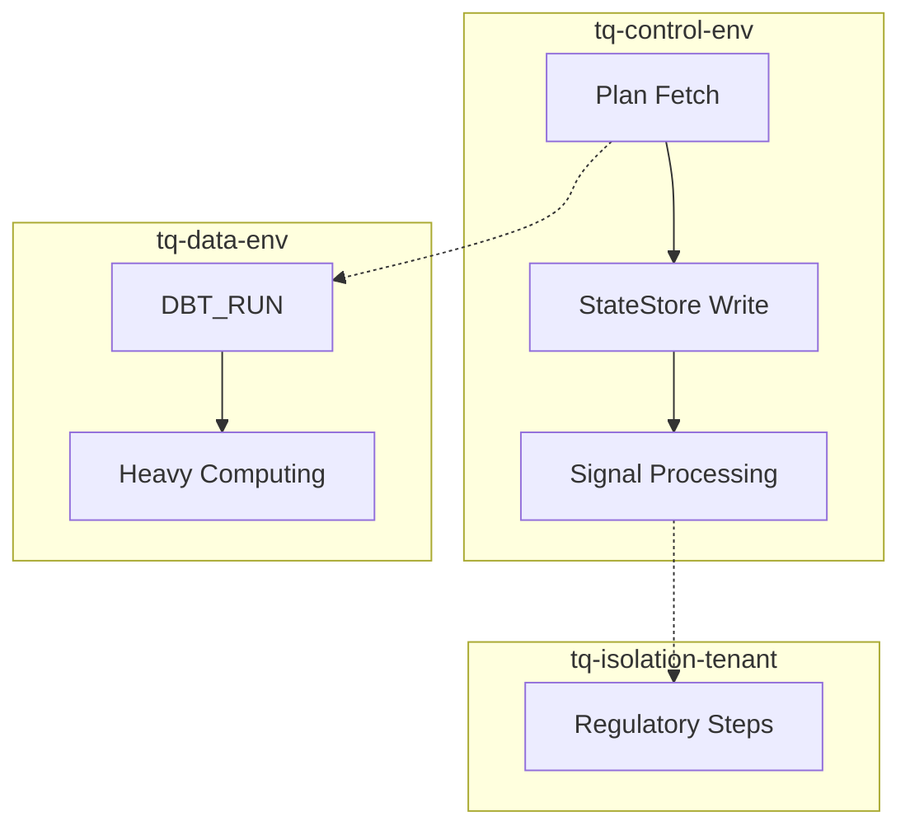

# Mi Arquitectura de Workers

Aquí está el diagrama:

```mermaid
graph TD
    subgraph Control_Plane [tq-control-env]
        A[Plan Fetch] --> B[StateStore Write]
        B --> C[Signal Processing]
    end

    subgraph Data_Plane [tq-data-env]
        D[DBT_RUN] --> E[Heavy Computing]
    end

    subgraph Isolation_Plane [tq-isolation-tenant]
        F[Regulatory Steps]
    end

    A -.-> D
    C -.-> F
```
