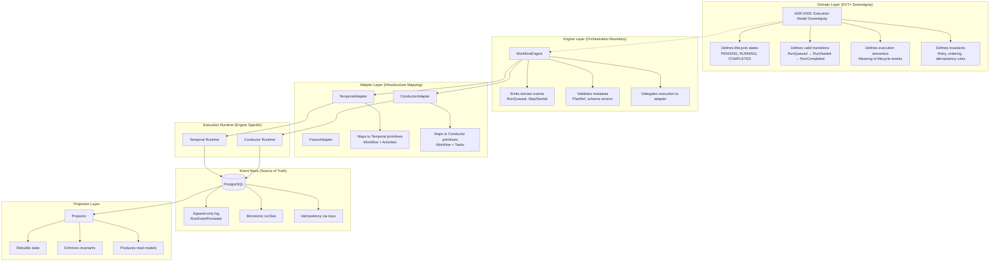
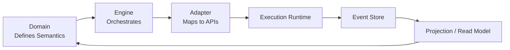

# ADR-0003: Execution Model Sovereignty

- **Status**: Accepted
- **Date**: 2026-02-16
- **Owners**: Architecture / Engine Domain
- **Related files**:
  - [`IWorkflowEngine.v2.0.md`](../architecture/components/engine/contracts/engine/IWorkflowEngine.v2.0.md)
  - [`RunEvents.v2.0.md`](../architecture/components/engine/contracts/engine/RunEvents.v2.0.md)
  - [`ExecutionSemantics.v2.0.md`](../architecture/components/engine/contracts/engine/ExecutionSemantics.v2.0.md)

---

## Context

The platform is evolving into:

- an orchestration abstraction layer,
- a multi-tenant execution runtime,
- a domain with explicit execution semantics,
- a system targeting multiple engines (Temporal, Conductor, future
  runtimes).

Ambiguity repeatedly appeared when semantics were inferred from engine
behavior instead of being domain-defined first.

---

## Decision

DVT+ will maintain **execution semantics sovereignty**, independent of
any specific workflow engine.

### 1) Domain-owned lifecycle

DVT+ MUST own the lifecycle state machine and valid transitions.

### 2) Domain-owned invariants

DVT+ MUST define step-level and run-level execution invariants.

### 3) Adapter translation boundary

Adapters MUST translate DVT+ semantics into engine APIs. Engines MUST
NOT define DVT+ semantics.

---

## Consequences

### Positive

- Consistent behavior across runtimes.
- Engine migration without changing business workflows.
- Clear separation of domain semantics vs infrastructure
  implementation.

### Trade-offs

- Additional abstraction layer to maintain.
- Semantic mapping maintenance cost per adapter.
- Potential performance overhead in translation boundaries.

---

## Acceptance Criteria

1. Run and step transitions are defined by DVT+ contracts, not adapter internals.
2. Adapter specs map to domain semantics without introducing engine-specific lifecycle semantics.
3. Deterministic replay and audit behavior are engine-agnostic by contract.

---

## Architecture Diagram (Detailed)



---

## Architecture Diagram (Conceptual Loop)



---

## Code Ownership Example

```typescript
// ❌ Anti-pattern: Engine defines behavior by I/O side effects
class Engine_OLD {
  async startRun(planRef: PlanRef, ctx: RunContext) {
    const bytes = await this.planFetcher.fetch(planRef.uri);
    return this.adapter.executePlan(bytes, ctx);
  }
}

// ✅ Correct pattern: Domain defines semantics, adapter handles infrastructure
class Engine {
  async startRun(planRef: PlanRef, ctx: RunContext): Promise<RunRef> {
    this.validateMetadata(planRef); // domain rule
    return this.adapter.executePlan(planRef, ctx);
  }
}

class TemporalAdapter implements IWorkflowAdapter {
  async executePlan(planRef: PlanRef, ctx: RunContext): Promise<RunRef> {
    const bytes = await this.fetch(planRef.uri);
    if (sha256(bytes) !== planRef.sha256) {
      throw new Error('PLAN_HASH_MISMATCH');
    }
    return this.startWorkflow(bytes, ctx);
  }
}
```

---

## Additional Commentary

- The **Engine does not fetch plans** --- that is infrastructure.
- The **Planner defines ordering and retry policy** --- not the
  engine.
- The **State Store is the single source of truth** --- not Temporal
  nor Conductor.
- Engine adapters must remain stateless regarding business semantics.
- Replacing Temporal with Conductor must not alter domain contracts.

---

## References

- [`ADR-0004-event-sourcing-strategy.md`](./ADR-0004-event-sourcing-strategy.md)
- Temporal docs: https://docs.temporal.io/
- Conductor docs: https://conductor.netflix.com/
- ADR-0011-run-started-ownership.md
- ADR-0012-plan-integrity-ownership.md
- ADR-0010-run-event-envelope-split.md
