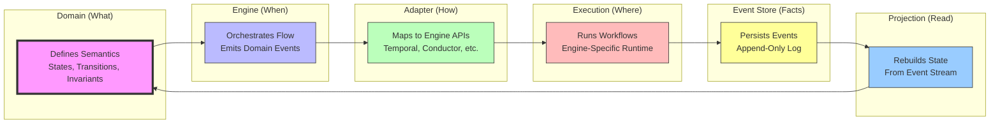

# ADR-0003: Execution Model Sovereignty

- **Status**: Accepted
- **Date**: 2026-02-16
- **Owners**: Architecture / Engine Domain
- **Related files**:
  - [`IWorkflowEngine.v2.0.md`](../architecture/engine/contracts/engine/IWorkflowEngine.v2.0.md)
  - [`RunEvents.v2.0.md`](../architecture/engine/contracts/engine/RunEvents.v2.0.md)
  - [`ExecutionSemantics.v2.0.md`](../architecture/engine/contracts/engine/ExecutionSemantics.v2.0.md)

---

## Context

The platform is evolving into:

- an orchestration abstraction layer,
- a multi-tenant execution runtime,
- a domain with explicit execution semantics,
- a system targeting multiple engines (Temporal, Conductor, future
  runtimes).

Ambiguity repeatedly appeared when semantics were inferred from engine
behavior instead of being domain-defined first.

---

## Decision

DVT+ will maintain **execution semantics sovereignty**, independent of
any specific workflow engine.

### 1) Domain-owned lifecycle

DVT+ MUST own the lifecycle state machine and valid transitions.

### 2) Domain-owned invariants

DVT+ MUST define step-level and run-level execution invariants.

### 3) Adapter translation boundary

Adapters MUST translate DVT+ semantics into engine APIs. Engines MUST
NOT define DVT+ semantics.

---

## Consequences

### Positive

- Consistent behavior across runtimes.
- Engine migration without changing business workflows.
- Clear separation of domain semantics vs infrastructure
  implementation.

### Trade-offs

- Additional abstraction layer to maintain.
- Semantic mapping maintenance cost per adapter.
- Potential performance overhead in translation boundaries.

---

## Acceptance Criteria

1.  Run and step transitions are defined by DVT+ contracts, not adapter
    internals.
2.  Adapter specs map to domain semantics without introducing
    engine-specific lifecycle semantics.
3.  Deterministic replay and audit behavior are engine-agnostic by
    contract.

---

## Architecture Diagram (Detailed)

```mermaid
graph TD
    subgraph "Domain Layer (DVT+ Sovereignty)"
        A[ADR-0003: Execution Model Sovereignty]
        A --> B[Defines lifecycle states<br/>PENDING, RUNNING, COMPLETED, etc.]
        A --> C[Defines valid transitions<br/>RunQueued → RunStarted → ...]
        A --> D[Defines execution semantics<br/>What does 'start' mean?]
        A --> E[Defines invariants<br/>Step order, retry policies]
    end

    subgraph "Engine Layer (Orchestration)"
        F[WorkflowEngine]
        F --> G[Emits RunQueued<br/>(domain event)]
        F --> H[Validates PlanRef metadata<br/>URI, schema version]
        F --> I[Forwards to adapter<br/>with full context]
    end

    subgraph "Adapter Layer (Infrastructure Mapping)"
        J[TemporalAdapter]
        K[ConductorAdapter]
        L[FutureAdapter]

        J --> M[Maps domain semantics to Temporal:<br/>- Fetch plan bytes<br/>- Validate SHA256<br/>- Start workflow<br/>- Emit RunStarted]
        K --> N[Maps domain semantics to Conductor:<br/>- Fetch plan bytes<br/>- Validate SHA256<br/>- Start workflow<br/>- Emit RunStarted]
    end

    subgraph "Execution Layer (Engine-Specific)"
        O[Temporal Workflow Runtime]
        P[Conductor Workflow Runtime]

        O --> Q[Executes activities<br/>Handles retries<br/>Manages timeouts]
        P --> R[Executes tasks<br/>Handles retries<br/>Manages timeouts]
    end

    subgraph "Event Store (Source of Truth)"
        S[(PostgreSQL)]
        S --> T[Append-only event log<br/>RunEventPersisted]
        S --> U[Monotonic runSeq<br/>per runId]
        S --> V[Idempotency via<br/>(runId, idempotencyKey)]
    end

    subgraph "Projection Layer (Read Models)"
        W[Projector]
        W --> X[Rebuilds state from events]
        W --> Y[Enforces transition invariants]
        W --> Z[Provides snapshots<br/>for performance]
    end

    A -.-> F
    A -.-> J
    A -.-> K

    F --> I
    I --> J
    I --> K

    J --> O
    K --> P

    J --> S
    K --> S
    O --> S
    P --> S

    S --> W
    W --> X
    W --> Y
    W --> Z

    style A fill:#f9f,stroke:#333,stroke-width:4px
    style F fill:#bbf,stroke:#333
    style J fill:#bfb,stroke:#333
    style K fill:#bfb,stroke:#333
    style L fill:#bfb,stroke:#333,stroke-dasharray: 5 5
    style O fill:#fbb,stroke:#333
    style P fill:#fbb,stroke:#333
    style S fill:#ff9,stroke:#333
    style W fill:#9cf,stroke:#333
```

---

## Architecture Diagram (Conceptual Loop)



---

## Code Ownership Example

```typescript
// ❌ BAD: Engine behavior defines semantics
class Engine_OLD {
  async startRun(planRef: PlanRef, ctx: RunContext) {
    const bytes = await this.planFetcher.fetch(planRef.uri);
    return this.adapter.executePlan(bytes, ctx);
  }
}

// ✅ GOOD: Domain defines semantics, engine orchestrates
class Engine {
  async startRun(planRef: PlanRef, ctx: RunContext): Promise<RunRef> {
    this.validateMetadata(planRef);
    return this.adapter.executePlan(planRef, ctx);
  }
}

class TemporalAdapter implements IWorkflowAdapter {
  async executePlan(planRef: PlanRef, ctx: RunContext): Promise<RunRef> {
    const bytes = await this.fetch(planRef.uri);
    if (sha256(bytes) !== planRef.sha256) {
      throw new Error('PLAN_HASH_MISMATCH');
    }
    return this.startWorkflow(bytes, ctx);
  }
}
```

---

## References

- ADR-0004-event-sourcing-strategy.md\
- ADR-0011-run-started-ownership.md\
- ADR-0012-plan-integrity-ownership.md\
- ADR-0010-run-event-envelope-split.md\
- Temporal docs: https://docs.temporal.io/\
- Conductor docs: https://conductor.netflix.com/
