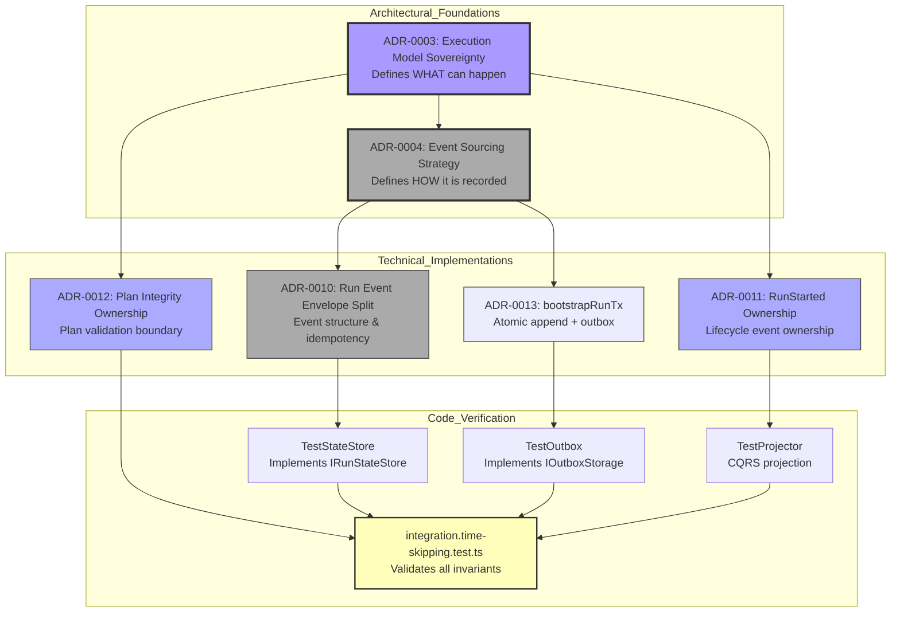
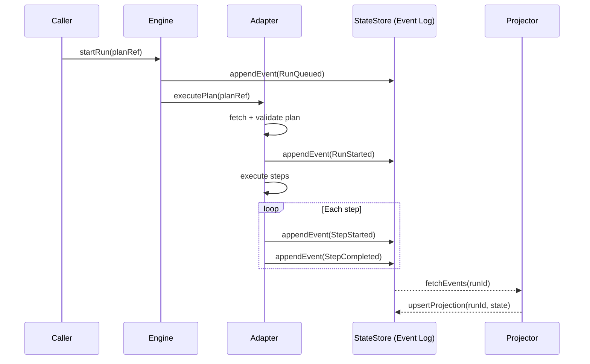

# ADR-0004: Event Sourcing Strategy (Extended)

- Status: Accepted
- Date: 2026-02-16
- Owners: Architecture / Data Domain
- Version: v2.0 (Extended Implementation & Verification)
- **Related files**:
  - [`ADR-0003-execution-model.md`](./ADR-0003-execution-model.md)
  - [`ExecutionSemantics.v2.0.md`](../architecture/engine/contracts/engine/ExecutionSemantics.v2.0.md)
  - [`RunEvents.v2.0.md`](../architecture/engine/contracts/engine/RunEvents.v2.0.md)
  - [`IRunStateStore.v2.0.md`](../architecture/engine/contracts/state-store/IRunStateStore.v2.0.md)

---



---

## 1. Context

Distributed execution systems must handle:

- retries and duplicate delivery
- partial failures
- clock drift
- concurrent updates
- strict auditability requirements
- multi-tenant isolation
- deterministic replay

The platform requires a persistence model that is:

- deterministic
- replayable
- append-only
- idempotent
- engine-agnostic
- audit-safe

Event sourcing satisfies these constraints.

---

## 2. Decision

Adopt an append-only, event-sourced persistence model as the canonical write strategy.

### 2.1 Canonical Write Model

The write side MUST use an append-only event log with:

- monotonic `runSeq` per `runId`
- globally unique event identity
- idempotency uniqueness constraint on `(runId, idempotencyKey)`
- immutable records
- persisted timestamp (`persistedAt`)

### 2.2 CQRS Separation

Write model and read projections MUST remain separated.

Projectors MUST:

- enforce transition invariants
- rebuild state exclusively from events
- support snapshot acceleration

### 2.3 Storage Choice

PostgreSQL is selected as the primary production store due to:

- ACID guarantees
- transactional integrity
- strong indexing capabilities
- operational maturity

SQLite MAY be used for local development.
Snowflake MAY be used for analytical projections (not transactional state).

---

## 3. Architecture Alignment

ADR-0004 complements ADR-0003:

| ADR      | Responsibility             | Analogy                  |
| -------- | -------------------------- | ------------------------ |
| ADR-0003 | Defines what may happen    | Constitution             |
| ADR-0004 | Defines how it is recorded | Ledger / Official Record |

Without ADR-0004:

- deterministic replay is impossible
- auditability collapses
- CQRS becomes invalid
- engine replacement becomes unsafe

---

## 4. Invariants

### INV-STATE-1: Monotonic Sequence

For a given runId:
runSeq MUST be strictly increasing by 1.

### INV-STATE-2: Deterministic Replay

Replaying events in runSeq order MUST reconstruct the same state.

### INV-STATE-3: Idempotency Guarantee

Duplicate `(runId, idempotencyKey)` MUST NOT create new records.

### INV-STATE-4: Tenant Isolation

All queries MUST be tenant-scoped.

---

## 5. Implementation in Code

### 5.1 Append-Only Log with Monotonic runSeq

```typescript
interface IRunStateStore {
  appendEvent(event: RunEventWrite): Promise<AppendResult>;
  fetchEvents(
    runId: string,
    options?: {
      afterSeq?: number;
      limit?: number;
    }
  ): Promise<RunEventRecord[]>;
}

class TestStateStore implements IRunStateStore {
  private readonly eventsByRun = new Map<string, RunEventRecord[]>();

  async appendEvent(event: RunEventWrite): Promise<AppendResult> {
    const events = this.eventsByRun.get(event.runId) ?? [];

    const nextRunSeq = events.length + 1;

    const record: RunEventRecord = {
      ...event,
      runSeq: nextRunSeq,
      persistedAt: new Date().toISOString(),
    };

    events.push(record);
    this.eventsByRun.set(event.runId, events);

    return {
      runSeq: nextRunSeq,
      idempotent: false,
      persisted: true,
    };
  }
}
```

---

### 5.2 Idempotency by (runId, idempotencyKey)

```typescript
class TestStateStore implements IRunStateStore {
  private readonly idempByRun = new Map<string, Map<string, RunEventRecord>>();

  async appendEvent(event: RunEventWrite): Promise<AppendResult> {
    const idx = this.idempByRun.get(event.runId) ?? new Map();

    const existing = idx.get(event.idempotencyKey);
    if (existing) {
      return {
        runSeq: existing.runSeq,
        idempotent: true,
        persisted: false,
      };
    }

    // assign runSeq and persist...
  }
}
```

---

### 5.3 CQRS Projector

```typescript
class TestProjector {
  rebuild(runId: string, events: RunEventRecord[]): RunStatus {
    let status: RunStatus = 'PENDING';

    for (const e of events) {
      if (e.eventType === 'RunStarted') status = 'RUNNING';
      if (e.eventType === 'RunCompleted') status = 'COMPLETED';
    }

    return { runId, status };
  }
}
```

---

### 5.4 Snapshots for Performance

```typescript
class TestStateStore implements IRunStateStore {
  private readonly snapshotsByRun = new Map<string, RunSnapshot>();

  async getSnapshot(runId: string): Promise<RunSnapshot | null> {
    return this.snapshotsByRun.get(runId) ?? null;
  }

  async projectSnapshot(runId: string): Promise<RunSnapshot> {
    const events = await this.fetchEvents(runId);
    const snapshot: RunSnapshot = {
      runId,
      status: this.calculateStatus(events),
      lastEventSeq: events.length,
      projectedAt: new Date().toISOString(),
    };

    this.snapshotsByRun.set(runId, snapshot);
    return snapshot;
  }
}
```

---

## 6. Test Verification

The integration test validates:

- append-only log
- monotonic runSeq
- deterministic replay
- correct event ordering
- CQRS separation

Example assertion:

```typescript
expect(events.every((e, idx) => e.runSeq === idx + 1)).toBe(true);
expect(projected.status).toBe('COMPLETED');
```

---

## 7. Compliance Matrix

| Requirement                 | Implementation     | Verified     |
| --------------------------- | ------------------ | ------------ |
| Append-only                 | eventsByRun        | Yes          |
| runSeq monotonic            | appendEvent        | Yes          |
| Idempotency                 | idempByRun         | Yes          |
| CQRS separation             | Projector          | Yes          |
| Snapshots                   | snapshotsByRun     | Partially    |
| PostgreSQL production store | Production adapter | N/A in tests |

---

## 8. Risks & Mitigations

| Risk                    | Mitigation                        |
| ----------------------- | --------------------------------- |
| Event duplication       | Idempotency keys                  |
| Planner/engine coupling | Strict responsibility separation  |
| Snapshot drift          | Rebuild from canonical log        |
| Tenant bleed            | Scoped queries + RBAC enforcement |

---

## 9. Conclusion

ADR-0004 establishes the canonical persistence foundation.

It ensures:

- deterministic replay
- strict auditability
- engine replaceability
- safe retries
- immutable historical record

This ADR is foundational. Any deviation breaks system guarantees.


