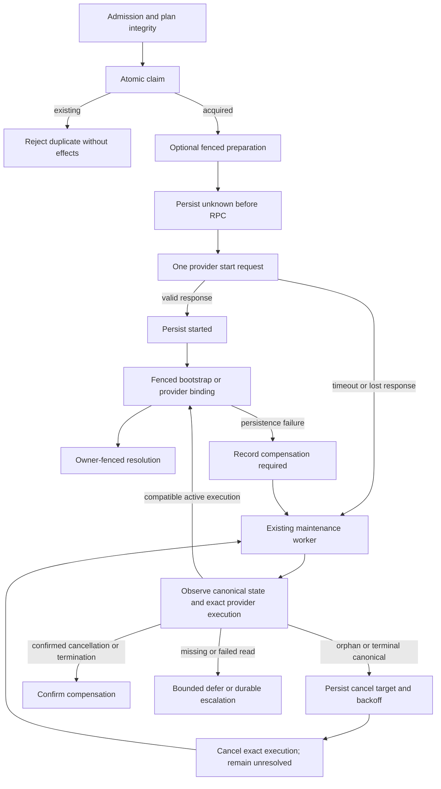

# ADR-0030 — Pre-Dispatch Intent Log for startRun Crash Consistency

- Status: Accepted
- Date: 2026-03-03
- Decision update: 2026-09-30, exclusive ownership and observation-only reconciliation
- Owners: Engine Domain
- Governing design: Planning DB `GH-2678-START-OWNERSHIP-PROTOCOL`
- Approval and scope: [#2678](https://github.com/dunay2/dvt/issues/2678),
  [#2679 observation-only decision](https://github.com/dunay2/dvt/issues/2679#issuecomment-5920617269)

## 1. Context

A timeout is not evidence that the provider rejected a start. The request may
complete after its caller loses its response or ownership. A deterministic
intent identity alone also does not prevent two callers from dispatching.
Metadata existence grants neither acquisition authority nor cancellation
confirmation.

Temporal rejects duplicate identities while their histories are retained.
Retention expiry or deletion removes that protection. Therefore a point-in-time
missing workflow is not a durable negative proof and MUST NOT authorize
automatic redispatch. Safe positive redispatch remains outside this slice and
open in #2679; this ADR does not certify it.

## 2. Decision and rationale

Use the existing start-intent aggregate, canonical state store, provider adapter
and maintenance worker. Do not add another command, reconciliation store,
worker, migration path or versioned protocol alongside them.

- Atomic acquisition returns an opaque claim receipt only to the winner.
  A losing caller gets an existing-intent observation, never a receipt.
- Explicit reclaim rotates the token using revision compare-and-set and
  store-owned age/due time. Reading an intent never acquires it.
- Persist dispatch authorization as `providerOutcome.kind = unknown` before
  the provider RPC. It authorizes one request, not a retry.
- Fence canonical bootstrap, provider binding and failure writes with the same
  intent-row lock, retained until the canonical transaction commits.
- Keep provider outcome, compensation and retry/escalation state distinct
  within that aggregate. Cancellation acknowledgement is not termination.
- Observe and reconcile, or escalate durably. Do not resend an unknown start.

### Alternatives rejected

| Alternative                                           | Reason                                                                    |
| ----------------------------------------------------- | ------------------------------------------------------------------------- |
| Return the same receipt for an idempotent create      | Both callers gain dispatch authority                                      |
| Check ownership before an unfenced canonical write    | Ownership can change between check and commit                             |
| Retry after provider lookup returns missing           | Absence is point-in-time; late completion and retention remain possible   |
| Resolve immediately after cancel acknowledgement      | The execution may still be active                                         |
| Add parallel PENDING and DISPATCHED behavior policies | Both need the same observation, canonical-state and compensation decision |
| Convert existing rows into new claims automatically   | Conversion invents authority and loses uncertainty; hard cut instead      |

## 3. Existing command and query rails

| Rail                                              | Owner / DDD object               | Port and adapter                                          | Scope and negative proof                                                                                           |
| ------------------------------------------------- | -------------------------------- | --------------------------------------------------------- | ------------------------------------------------------------------------------------------------------------------ |
| `IWorkflowEngine.startRun`                        | Runtime / StartRunIntent and Run | StartRunApplicationService; existing Engine and API entry | Tenant/project/environment admission; duplicate and stale callers produce no provider dispatch or canonical writes |
| `IRunMaintenanceService.reconcileOrphanedIntents` | Runtime / StartRunIntent         | Existing intent reconciler worker and store               | Bounded service-context scan; dry run has no mutations                                                             |
| `IRunMaintenanceService.reconcileStartRunIntent`  | Runtime / StartRunIntent         | Existing recovery use case                                | Tenant authorization before lookup; unknown or escalated is not confirmed                                          |
| `IStartRunIntentQueryStore.getIntent`             | Runtime / intent read model      | Existing tenant-scoped query store                        | No claim token returned; cross-tenant lookup reveals no record                                                     |
| `IRunStartDispatchResolver.resolve`               | API / run-control readiness      | Existing API resolver                                     | Only resolved, started, uncompensated, scope-matched intent confirms dispatch                                      |

Planning DB owns rail identities and implementation bindings. This table
explains those existing boundaries; it is not a parallel rail catalog.

## 4. Protocol

### Ownership and persistence

`claimIntent` returns `acquired | existing`. Mutations require a
`StartRunIntentClaimReceipt`; its opaque token is not part of query results,
logs, metrics or public DTOs. `reclaimIntent` returns `acquired | not_acquired`.

Mutation results distinguish `applied`, `already_applied`, `not_owner`,
`missing`, `conflict` and `invalid_state`. An already-authorized dispatch
MUST NOT send another provider request. PostgreSQL acquisition uses an insert
followed by a fresh READ COMMITTED statement snapshot when there is a conflict.

Both canonical and intent writes use the same acquisition fence. Bootstrap
retains the atomic metadata/events/outbox semantics of ADR-0013. Equal estimated
and returned references do not bypass the fenced provider-binding check.
Compensation-required or escalated intents cannot adopt a provider reference.

### Outcomes and lifecycle

| State or evidence                                                                             | Allowed action                                                                                     |
| --------------------------------------------------------------------------------------------- | -------------------------------------------------------------------------------------------------- |
| PENDING, not requested, positively missing                                                    | Expire without provider command                                                                    |
| PENDING, unknown, missing or failed observation                                               | Defer or escalate; never expire, confirm, fail the run or redispatch from that evidence            |
| Observed active provider, compatible nonterminal canonical run, no compensation               | Persist started, fence adoption, resolve                                                           |
| Observed active provider with no canonical run, terminal canonical run or sticky compensation | Persist compensation and exact execution identity before cancel; do not resolve on acknowledgement |
| Same execution observed cancelled or terminated                                               | Confirm compensation and resolve the intent; do not report successful dispatch                     |
| Incompatible terminal outcome or replacement execution                                        | Escalate without cancelling a different execution                                                  |
| RESOLVED or EXPIRED                                                                           | No automatic acquisition or additional effects                                                     |

`PENDING -> RESOLVED` is prohibited. Normal resolution requires DISPATCHED
with a started outcome and no required compensation. Compensation resolution
requires the separate exact-execution confirmation command.

### Reconciliation and bounded scheduling

The observer reads metadata and canonical status before accessing the provider.
Failed reads remain failures, including non-Error rejections. Effects do not
re-read the evidence on which the decision was based. Pure decisions share only
canonical terminal-status and retry-budget constants, not runtime collaborators.

Retry attempts, next due time and bounded reason codes are persisted in the
intent. The policy allows at most eight observations/attempt decisions, with
30s, 60s, 120s, 240s and then 300s backoff. The last inconclusive attempt
escalates; it does not issue another cancellation. Worker scan cadence and the
configured reclaim age may delay an otherwise due attempt further.

Escalated records leave automated scans and remain available to authorized
inspection. Operators must inspect the recorded reason and exact provider
identity; they must not reset unknown to not-requested or replay the start.
An operator remediation command is not introduced by this slice.

The batch reports `expired`, `resolved`, `cancelled`, `cancelFailed`,
`deferred` and `escalated` separately. Metrics use bounded provider/outcome/reason
labels; logs provide tenant/run/intent correlation without acquisition tokens.
Diagnostic failures cannot grant authority or alter a decision.

### Failure handling

Failure emission still requires this invocation's created preparation, an
eligible phase, successfully read metadata and started intent, and a valid
receipt at canonical commit. Reused recovery preparation does not grant
failure authority. Completion persistence failure rejects without emitting
RunFailed or cancelling a successfully bound provider.

Bootstrap or provider-binding failure records sticky compensation for the
existing worker. If that record cannot be persisted, preserve the original
error and leave reconciliation evidence unresolved; never synthesize success.

## 5. Hard-cut deployment

The port and schema changes require all consumers to deploy together. There is
one supported schema and no compatibility adapter, field alias, dual write or
backfill.

The initializer creates the current schema only when the intent table is
absent. Existing incompatible registry, columns or tenant-isolation flags cause
`START_RUN_INTENT_SCHEMA_INCOMPATIBLE`; verification does not repair or convert
the table. An operator must stop old writers, back up and classify existing
intents and their provider executions, and obtain an explicit disposition before
retiring an incompatible table. Do not infer successful or absent provider
effects from old rows. Production reset is not authorized by this ADR.

## 6. Verification invariants

- **INV-INTENT-001**: acquire exclusively before any provider start.
- **INV-INTENT-002**: persist unknown before RPC and started only from valid positive evidence.
- **INV-INTENT-003**: confirm start only after fenced canonical preparation/binding and intent resolution.
- **INV-INTENT-004**: compensation acknowledgement never resolves the intent.
- **INV-INTENT-005**: intent persistence and canonical fencing are mandatory dependencies.
- **INV-INTENT-006**: normal lifecycle is PENDING -> DISPATCHED -> RESOLVED.
- **INV-INTENT-007**: only never-authorized PENDING intents may expire.
- **INV-INTENT-008**: metadata presence alone cannot authorize adoption or resolution.
- **INV-INTENT-009**: scans contain only aged, due, active, non-escalated intents with stable bounded ordering.
- **INV-INTENT-010**: cancellation failures persist retry state and remain unresolved.
- **INV-INTENT-011**: deterministic identity includes tenant, run, logical attempt and provider; active tenant/run uniqueness prevents parallel claims.
- **INV-INTENT-012**: unknown provider absence never grants automatic redispatch.
- **INV-INTENT-013**: cancellation confirmation identifies the exact observed execution.
- **INV-INTENT-014**: batch result categories distinguish adoption, compensation, deferral and escalation.
- **INV-INTENT-015**: every stale-receipt write leaves canonical and intent state unchanged.
- **INV-INTENT-016**: failed observations never become confirmed absence.

## 7. Evidence and limitations

Real PostgreSQL tests use independent connections and a non-owner application
role. They exercise acquisition races, revision reclaim, the transaction fence,
RLS and preservation of incompatible schemas. Temporal service-backed tests
prove retained-identity rejection, the history-deletion counterexample, and
cancellation acknowledgement without termination.

These proofs do not establish perpetual provider deduplication, cross-region
provider fencing, automatic redispatch safety or an operator remediation API.
Issue #2679 remains open for its positive safe-redispatch acceptance.

The detailed entry, admission and failure contracts remain in
[StartRunProtocol](../architecture/components/engine/contracts/engine/StartRunProtocol.v1.md).
Related authorities: [ADR-0013](ADR-0013-run-state-store-bootstrapRunTx.md),
[ADR-0029](ADR-0029-run-maintenance-service.md),
[ADR-0031](ADR-0031-adapter-tenant-isolation.md).
