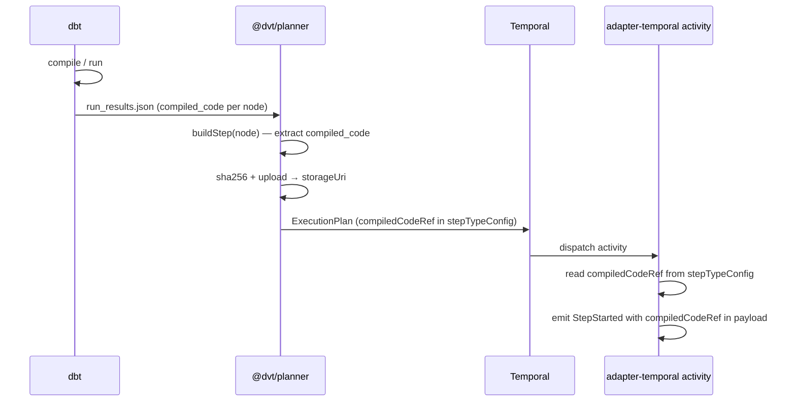
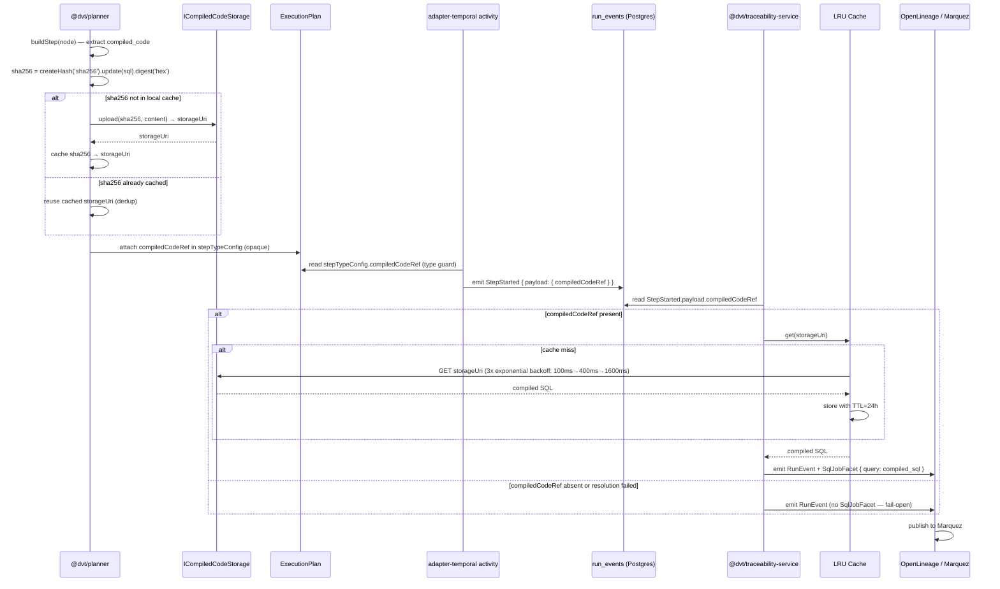
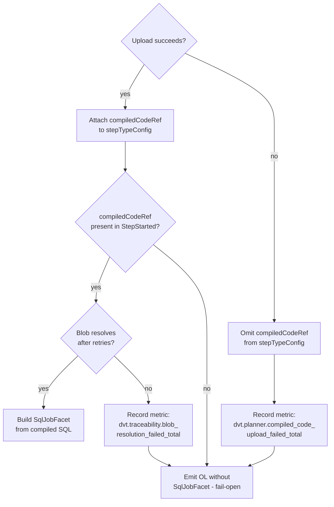
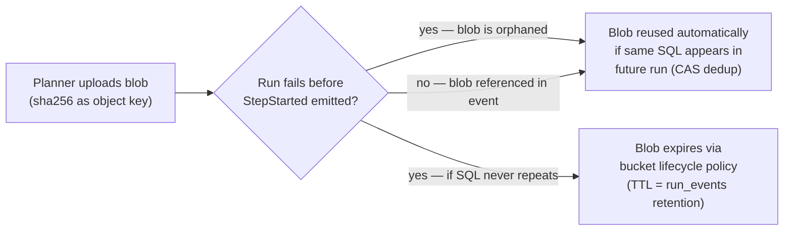
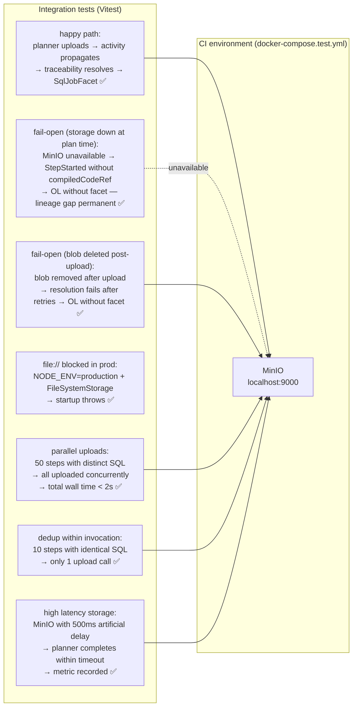

# ADR-0032 — compiledCodeRef Ownership: Reference in StepStarted Payload

- **Status**: Accepted
- **Date**: 2026-03-04
- **Owners**: Engine Domain / Planner / Traceability
- **ARC Level**: ARC-2 (non-breaking contract extension, optional field)
- **Related files**:
  - [IRunStateStore.v1.ts](../../packages/@dvt/contracts/src/contracts/engine/IRunStateStore.v1.ts)
  - [ExecutionPlan.v2.ts](../../packages/@dvt/contracts/src/contracts/planner/ExecutionPlan.v2.ts)
  - [ADR-0003 — Execution Model](ADR-0003-execution-model.md)
  - [ADR-0004 — Event Sourcing Strategy](ADR-0004-event-sourcing-strategy.md)
  - [ADR-0012 — Plan Integrity Ownership](ADR-0012-plan-integrity-ownership.md)
  - `ADR-0020 — OpenLineage Integration Strategy` (not present in the repo at this time)
  - `ADR-0021 — RunEvents → OL Mapping` (not present in the repo at this time)
  - [GAP_EXECUTION_PLANS.md — G4](../planning/gaps/GAP_EXECUTION_PLANS.md#g4---compiledcoderef-ownership)

---

## 1. Context

### 1.1 The problem

dbt produces `compiled_code` per node in `run_results.json`: the exact SQL executed against the warehouse, with all `ref()` and `source()` macros fully expanded. This compiled code is the **deterministic fingerprint** of what the step executed.

DVT+ needs this artifact for two distinct reasons:

1. **Lineage** (OpenLineage): the `RunEvents → OL` mapping (ADR-0020/0021) requires the compiled SQL to construct the `SqlJobFacet` for Marquez. Without it, data lineage traceability is structurally incomplete.
2. **Audit / replay forensics**: answering "exactly which SQL executed in run R, step S, logicalAttemptId N?" deterministically.

Current gap: `stepTypeConfig` in `EventInput.payload` is an opaque `Record<string, unknown>`. There is no canonical field to attach or reference compiled code. The planner builds the plan but does not emit a `compiledCodeRef`. The traceability-service cannot construct `SqlJobFacet` without it.

### 1.2 Design constraints

| Constraint                                                                                                                                                           | Source   |
| -------------------------------------------------------------------------------------------------------------------------------------------------------------------- | -------- |
| Event log is append-only and immutable — no post-hoc enrichment                                                                                                      | ADR-0004 |
| Event log must stay lightweight — compiled SQL can exceed 100 KB per node; storing it in `payload JSONB` inflates `run_events` and degrades `listEvents` performance | ADR-0004 |
| Compiled SQL is available at `StepStarted` time — the only moment it is both available and verifiable                                                                | ADR-0003 |
| SHA-256 determinism — two steps executing the same SQL MUST reference the same blob (content-addressable key)                                                        | —        |
| Compiled SQL is determined at planning time, not at execution time (§1.3)                                                                                            | —        |

### 1.3 dbt compilation model in DVT+

In the DVT+ pipeline, the order of operations is:



The `compiled_code` field in `run_results.json` is **static** for a given dbt invocation. It does not change between the planning and execution of a step, because the plan is built on top of already-produced compilation artifacts — not on an in-flight compilation process.

This distinction is central to the choice between Option A and Option D (see §2).

---

## 2. Options considered

### Option A — `compiledCodeRef` as reference in `StepStarted.payload` (selected)

Add optional field `compiledCodeRef` to `StepStarted.payload`:

```typescript
interface CompiledCodeRef {
  sha256: string; // SHA-256 hex of compiled SQL bytes (content-addressable key)
  storageUri: string; // Blob URI: s3://<bucket>/<key>, gs://<bucket>/<key>
  // file://<path> is ONLY valid in local development
  sizeBytes: number; // Size of the compiled SQL blob in bytes
  encoding?: 'utf-8'; // Character encoding. Default: 'utf-8'
}
```

The compiled SQL is stored in object storage (S3/MinIO/GCS in production; `file://` in local dev only). The event contains only the reference. The `sha256` acts as the content-addressable key.

**Reference transport mechanism**: The planner computes `CompiledCodeRef` (sha256 + upload) and attaches it inside the step's `stepTypeConfig` within the `ExecutionPlan`. The activity (adapter-temporal) reads it from the plan and propagates it to `StepStarted.payload.compiledCodeRef`. The `ExecutionPlan` acts as an internal transport channel from planner to activity — this is distinct from including the reference as a first-class signed contract field (see difference with Option D, §2.4).

```mermaid
flowchart LR
    RR["dbt run_results.json\ncompiled_code per node"]
    PLAN["@dvt/planner\nsha256 + upload\nICompiledCodeStorage port"]
    STYPE["ExecutionPlan\nsteps[i].stepTypeConfig\n.compiledCodeRef\n(opaque transport)"]
    ACT["adapter-temporal\nactivity"]
    EVENT["StepStarted.payload\n.compiledCodeRef"]
    STORE["run_events\n(reference only — no SQL)"]
    TRACE["@dvt/traceability-service\nICompiledCodeReader port\nLRU cache + retry"]
    OL["OpenLineage\nRunEvent + SqlJobFacet"]
    MRQ["Marquez"]

    RR --> PLAN
    PLAN -->|CompiledCodeRef| STYPE
    STYPE -->|activity reads| ACT
    ACT -->|propagates| EVENT
    EVENT --> STORE
    STORE --> TRACE
    TRACE -->|fail-open if unresolvable| OL
    OL --> MRQ
```



**Advantages**:

- Lightweight events — event log does not grow with SQL content
- Content-addressable: two steps with identical SQL share the same blob
- Lazy access: traceability-service resolves the blob only when building the OL facet
- Separation of concerns: event store for execution state; blob storage for large artifacts
- Idempotent: re-emitting the same `StepStarted` with the same `sha256` is safe

**Disadvantages**:

- Object storage dependency in planner/activity
- Additional latency when building the plan if many steps need upload
- Lazy resolution: traceability-service must make an additional GET when building OL

**Mitigations**:

- Pre-computed parallel uploads in the planner with local sha256 → storageUri cache (avoids re-uploading identical SQL within a single invocation)
- Fail-open: if `storageUri` cannot be resolved, the traceability-service produces OL without `SqlJobFacet`

---

### Option B — Inline SQL in `StepStarted.payload` as JSONB

Store compiled SQL directly in `payload JSONB`:

```typescript
// StepStarted.payload
{
  compiledCode: 'SELECT ... FROM ...';
} // can be 100 KB+
```

**Rejected**: Violates the lightweight event log constraint. 100 KB × 1M steps = 100 GB of event log payload alone. Degrades `listEvents`, `getSnapshot` rebuild, and all indexes. The event log is an append-only execution state store, not an artifact store.

---

### Option C — Separate table `compiled_code_refs(run_id, step_id, sha256, storage_uri)`

A parallel Postgres table with foreign keys into the event store:

```sql
CREATE TABLE compiled_code_refs (
  run_id               TEXT NOT NULL,
  step_id              TEXT NOT NULL,
  logical_attempt_id   INTEGER NOT NULL,
  sha256               TEXT NOT NULL,
  storage_uri          TEXT NOT NULL,
  size_bytes           INTEGER NOT NULL,
  created_at           TIMESTAMPTZ NOT NULL,
  PRIMARY KEY (run_id, step_id, logical_attempt_id)
);
```

**Rejected**: Introduces a second source of truth for data that conceptually belongs to the `StepStarted` event. Deterministic state replay would require reading both `run_events` and `compiled_code_refs`. Violates ADR-0004's invariant: "the event log is the single source of truth for run state." Not cross-adapter: a Temporal/Conductor adapter does not have natural access to this table.

---

### Option D — `compiledCodeRef` as a first-class signed field in `ExecutionPlan`

Attach the reference as a typed contract field in `ExecutionPlan.steps[].compiledCodeRef`, covered by the plan's cryptographic signature (ADR-0012):

**Rejected**: The `ExecutionPlan` signature covers its typed fields to guarantee integrity. If `compiledCodeRef` were a first-class signed field, the signature would cover storage URIs — meaning any URI rotation (bucket migration, key-prefix change) would require re-signing the plan, which is operationally brittle.

**Distinction from Option A**: In Option A, `compiledCodeRef` travels inside `stepTypeConfig` (an opaque `Record<string, unknown>`) — it is **not** a typed contract field of `ExecutionPlan`. The plan does not guarantee the presence or shape of this field; it is an internal transport mechanism between planner and activity, not a signed contract invariant. Option D would have required a first-level typed field covered by the signature.

Additionally: in systems where SQL resolution depends on runtime environment variables (late-binding compilation), a reference baked into the signed plan could go stale. In DVT+ this does not occur (§1.3), but the architectural distinction — transport vs. signed contract — remains valid independent of the compilation model.

---

## 3. Decision

**Option A is selected.**

### 3.1 Canonical contract

**New type in `packages/@dvt/contracts/src/engine/IRunStateStore.v1.ts`**:

```typescript
/**
 * Content-addressable reference to a compiled SQL artifact stored in object storage.
 * Attached to StepStarted.payload for dbt_model and dbt_test step types.
 *
 * Pattern: Content-Addressable Storage (CAS) — Venti/Plan 9 [REF-1]
 */
export interface CompiledCodeRef {
  /**
   * SHA-256 hex digest of the compiled SQL bytes.
   * Acts as the content-addressable key. Computed via Node.js built-in
   * `node:crypto` createHash('sha256') — no external dependency required.
   */
  sha256: string;

  /**
   * Object storage URI: s3://<bucket>/<key> | gs://<bucket>/<key>
   * `file://<path>` is ONLY valid in local development environments.
   * Production MUST use a shared object store (S3/GCS/MinIO) accessible
   * by both planner and traceability-service.
   */
  storageUri: string;

  /** Size of the compiled SQL blob in bytes. */
  sizeBytes: number;

  /** Character encoding of the blob. MUST be 'utf-8'. Default: 'utf-8'. */
  encoding?: 'utf-8';
}
```

`StepStarted.payload` extension (naturally non-breaking — already `Record<string, unknown>`):

```typescript
// StepStarted payload shape
interface StepStartedPayload extends Record<string, unknown> {
  compiledCodeRef?: CompiledCodeRef;
}
```

**`ExecutionPlan` contract**: `compiledCodeRef` is NOT added as a typed first-level field in `ExecutionPlan.v1.ts`. It travels inside `stepTypeConfig` (opaque). The planner includes it when building the plan; the activity reads it with a type guard. The plan contract remains stable.

If `compiledCodeRef` is ever promoted to a typed field in `ExecutionPlan`, that requires a separate ADR (minimum ARC-2 contract change).

### 3.2 Invariants

| ID                | Statement                                                                                                                                                                                                                             |
| ----------------- | ------------------------------------------------------------------------------------------------------------------------------------------------------------------------------------------------------------------------------------- |
| **INV-CCREF-001** | If `compiledCodeRef` is present in `StepStarted.payload`, the `sha256` field MUST be the SHA-256 hex digest of the blob content referenced by `storageUri`.                                                                           |
| **INV-CCREF-002** | The blob referenced by `storageUri` MUST exist and be accessible at the time the event is emitted. The producer (planner/activity) is responsible for prior upload.                                                                   |
| **INV-CCREF-003** | `compiledCodeRef` is OPTIONAL. Its absence is not an error. Consumers (traceability-service) MUST degrade gracefully — fail-open: produce OL without `SqlJobFacet`.                                                                   |
| **INV-CCREF-004** | `sha256` is content-addressable. Two `StepStarted` events with identical compiled SQL MUST reference the same `sha256`. The upload MAY use SHA-256 as the object key for automatic deduplication.                                     |
| **INV-CCREF-005** | `compiledCodeRef` captures the artifact in the context of the event's `logicalAttemptId`. On retry (new `logicalAttemptId`), the step MUST emit a new `StepStarted` with the correct reference for that attempt.                      |
| **INV-CCREF-006** | The event log (`run_events`) MUST NOT store compiled SQL directly. Only the reference is stored. This invariant CANNOT be relaxed without a new ADR.                                                                                  |
| **INV-CCREF-007** | `file://` URIs are prohibited in production environments. The planner MUST reject `FileSystemCompiledCodeStorage` configuration when `NODE_ENV=production` (or equivalent env flag), throwing at startup — fail-fast pattern [REF-2]. |

### 3.3 Canonical flow



### 3.4 Fail-open policy



**Metric labels**:

- `dvt.planner.compiled_code_upload_failed_total` — label: `step_type`
- `dvt.traceability.blob_resolution_failed_total` — label: `failure_reason`, `storage_scheme` (scheme + bucket only — no key, to avoid logging sensitive paths)

### 3.5 Known architectural limitation: permanent lineage gap on upload failure

> **This is a hard constraint, not a mitigation gap.**

Because the event log is append-only and immutable (ADR-0004), if the planner cannot upload the blob at plan-build time (e.g., S3 outage), the `StepStarted` event is emitted **without** `compiledCodeRef`. This gap is **permanent and irreversible** — there is no mechanism to enrich a past event post-hoc.

Consequence: a sustained S3 outage during plan-build creates a window where SQL lineage for those runs is permanently lost, even after S3 recovers.

This is an accepted architectural trade-off: **run execution is first-order; SQL lineage traceability is second-order**. The system intentionally prioritises unblocking the run over guaranteeing lineage completeness. Teams operating in regulated environments requiring complete lineage must ensure object storage availability is treated as a hard dependency at plan-build time (circuit breaker, SLA monitoring, alerting on `compiled_code_upload_failed_total`).

If future requirements elevate lineage to a first-order concern (e.g., regulatory mandates), this ADR must be superseded with a design that allows post-hoc event enrichment or pre-empts the lineage gap.

### 3.6 Orphaned blobs

A blob becomes orphaned if the planner uploads it but the run fails before `StepStarted` is emitted (e.g., planner crash, dispatch timeout). Cleanup strategy:



- **Lifecycle policy on the bucket**: TTL aligned with `run_events` retention (configurable; default: 90 days). Orphaned blobs expire alongside run logs.
- **Content-addressable key** (`sha256` as object name): an "orphaned" blob from a failed run is automatically reused by a retry or future run with identical SQL — no waste. Note: in dbt, most models produce unique SQL, so dedup savings are secondary; the primary value of SHA-256 is **integrity verification** (INV-CCREF-001) and **upload idempotency**, not storage deduplication.
- **No active sweep job**: lifecycle TTL is sufficient. If orphaned blob volume becomes significant, a dedicated ADR will address it.
- **Retention cost**: for tenants with long regulatory retention requirements (e.g., 7 years), blob storage cost must be modelled separately. The lifecycle TTL MUST be configurable per deployment, not hardcoded. IAM per-tenant isolation in a shared bucket (prefix-based policies) is operationally complex — deployments with strict isolation requirements SHOULD use one bucket per tenant instead.

---

## 4. Consequences

### Positive

- Event log stays lightweight — `run_events` does not grow with compiled SQL. At 100 KB per step, 1M steps = 100 GB of JSONB payload, which inflates every `listEvents` response and `getSnapshot` rebuild regardless of whether the SQL is needed. The reference approach keeps each event row at ~200 bytes regardless of SQL size.
- OpenLineage lineage complete when blob resolves — `SqlJobFacet` can be constructed on demand
- SHA-256 content-addressable key provides **integrity verification** (INV-CCREF-001) and **upload idempotency** — retrying a failed upload is always safe. Note: storage deduplication across runs is a secondary benefit in dbt, where most models produce unique SQL.
- Forensic auditability — exact SQL for any `(runId, stepId, logicalAttemptId)` is recoverable from storage
- Fail-open — absence of `compiledCodeRef` does not fail the run or the traceability pipeline

### Negative / trade-offs

| Trade-off                                                      | Estimated impact                                                                       | Mitigation                                                                                     |
| -------------------------------------------------------------- | -------------------------------------------------------------------------------------- | ---------------------------------------------------------------------------------------------- |
| Object storage dependency in planner                           | New infrastructure dependency (S3/MinIO)                                               | `ICompiledCodeStorage` port isolates it; `InMemoryCompiledCodeStorage` for tests               |
| Upload latency per step (S3 PUT ~50–200ms p99 in same region)  | 100 steps × 100ms avg = ~10s extra if serial; ~200ms with parallelism                  | Parallel uploads (bounded concurrency, e.g. `p-map` with concurrency=10) + sha256 cache        |
| Lazy resolution in traceability-service (S3 GET ~20–80ms p99)  | 1 GET per unique `storageUri` per service restart                                      | LRU cache (TTL=24h, max=512 entries) eliminates repeated GETs; tune `max` to unique-SQL volume |
| Permanent lineage gap on S3 outage at plan time                | Irreversible — see §3.5                                                                | Alert on metric; treat S3 availability as SLA dependency in regulated deployments              |
| Orphaned blobs                                                 | Negligible if lifecycle TTL configured                                                 | Bucket lifecycle policy; content-addressable key enables reuse                                 |
| Blob storage cost at long retention (7-year regulated tenants) | ~$2.30/GB/year on S3 Standard; 1M steps × 100 KB = 100 GB = ~$230/year per such tenant | Model cost per tenant; use S3 Glacier for blobs older than 30d                                 |
| IAM per-tenant in shared bucket (prefix policies)              | Operationally complex; misconfiguration can leak SQL                                   | Prefer one bucket per tenant for strict isolation; document as open sub-decision               |
| `file://` in production                                        | Misconfiguration risk                                                                  | INV-CCREF-007 + fail-fast at startup                                                           |

---

## 5. Implementation scope

### 5.1 Contract changes

**File**: `packages/@dvt/contracts/src/engine/IRunStateStore.v1.ts`

Add `CompiledCodeRef` interface (see §3.1). No breaking change — `EventInput.payload` is already `Record<string, unknown>`.

**`ExecutionPlan.v1.ts`**: no typed change. `compiledCodeRef` travels in `stepTypeConfig` (opaque). If promoted to a typed field in the future, a separate ADR is required.

> **Technical debt tracking**: the use of `stepTypeConfig` as an untyped transport is an intentional, time-boxed trade-off. A follow-up issue should be opened after G4 implementation to evaluate elevating `compiledCodeRef` to a first-class typed field in `ExecutionPlan.v1.ts` (separate ARC-2 ADR). Label: `tech-debt`, `g4-followup`.

### 5.2 `@dvt/planner` changes

**SHA-256 computation**: Node.js built-in `node:crypto` — no additional dependency.

```typescript
import { createHash } from 'node:crypto';

function computeSha256(content: Buffer): string {
  return createHash('sha256').update(content).digest('hex');
}
```

**`ICompiledCodeStorage` port** (hexagonal architecture [REF-4]):

```typescript
export interface ICompiledCodeStorage {
  /**
   * Upload compiled SQL blob. Returns the canonical storageUri.
   * Implementations MUST be idempotent: uploading the same sha256 twice is safe.
   */
  upload(sha256: string, content: Buffer): Promise<string /* storageUri */>;
}
```

**Implementations** (all use the same port, swapped via DI):

| Implementation                  | Transport                               | Environment                    | Library                                 |
| ------------------------------- | --------------------------------------- | ------------------------------ | --------------------------------------- |
| `S3CompiledCodeStorage`         | S3 `PutObjectCommand`                   | Production                     | `@aws-sdk/client-s3` [REF-5]            |
| `MinioCompiledCodeStorage`      | S3-compatible API (`endpoint` override) | Staging / CI                   | `@aws-sdk/client-s3` + endpoint [REF-6] |
| `FileSystemCompiledCodeStorage` | `node:fs` write                         | Local dev only (`file://`)     | Node built-in                           |
| `InMemoryCompiledCodeStorage`   | `Map<sha256, Buffer>`                   | Unit tests                     | None                                    |
| `NoopCompiledCodeStorage`       | no-op                                   | Tests that don't verify upload | None                                    |

> **Note**: `MinioCompiledCodeStorage` reuses `@aws-sdk/client-s3` with a custom `endpoint` pointing to the MinIO instance. MinIO exposes a fully S3-compatible API [REF-6], so no separate MinIO SDK is needed.

**Sha256 local cache** (per-invocation deduplication):

```typescript
// Within a single planner invocation, avoid re-uploading identical SQL
const uploadCache = new Map<string, string>(); // sha256 → storageUri

async function uploadIfNotCached(
  storage: ICompiledCodeStorage,
  sha256: string,
  content: Buffer
): Promise<string> {
  const cached = uploadCache.get(sha256);
  if (cached) return cached;
  const uri = await storage.upload(sha256, content);
  uploadCache.set(sha256, uri);
  return uri;
}
```

**Plan attachment**: planner includes `compiledCodeRef` in `stepTypeConfig` (opaque field):

```typescript
step.stepTypeConfig = {
  ...step.stepTypeConfig,
  compiledCodeRef: { sha256, storageUri, sizeBytes: content.byteLength } satisfies CompiledCodeRef,
};
```

### 5.3 `@dvt/adapter-temporal` (activity) changes

```typescript
import type { CompiledCodeRef } from '@dvt/contracts';

function extractCompiledCodeRef(
  stepTypeConfig: Record<string, unknown>
): CompiledCodeRef | undefined {
  const ref = stepTypeConfig['compiledCodeRef'];
  if (
    ref !== null &&
    typeof ref === 'object' &&
    typeof (ref as Record<string, unknown>)['sha256'] === 'string' &&
    typeof (ref as Record<string, unknown>)['storageUri'] === 'string' &&
    typeof (ref as Record<string, unknown>)['sizeBytes'] === 'number'
  ) {
    return ref as CompiledCodeRef;
  }
  return undefined; // fail-open: absent or malformed → no compiledCodeRef in event
}

// In executeStep():
const compiledCodeRef = extractCompiledCodeRef(step.stepTypeConfig ?? {});
await emitEvent({ type: 'StepStarted', payload: { ...payload, compiledCodeRef } });
```

### 5.4 `@dvt/traceability-service` changes

**`ICompiledCodeReader` port**:

```typescript
export interface ICompiledCodeReader {
  /**
   * Fetch compiled SQL from object storage.
   * Returns null on any failure (fail-open — caller must not throw).
   */
  get(storageUri: string): Promise<string | null>;
}
```

**Implementations**:

| Implementation                                     | Library                                                         |
| -------------------------------------------------- | --------------------------------------------------------------- |
| `S3CompiledCodeReader` / `MinioCompiledCodeReader` | `@aws-sdk/client-s3` [REF-5]                                    |
| `InMemoryCompiledCodeReader`                       | Shares `Map<sha256, Buffer>` with `InMemoryCompiledCodeStorage` |

**LRU cache** — use [`lru-cache`](https://www.npmjs.com/package/lru-cache) (npm, ISC license, no prod dependencies) [REF-3]:

```typescript
import { LRUCache } from 'lru-cache';

const cache = new LRUCache<string, string>({
  max: Number(process.env['COMPILED_CODE_CACHE_MAX_ENTRIES'] ?? 512),
  ttl: Number(process.env['COMPILED_CODE_CACHE_TTL_MS'] ?? 86_400_000), // 24h default
});
```

> **Recommended default values** (tune based on load benchmarking):
>
> - `COMPILED_CODE_CACHE_MAX_ENTRIES=512` — adjust upward if step diversity exceeds this over a 24h window
> - `COMPILED_CODE_CACHE_TTL_MS=86400000` — 24 hours; align with `run_events` retention if shorter

**Retry with exponential backoff** — use [`p-retry`](https://www.npmjs.com/package/p-retry) (sindresorhus, MIT) [REF-7]:

```typescript
import pRetry from 'p-retry';

async function fetchWithRetry(
  reader: ICompiledCodeReader,
  storageUri: string
): Promise<string | null> {
  try {
    return await pRetry(() => reader.get(storageUri), {
      retries: 3,
      minTimeout: 100,
      factor: 4, // 100ms → 400ms → 1600ms
    });
  } catch {
    return null; // fail-open after all retries exhausted
  }
}
```

**SqlJobFacet construction** (OpenLineage spec [REF-8]):

```typescript
// OpenLineage SqlJobFacet shape per spec 1-0-0
interface SqlJobFacet {
  _producer: string;
  _schemaURL: 'https://openlineage.io/spec/facets/1-0-0/SqlJobFacet.json';
  query: string;
}

async function buildSqlJobFacet(
  ref: CompiledCodeRef | undefined
): Promise<SqlJobFacet | undefined> {
  if (!ref) return undefined;
  const sql = await fetchWithRetry(reader, ref.storageUri);
  if (!sql) return undefined;
  return {
    _producer: 'dvt-traceability-service',
    _schemaURL: 'https://openlineage.io/spec/facets/1-0-0/SqlJobFacet.json',
    query: sql,
  };
}
```

### 5.5 Required tests

**Unit tests** (all using `InMemoryCompiledCodeStorage`/`Reader` — no I/O):

| Test                                                                                   | Package                     |
| -------------------------------------------------------------------------------------- | --------------------------- |
| `sha256` computation is deterministic (same SQL → same hash)                           | `@dvt/planner`              |
| Planner emits `compiledCodeRef` in `stepTypeConfig` when `compiled_code` is present    | `@dvt/planner`              |
| Planner omits `compiledCodeRef` when `compiled_code` is absent — no upload, no error   | `@dvt/planner`              |
| Local sha256 cache — same sha256 does not trigger a second upload call                 | `@dvt/planner`              |
| Activity type guard accepts valid `CompiledCodeRef` shapes                             | `@dvt/adapter-temporal`     |
| Activity type guard returns `undefined` for absent/malformed `compiledCodeRef`         | `@dvt/adapter-temporal`     |
| traceability-service produces `SqlJobFacet` when ref is present and resolves           | `@dvt/traceability-service` |
| traceability-service produces OL without facet when ref is absent                      | `@dvt/traceability-service` |
| traceability-service produces OL without facet when `get()` returns null after retries | `@dvt/traceability-service` |
| LRU cache: second call for same `storageUri` does not hit the reader                   | `@dvt/traceability-service` |
| Planner fails fast at startup with `file://` storage in `NODE_ENV=production`          | `@dvt/planner`              |
| Contract golden fixture: `StepStarted` with `compiledCodeRef`                          | `@dvt/contracts`            |
| Contract golden fixture: `StepStarted` without `compiledCodeRef`                       | `@dvt/contracts`            |

**Integration tests** (MinIO in CI via Docker):



**Test infrastructure**:

- `docker-compose.test.yml` adds MinIO service (`minio/minio` image, S3-compatible API on port 9000)
- `InMemoryCompiledCodeStorage` + `InMemoryCompiledCodeReader` share a single `Map<string, Buffer>` — usable across package boundaries in unit tests
- Vitest 3.2.4 (already in use across the monorepo — no new test dependency)

---

## 6. ADR-012 Self-Evaluation

| Criterion                           | Applies | Verification                                                                                                                                                                                                                                                                                    |
| ----------------------------------- | ------- | ----------------------------------------------------------------------------------------------------------------------------------------------------------------------------------------------------------------------------------------------------------------------------------------------- |
| Proven patterns (CAS) [REF-1]       | ✅      | SHA-256 as CAS key — industry standard                                                                                                                                                                                                                                                          |
| DRY                                 | ✅      | Single `CompiledCodeRef` type reused across planner, adapter, traceability                                                                                                                                                                                                                      |
| Decoupling (ports/adapters) [REF-4] | ✅      | `ICompiledCodeStorage` and `ICompiledCodeReader` isolate real storage                                                                                                                                                                                                                           |
| Open/Closed                         | ✅      | Optional field in payload — no breaking change to existing consumers                                                                                                                                                                                                                            |
| CQRS                                | ✅      | Write path (planner → event) separated from read path (traceability → OL)                                                                                                                                                                                                                       |
| Testability                         | ✅      | `InMemoryCompiledCodeStorage`/`Reader` for unit tests (no I/O); MinIO for integration                                                                                                                                                                                                           |
| Security                            | ⚠️      | Compiled SQL may contain PII (table/column names or literal values). Mitigations: private bucket, IAM per tenant, encryption at rest (S3 SSE-S3/SSE-KMS [REF-9]), TLS in transit. `file://` prohibited in production (INV-CCREF-007). Metric labels MUST NOT include the full `storageUri` key. |
| Performance                         | ✅      | Parallel uploads + sha256 local cache + LRU cache (TTL=24h, max=512) + exponential retry                                                                                                                                                                                                        |
| Error handling                      | ✅      | Fail-open in both directions; orphaned blobs handled by bucket lifecycle policy                                                                                                                                                                                                                 |
| Existing libraries reused           | ✅      | `node:crypto` (SHA-256), `@aws-sdk/client-s3` (S3+MinIO), `lru-cache`, `p-retry`, `minio/minio` Docker image                                                                                                                                                                                    |

---

## 7. Risk Register

| ID        | Description                                                                                                             | Severity | Probability | Status     | Mitigation                                                                                                                                                                                                                                                  |
| --------- | ----------------------------------------------------------------------------------------------------------------------- | -------- | ----------- | ---------- | ----------------------------------------------------------------------------------------------------------------------------------------------------------------------------------------------------------------------------------------------------------- |
| R-0032-01 | Blob storage unavailable at plan time → runs without SQL lineage                                                        | Medium   | Low         | Mitigating | Fail-open in planner; alert metric                                                                                                                                                                                                                          |
| R-0032-02 | SHA-256 collision (theoretical)                                                                                         | Very low | Very low    | Accepted   | SHA-256 is collision-resistant in practice [REF-10]                                                                                                                                                                                                         |
| R-0032-03 | PII in compiled SQL (table/column names or literal values in SQL literals)                                              | Medium   | Medium      | Mitigating | Private bucket; SSE-KMS encryption at rest; TLS in transit; metric labels exclude full key. IAM per tenant: prefer one bucket per tenant for strict isolation; prefix-based policies in shared bucket are complex and require IaC enforcement (not manual). |
| R-0032-04 | No blob lifecycle policy → unbounded storage growth; long-retention regulated tenants (7-year) face significant S3 cost | Low      | High        | Mitigating | Lifecycle TTL configurable per deployment (default 90d); use S3 Glacier transition for blobs >30d; model cost per tenant before onboarding regulated customers (~$230/year at 100 GB/tenant/year on S3 Standard).                                           |
| R-0032-08 | Permanent lineage gap if S3 unavailable at plan-build time (see §3.5)                                                   | Medium   | Low         | Accepted   | Documented hard constraint. Alert on `compiled_code_upload_failed_total`; treat S3 availability as SLA dependency in regulated deployments. Supersede this ADR if lineage is elevated to first-order requirement.                                           |
| R-0032-05 | Slow plan build due to sequential uploads                                                                               | Low      | Medium      | Mitigating | Parallel uploads + sha256 local cache per invocation                                                                                                                                                                                                        |
| R-0032-06 | Orphaned blobs (run fails before StepStarted)                                                                           | Very low | Medium      | Accepted   | Lifecycle TTL sufficient; CAS enables automatic reuse                                                                                                                                                                                                       |
| R-0032-07 | `file://` URI used accidentally in production                                                                           | Low      | Low         | Mitigating | INV-CCREF-007 + fail-fast validation at planner startup                                                                                                                                                                                                     |

---

## 8. Prior Art — Similar decisions in production projects

This section documents how production projects have made the same or analogous architectural decisions, reinforcing the choices in this ADR.

### 8.1 CAS (SHA-256 as content-addressable key) for build/compilation artifacts

**Git** (Linus Torvalds, 2005 → present): all objects (blobs, trees, commits, tags) are stored with SHA-1/SHA-256 as the key. Two identical file contents produce one stored object. Git is the canonical production reference for CAS in software tooling. DVT+ uses the identical principle for compiled SQL blobs.

**Nix package manager** (Dolstra, 2004 → present): derivation outputs are stored under paths derived from the SHA-256 hash of all inputs. An artifact computed from the same inputs is never recomputed or stored twice. The same deduplication property applies to DVT+'s planner: two steps with identical compiled SQL share one blob.

**Docker content-addressable storage** (Docker Engine, layer storage): image layers are identified by SHA-256 of their content (`sha256:<digest>`). The Docker daemon never pulls a layer already present locally. This is operationally identical to DVT+'s per-invocation `Map<sha256, storageUri>` cache.

**dbt Cloud artifact storage** (dbt Labs): dbt Cloud stores compilation artifacts (manifest, run_results) in S3 between runs. The compiled SQL per node is already produced at compile time and remains stable for the duration of that invocation — the same constraint DVT+ relies on in §1.3.

### 8.2 Reference in event / message, not inline content

**Confluent Schema Registry** (Confluent, 2015 → present): Kafka messages carry a schema ID (4 bytes), not the full Avro/JSON schema. Consumers resolve the schema from the registry lazily. This is structurally identical to DVT+'s pattern: `StepStarted.payload` carries a `sha256` + `storageUri` reference; the traceability-service resolves the blob lazily only when building the OL facet.

> Schema Registry design note: "The schema is stored once in the registry; each message carries only the schema ID. This keeps messages small and the registry as the single source of truth." — [Confluent Schema Registry docs](https://docs.confluent.io/platform/current/schema-registry/index.html)

**AWS S3 Event Notifications** (Amazon, 2014 → present): S3 events (e.g., `s3:ObjectCreated`) carry the bucket name and object key — not the object content. Consumers fetch the object if they need it. AWS explicitly designed this for lightweight event delivery at scale, the same motivation as INV-CCREF-006.

**Apache Pulsar Tiered Storage** (Apache, 2018 → present): messages are offloaded to S3/GCS after a retention window; the broker retains only metadata (offset + storage pointer). Consumers transparently resolve the pointer. Same "pointer in the log, data in object storage" pattern.

### 8.3 OpenLineage SqlJobFacet in production integrations

**dbt-ol / `dbt-openlineage`** (OpenLineage community, 2022 → present): the official dbt OpenLineage integration attaches `SqlJobFacet` to each `COMPLETE` job run event, using the compiled SQL from `run_results.json`. This is the direct precedent for DVT+'s traceability-service construction of `SqlJobFacet`. The integration reads `compiled_code` post-run and emits it to the OpenLineage backend — DVT+ does the same but asynchronously via the blob reference pattern to keep the event log lightweight.

Source: [dbt-openlineage GitHub](https://github.com/OpenLineage/OpenLineage/tree/main/integration/dbt)

**Apache Airflow OpenLineage provider** (Apache, 2022 → present): Airflow's `openlineage-airflow` provider attaches `SqlJobFacet` to SQL operator runs (BigQueryOperator, PostgresOperator, etc.). The provider is instrumented fail-open: if the OpenLineage backend is unavailable, the Airflow task continues normally. This is the same fail-open philosophy as INV-CCREF-003.

Source: [Airflow OpenLineage provider](https://airflow.apache.org/docs/apache-airflow-providers-openlineage/stable/index.html)

### 8.4 Hexagonal architecture (Ports & Adapters) in data engineering

**Dagster I/O Managers** (Dagster Labs, 2019 → present): Dagster separates asset materialization logic (the "port") from the storage backend (S3, GCS, Snowflake — the "adapters"). Swapping storage backends does not change business logic. DVT+'s `ICompiledCodeStorage` / `ICompiledCodeReader` ports follow the identical pattern.

Source: [Dagster I/O managers docs](https://docs.dagster.io/guides/build/io-managers/)

**dbt adapters** (dbt Labs): dbt separates model compilation (port) from warehouse execution (adapter: BigQuery, Snowflake, Redshift, DuckDB, etc.). This is explicitly the Ports & Adapters pattern [REF-4] applied to SQL execution.

### 8.5 Fail-open for observability / lineage features

**OpenTelemetry SDK** (CNCF, 2019 → present): the OTel SDK is designed to be fail-open by specification. If the exporter or collector is unavailable, the instrumented application continues running normally; telemetry is dropped, not the operation. DVT+'s fail-open in both the planner (upload failure) and the traceability-service (blob resolution failure) follows this same principle.

> "The SDK MUST NOT throw exceptions or errors that propagate to user code." — [OTel SDK specification](https://opentelemetry.io/docs/specs/otel/error-handling/)

**Datadog APM** (Datadog, 2016 → present): if the Datadog agent is unavailable, traces are dropped and the application continues unaffected. The agent communicates via a local Unix socket — unavailability causes silent loss of observability data, not application failure. Same fail-open philosophy.

### 8.6 LRU cache for remote blob/artifact resolution

**Webpack Module Federation runtime cache** (Webpack 5, 2020 → present): remote modules are fetched once and cached in memory for the lifetime of the page/process. Subsequent imports hit the cache. This is the same `lru-cache`-based pattern used in the traceability-service for `storageUri → compiled SQL` resolution.

**AWS Lambda execution context reuse**: Lambda reuses execution contexts between invocations. In-memory caches (including `Map`-based LRU caches) persist across warm invocations — a widely documented production pattern for reducing latency on repeated S3/DynamoDB reads. The traceability-service LRU cache applies the same principle for repeated `SqlJobFacet` constructions.

---

## 9. References

| ID     | Description                                                     | Link                                                                                                                 |
| ------ | --------------------------------------------------------------- | -------------------------------------------------------------------------------------------------------------------- |
| REF-1  | Content-Addressable Storage — original Venti paper (Plan 9)     | [Quinlan & Dorward, 2002](https://www.usenix.org/legacy/publications/library/proceedings/fast02/quinlan/quinlan.pdf) |
| REF-2  | Fail-Fast pattern — "Release It!" by Michael Nygard (Ch. 5)     | Nygard, M. (2018). _Release It!_ 2nd ed. Pragmatic Bookshelf.                                                        |
| REF-3  | `lru-cache` npm package (isaacs, ISC license)                   | https://www.npmjs.com/package/lru-cache                                                                              |
| REF-4  | Hexagonal Architecture / Ports and Adapters — Alistair Cockburn | https://alistair.cockburn.us/hexagonal-architecture/                                                                 |
| REF-5  | AWS SDK for JavaScript v3 — `@aws-sdk/client-s3`                | https://docs.aws.amazon.com/AWSJavaScriptSDK/v3/latest/client/s3/                                                    |
| REF-6  | MinIO S3-compatible API — official docs                         | https://min.io/docs/minio/linux/developers/javascript/API.html                                                       |
| REF-7  | `p-retry` npm package (sindresorhus, MIT) — exponential backoff | https://www.npmjs.com/package/p-retry                                                                                |
| REF-8  | OpenLineage `SqlJobFacet` spec 1-0-0                            | https://openlineage.io/spec/facets/1-0-0/SqlJobFacet.json                                                            |
| REF-9  | AWS S3 Server-Side Encryption (SSE-S3 / SSE-KMS)                | https://docs.aws.amazon.com/AmazonS3/latest/userguide/serv-side-encryption.html                                      |
| REF-10 | SHA-2 (SHA-256) — NIST FIPS 180-4                               | https://csrc.nist.gov/publications/detail/fips/180/4/final                                                           |
| REF-11 | dbt-openlineage integration (SqlJobFacet from compiled SQL)     | https://github.com/OpenLineage/OpenLineage/tree/main/integration/dbt                                                 |
| REF-12 | Confluent Schema Registry — reference-in-message pattern        | https://docs.confluent.io/platform/current/schema-registry/index.html                                                |
| REF-13 | OpenTelemetry SDK error handling specification (fail-open)      | https://opentelemetry.io/docs/specs/otel/error-handling/                                                             |
| REF-14 | Dagster I/O Managers — Ports & Adapters for storage             | https://docs.dagster.io/guides/build/io-managers/                                                                    |
| REF-15 | Airflow OpenLineage provider — fail-open observability          | https://airflow.apache.org/docs/apache-airflow-providers-openlineage/stable/index.html                               |
| REF-16 | ADR-0003 — Execution Model                                      | [ADR-0003](ADR-0003-execution-model.md)                                                                              |
| REF-17 | ADR-0004 — Event Sourcing Strategy                              | [ADR-0004](ADR-0004-event-sourcing-strategy.md)                                                                      |
| REF-18 | ADR-0012 — Plan Integrity Ownership                             | [ADR-0012](ADR-0012-plan-integrity-ownership.md)                                                                     |
| REF-19 | ADR-0013 — bootstrapRunTx Atomicity                             | [ADR-0013](ADR-0013-run-state-store-bootstrapRunTx.md)                                                               |
