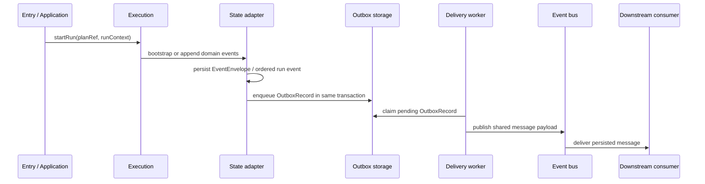
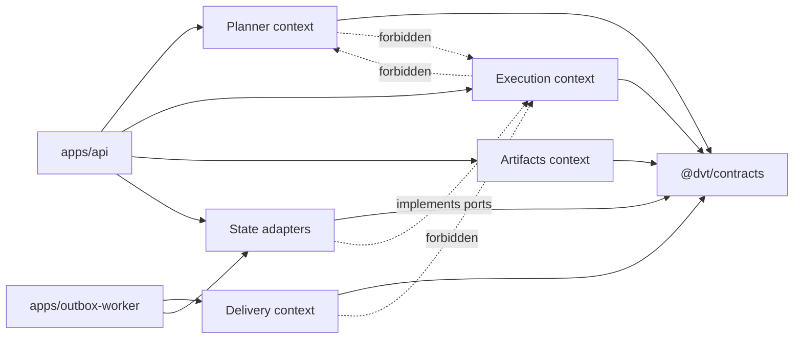
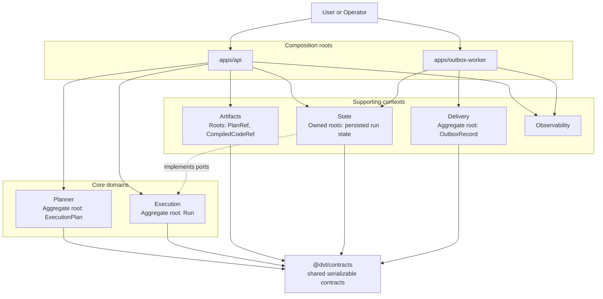

# ADR-0034 - Bounded Context Boundaries And Communication Rules

## Status

Accepted.

## Context

The repository already declares independent bounded contexts, but the codebase
still contains structural drift that hides or violates those boundaries:

- peer domains are treated as independent in architecture docs, but
  `@dvt/engine` still depends on `@dvt/planner` in tests and package metadata;
- wrapper packages such as `@dvt/engine-contracts` and `@dvt/state-contracts`
  create artificial boundaries without owning contracts or behavior;
- operational delivery code is still mixed into domain surfaces that should
  stay focused on execution semantics;
- current imports do not consistently distinguish shared serializable contracts,
  domain-owned behavior ports, concrete adapters, and test-only helpers.

This drift creates three failures:

1. the package graph does not reflect the domain model;
2. imports do not express ownership;
3. tests can reintroduce forbidden couplings even when runtime code is clean.

The repository needs one canonical decision that states:

- which bounded contexts exist;
- which aggregates and roots they own;
- which package categories may import each other;
- which communication mechanisms are valid between independent contexts.

## Decision

DVT uses bounded contexts with explicit ownership, explicit communication
boundaries, and one-way dependency rules.

### 1. Bounded contexts and owned roots

The repository recognizes these bounded contexts as the canonical model.

| Context             | Kind                         | Core responsibility                                                                    | Aggregate root or owned root                                                        | Current or target package home                       |
| ------------------- | ---------------------------- | -------------------------------------------------------------------------------------- | ----------------------------------------------------------------------------------- | ---------------------------------------------------- |
| Planner             | core domain                  | Build deterministic execution plans from canonical inputs                              | `ExecutionPlan`                                                                     | `@dvt/planner`                                       |
| Execution           | core domain                  | Orchestrate run lifecycle and enforce execution invariants                             | `Run`                                                                               | `@dvt/engine`                                        |
| State               | supporting context           | Persist ordered run facts, snapshots, and intent state with storage authority          | per-run persisted state under `IRunStateStore` and `IStartRunIntentStore` contracts | state adapters such as `@dvt/adapter-postgres`       |
| Artifacts           | supporting context           | Store immutable plan and compiled-code artifacts and expose stable references          | immutable artifact blobs and refs such as `PlanRef` and `CompiledCodeRef`           | currently split; target is `@dvt/artifacts`          |
| Delivery            | supporting context           | Drain outbox records and publish persisted events without owning run semantics         | `OutboxRecord`                                                                      | currently split; target is `@dvt/delivery`           |
| Observability       | supporting technical context | Provide logs, traces, metrics, and audit correlation without becoming domain authority | telemetry facades and correlation utilities, not business aggregates                | `@dvt/observability`, `@dvt/observability-otel`      |
| Entry / Application | composition layer            | Compose domains and adapters into runnable use cases and processes                     | application service or host root, not domain aggregates                             | `apps/api`, `apps/outbox-worker`, future entrypoints |

### 2. Aggregate and component ownership details

#### 2.1 Planner context

- Owns deterministic plan assembly.
- Owns `ExecutionPlan` as the planner aggregate root.
- Owns planner-specific policies, node selection, graph construction, and step
  assembly.
- Must not call execution or state runtime internals directly.

#### 2.2 Execution context

- Owns `Run` as the execution aggregate root.
- Owns lifecycle transitions, run invariants, signal semantics, idempotency
  semantics, and provider delegation policy.
- Consumes plan references and shared contracts; it does not construct plans.
- Must not import planner services, planner internals, or planner test helpers.

#### 2.3 State context

- Owns storage authority for ordered persisted events, snapshots, run metadata,
  and start-run intent durability.
- Must not own execution semantics or provider behavior.
- Implements execution-owned ports; it does not define execution policy.
- The allowed dependency direction is adapter-to-port only: state adapter
  packages import execution-owned ports in order to implement them, but
  execution packages do not import state packages or storage implementations.

#### 2.4 Artifacts context

- Owns immutable artifact storage and retrieval concerns.
- Covers immutable plan blobs addressed by `PlanRef`, compiled-code blobs
  addressed by `CompiledCodeRef`, and future immutable execution-adjacent
  artifacts that are referenced by stable refs instead of being embedded in run
  state.
- Supports four operations only: publish or store immutable bytes, resolve or
  retrieve by stable ref, expose integrity metadata such as hash and size, and
  apply retention or access policy.
- Owns artifact storage boundaries and reference semantics, not planner policy
  or run lifecycle.
- Per ADR-0018, the serializable ref shapes still live in `@dvt/contracts`;
  artifact-specific ports and implementations belong to the artifact owner
  package once that package is extracted.
- `@dvt/artifacts` is the canonical package home for artifact-context
  application services, ports, and domain policies.
- `@dvt/artifacts` must not redefine shared refs such as `PlanRef` or
  `CompiledCodeRef`; those stay physically hosted in `@dvt/contracts`.
- Concrete artifact storage adapters such as S3, MinIO, filesystem, or cloud
  vendor clients live outside the owner package and plug in through
  artifact-owned ports.
- Artifact-boundary extraction is a priority follow-up, not an optional cleanup:
  planner and execution packages must not accumulate new direct artifact-storage
  responsibilities while the dedicated boundary is still being extracted.
- Planner and traceability may depend on artifact contracts, but artifact
  adapters must not depend on planner or execution internals.

#### 2.5 Delivery context

- Owns outbox draining, retries, DLQ handling, shard ownership, and publication
  wiring.
- It is operational infrastructure over persisted domain events.
- `@dvt/delivery` is the canonical package home for delivery-context
  application logic, ports, worker orchestration, and delivery policies such as
  retry, sharding, and fencing.
- `@dvt/delivery` must not redefine `OutboxRecord`; shared delivery payload
  shapes remain in `@dvt/contracts`.
- Concrete publishers, buses, and delivery-side storage implementations live
  outside the owner package and are injected through delivery-owned ports.
- `apps/outbox-worker` is a composition root for `@dvt/delivery`; it must not
  remain the long-term owner of delivery logic.
- It must not own run state truth, run transitions, or planner policy.

#### 2.6 Observability context

- Is a supporting technical context, not a business domain with a business
  aggregate root.
- Owns telemetry-facing facades such as `IObservability`, cardinality policy,
  trace correlation helpers, and concrete exporter adapters such as OpenTelemetry
  bindings.
- The facade package must remain lightweight and exporter-free: it may expose
  contracts, no-op implementations, and label-cardinality policy, but it must
  not pull OpenTelemetry SDKs or provider-specific runtime dependencies.
- Follows the same import rule as the rest of the repository: domain packages
  may depend on a stable observability facade, but they must not depend on
  concrete OTel implementations, app-local loggers, or provider-specific
  telemetry code.
- Concrete observability implementations are composed and injected at
  application roots.
- Must never become the source of truth for run state, planner policy, or
  delivery ownership.

### 3. Composition roots

Bounded contexts do not compose each other directly.

Composition is performed by entrypoint applications and runtime hosts.

Canonical composition roots are:

- `apps/api` for planner + execution + state + provider adapters;
- `apps/outbox-worker` for `@dvt/delivery` + state adapter + concrete publisher
  wiring;
- future operational services for traceability, read models, and artifact
  access.

Composition roots may know multiple contexts.
Peer domain packages must not.

### 4. Communication rules

#### 4.1 Peer contexts communicate through contracts, messages, or refs

Independent bounded contexts must communicate through one of these mechanisms:

- immutable shared contracts in `@dvt/contracts`;
- immutable references such as `PlanRef`, `CompiledCodeRef`, and `EngineRunRef`;
- persisted messages or events such as `EventEnvelope` and `OutboxRecord`;
- application-layer orchestration in a composition root.

Peer bounded contexts must not communicate by importing each other's domain
services, aggregates, or package-local internals.

Logical ownership of a concern does not change ADR-0018's physical rule:
serializable cross-context shapes are still exported from `@dvt/contracts`.
This includes persisted envelope and outbox payload shapes such as
`EventEnvelope` and `OutboxRecord`.

#### 4.2 Ports are for domain-to-infrastructure relationships

Strategies, adapters, and interfaces are valid only when a domain defines a
replaceable infrastructure dependency.

Examples:

- execution owns `IRunStateStore`, `IStartRunIntentStore`, and
  `IProviderAdapter`;
- state and provider adapters implement those ports.

Ports are not the primary mechanism for peer domain communication.
Peer domain communication uses shared contracts, refs, or messages.

Execution must not import persistence-internal DTOs from state packages.
If a state-shaped DTO is genuinely consumed across contexts, it must be
published as a serializable shared contract in `@dvt/contracts` with State
declared as the semantic owner.
If the shape exists only to describe storage internals or adapter-local
projection state, it remains private to the state package and Execution may not
depend on it.

#### 4.3 Cross-context sync calls are mediated by the application layer

If a workflow requires planner output to reach execution:

1. the application layer invokes planner;
2. planner produces a stable artifact or contract result;
3. the application layer passes a stable reference or contract to execution.

Execution must not invoke planner directly.
Planner must not invoke execution directly.

#### 4.4 Persisted message flow is execution -> state -> delivery

The persistent message path is:

1. execution produces domain facts to be persisted;
2. the state adapter persists the ordered event envelope and enqueues an
   `OutboxRecord` atomically;
3. delivery claims pending `OutboxRecord` entries, applies retry and DLQ
   policy, and publishes them to the configured bus;
4. downstream consumers react to the published message or project their own
   read models without importing execution internals.



`EventEnvelope` is produced on the execution write path.
`OutboxRecord` is produced by the state adapter as delivery metadata in the same
atomic persistence boundary.
Both are serializable cross-context contracts and therefore belong in
`@dvt/contracts` per ADR-0018.
Delivery is the only context allowed to drain, retry, shard, fence, dead-letter,
or mark those records as published.

#### 4.5 Worked example: planner hands off by ref, not by service import

The canonical happy path is:

```ts
const planRef = await planner.buildPlan(input);
const runRef = await workflowEngine.startRun(planRef, runContext);
```

Interpretation:

1. `apps/api` invokes planner and receives a stable `PlanRef`.
2. Planner may use the artifact boundary to store plan bytes, but it does not
   call execution.
3. `apps/api` passes the `PlanRef` to execution.
4. Execution validates and consumes the ref without importing planner services
   or planner internals.

#### 4.6 Concrete composition example from the current repo

The current repository already contains the application-layer composition that
this ADR expects.

At the composition root, `apps/api` constructs `WorkflowEngine` and injects
state, intent, projector, adapter, policy, and observability dependencies:

```ts
const stateAdapter = new PostgresStateStoreAdapter({ connectionString: databaseUrl });
const intentStore = new PostgresStartRunIntentStore({ connectionString: databaseUrl });
const projector = new SnapshotProjector();
const mockAdapter = new MockAdapter({ stateStore: stateAdapter, projector });

const engine = new WorkflowEngine({
  stateStore: stateAdapter,
  outbox: stateAdapter,
  projector,
  idempotency: new IdempotencyKeyBuilder(),
  clock: { nowIsoUtc: () => new Date().toISOString() },
  authorizer: new AllowAllAuthorizer(),
  planRefPolicy: new PlanRefPolicy({
    allowedSchemes: ['https', 's3', 'gs', 'azure'],
  }),
  intentStore,
  adapters: new Map([['mock', mockAdapter]]),
  observability,
});

const useCase = new EngineStartRunUseCase(engine);
```

On the application path, the API command model carries a `planRef` value object
and the use case forwards only the shared contract fields required by
`IWorkflowEngine.startRun()`:

```ts
const ref = await this.engine.startRun(
  {
    uri: command.planRef.uri,
    sha256: command.planRef.sha256,
    schemaVersion: command.planRef.schemaVersion,
    planId: command.planRef.planId,
    planVersion: command.planRef.planVersion,
  },
  {
    tenantId: context.scope.tenantId.value,
    projectId: context.scope.projectId?.value ?? '',
    environmentId: context.scope.environmentId?.value ?? '',
    runId: command.runId,
    targetAdapter: command.targetAdapter,
    logicalAttemptId: 1,
  }
);
```

Error handling on that path is also already layered:

1. `startRunRoute` rejects malformed request bodies such as invalid `planRef`
   with HTTP `400`;
2. `StartRunAuthorizedFacade` turns authentication and authorization failures
   into explicit facade results instead of leaking HTTP concerns into the
   domain;
3. `EngineStartRunUseCase` does not swallow engine errors;
4. `WorkflowEngine.startRun()` validates `PlanRef` through `parsePlanRef()`,
   validates schema and policy preconditions before adapter dispatch, and then
   propagates domain errors if validation or persistence fails.

The important point is that `planRef` remains a shared serializable reference:
it contains location and integrity metadata, not planner internals or plan
bytes, and the engine normalizes it via `parsePlanRef()` before use.

### 5. Import rules

Imports must express ownership.

| Imported thing                                               | Canonical import location                                 | Rule                                                                     |
| ------------------------------------------------------------ | --------------------------------------------------------- | ------------------------------------------------------------------------ |
| Shared serializable DTOs, refs, schemas, persisted envelopes | `@dvt/contracts` or explicit subpaths of `@dvt/contracts` | Default cross-context import surface                                     |
| Domain-owned behavior ports                                  | the owning domain package                                 | Ports stay with the domain that defines the need                         |
| Domain services, aggregates, policies                        | the owning domain package                                 | Only composition roots and the owning package may wire them              |
| Technical support facades such as observability              | the owning support package such as `@dvt/observability`   | Domains may depend on the facade, never on the concrete exporter adapter |
| Concrete adapters and implementations                        | adapter packages or app roots                             | Not imported by peer domains                                             |
| Test doubles, in-memory stores, stubs                        | `package/testing` subpath                                 | Never exported from the production root surface                          |

### 6. Package boundary rules

#### 6.1 Wrapper packages without unique ownership are forbidden

Packages that only re-export another package without owning contracts,
behavior, or validation are forbidden architectural surfaces.

As a consequence:

- `@dvt/engine-contracts` is not a valid long-term boundary;
- `@dvt/state-contracts` is not a valid long-term boundary.

Narrow import surfaces must be expressed through export maps on the owner
package, not through empty satellite packages.

#### 6.2 `@dvt/contracts` is a governed shared kernel, not a neutral dump

Serializable cross-package contracts remain physically hosted in
`@dvt/contracts` unless a separate ADR explicitly changes ownership.

That does not make `@dvt/contracts` an ownerless neutral zone.

The governance rule is:

1. `@dvt/contracts` is a shared-kernel package governed by ADR-0018 and
   repository contract governance, not by ad hoc convenience imports;
2. every exported contract family must have a declared owning bounded context
   even when the physical export lives in `@dvt/contracts`;
3. adding a new contract to `@dvt/contracts` requires proving that the shape is
   serializable, cross-context, and not better owned by a domain package;
4. `@dvt/contracts` must not become the place where contexts dump internal DTOs
   just to avoid choosing an owner.

This ADR does not supersede ADR-0018.
It makes the ownership and boundary implications explicit while ADR-0018 is
applied.

#### 6.3 Allowed and forbidden contents of `@dvt/contracts`

Allowed contents are:

- serializable DTOs, refs, identifiers, event-envelope shapes, and persisted
  message shapes;
- machine-readable schemas and compatibility artifacts required by ADR-0005 and
  ADR-0017;
- boundary validators or parsers that exist only to validate those serializable
  contracts at runtime.

Forbidden contents are:

- domain services, policies, aggregates, and business rules;
- infrastructure adapters, storage implementations, network clients, and side
  effects;
- convenience utilities unrelated to boundary validation;
- behavior ports that express domain-owned behavior rather than a shared
  serializable contract.

Put differently: `@dvt/contracts` may contain contract-validation logic, but it
must not contain domain logic.

#### 6.4 Versioning and compatibility for `@dvt/contracts`

`@dvt/contracts` is not versionless glue.

Its governance follows these rules:

1. breaking semantic changes to exported contracts require a major-version
   change and compatibility treatment per ADR-0005;
2. additive backward-compatible contract evolution uses minor-version updates;
3. non-semantic clarification stays patch-level;
4. consumers such as planner, execution, artifacts, delivery, and adapters must
   declare and test against compatible contract ranges;
5. contracts that affect multi-context execution paths, such as `ExecutionPlan`
   and `PlanRef`, require machine-readable compatibility artifacts and CI checks
   per ADR-0017 instead of relying on coordinated guesswork.

If planner changes a shared contract shape in a breaking way without versioning
or compatibility artifacts, that change is invalid by policy.

#### 6.5 Test boundaries are real boundaries

Package-level tests must follow the same bounded-context rules as production
code.

Therefore:

- `@dvt/engine` tests must not import `@dvt/planner`;
- `@dvt/planner` tests must not import `@dvt/engine`;
- cross-context compatibility tests belong in composition-root or dedicated
  integration surfaces, not inside one peer domain package.

Recommended homes for cross-context compatibility tests are:

- composition-root integration tests under `apps/*/test`;
- dedicated compatibility workspaces following the existing `packages/test` and
  `contracts/compat` pattern;
- a future top-level compatibility workspace if the current dedicated surfaces
  stop being sufficient.

### 7. Canonical dependency direction

The allowed dependency direction is:



Notes:

- `State --> Execution` is allowed only as an implementation dependency from a
  state adapter package into execution-owned behavior ports. It does not mean
  execution imports state.
- `Planner <-> Execution` direct imports are forbidden.
- `Delivery -> Execution` direct imports are forbidden once delivery logic is
  extracted from execution.

### 8. Visual context map



### 9. Consequences

Positive:

- package boundaries now reflect domain ownership;
- imports become a design signal instead of a convenience shortcut;
- peer-domain coupling becomes mechanically detectable;
- outbox and artifact extractions have a canonical destination and rule set.

Negative:

- some existing packages and tests become invalid and must be refactored;
- export maps and testing subpaths need tightening across multiple workspaces;
- transitional duplication may exist briefly while imports are migrated.

## Implementation guidance

This ADR authorizes the following follow-up work and migration order:

1. tighten owner package export maps so the intended public surfaces exist
   before imports are migrated, especially `@dvt/contracts` subpaths and
   `package/testing` subpaths;
2. migrate consumers from wrapper packages to the owner package surfaces;
3. delete wrapper packages such as `@dvt/engine-contracts` and
   `@dvt/state-contracts` once residual references reach zero;
4. move test doubles and in-memory helpers behind explicit `*/testing`
   surfaces, then update package tests to respect the same context rules as
   production code;
5. remove peer-domain test coupling such as `@dvt/engine` tests importing
   `@dvt/planner`;
6. extract artifact storage ports and application logic into `@dvt/artifacts`,
   keep concrete storage adapters outside the owner package, and stop adding
   new direct artifact-handling logic to planner or execution roots during the
   transition;
7. extract delivery or outbox runtime code from execution package roots into
   `@dvt/delivery`, keeping concrete publishers and stores outside the owner
   package;
8. relocate cross-context compatibility tests to integration or composition
   surfaces;
9. enforce package-boundary rules in package manifests, lints, and arch tests.

### Transitional duplication rule

Temporary duplication during migration is allowed only under these constraints:

1. the owner package remains the canonical source of truth;
2. temporary aliases are owner-controlled re-exports or compatibility entry
   points, not new satellite packages with fake ownership;
3. the alias is explicitly marked as transitional in code or package metadata;
4. migration removes downstream references until residual imports reach zero;
5. the alias is deleted once residual references reach zero.

Do not create new wrapper packages as a migration tactic.

### Enforcement target

These rules must be made mechanically enforceable.

The target enforcement stack is:

1. package `exports` maps that expose only approved public entrypoints;
2. package manifest dependencies that do not declare forbidden peer-domain
   imports;
3. `eslint` `no-restricted-imports` rules for known forbidden pairings and
   legacy barrels;
4. `dependency-cruiser` or equivalent arch tests for workspace-level dependency
   direction, following the pattern already used by `apps/api`;
5. package-local tests that fail if a package test reaches across a forbidden
   context boundary;
6. existing repo validation commands such as `pnpm type-check`,
   `pnpm docs:quality:check`, and affected package tests.

Where a gate is not yet wired, this ADR authorizes adding it as part of the
refactor instead of relying on reviewer memory.

### Operational execution requirement

This ADR is a normative boundary decision, not the operational migration plan.

Before any substantial implementation slice starts under this ADR, the work
must have a companion execution plan in `GAP_EXECUTION_PLANS.md` or a dedicated
tracker that declares:

1. the slice owner;
2. the target date;
3. the touched packages and entrypoints;
4. the validation commands;
5. the rollback or residual-risk note.

At least one pilot package or application must prove the enforcement approach
before repository-wide rollout. The existing `apps/api` architectural test lane
is the first reference pattern for this enforcement style; other workspaces may
reuse that pattern or establish an equivalent repo-approved gate.

## Related

- [ADR-0003 - Execution Model Sovereignty](./ADR-0003-execution-model.md)
- [ADR-0004 - Event Sourcing Strategy](./ADR-0004-event-sourcing-strategy.md)
- [ADR-0018 - Shared Kernel Ownership Governance](./ADR-0018_Shared_Kernel_Ownership_Governance.md)
- [ADR-0032 - compiledCodeRef Ownership](./ADR-0032-compiledcoderef-ownership.md)
- [ADR-0033 - Outbox Worker Sharding And Fencing Model](./ADR-0033-outbox-worker-sharding-and-fencing-model.md)
