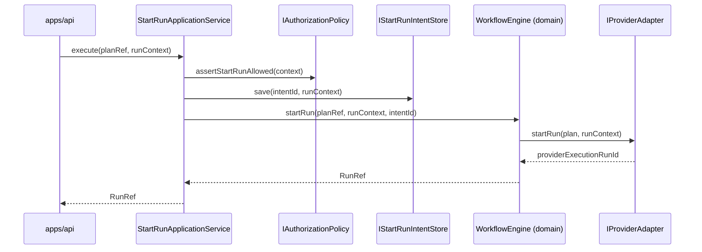

# ADR-0039 — Hexagonal Port Hardening and SOLID Remediation

## Status

Accepted.

## Context

The 2026-03-22 DDD and Hexagonal Port Audit
([20260322-ddd-hexagonal-port-audit.md](../planning/reviews/20260322-ddd-hexagonal-port-audit.md))
identified five structural gaps after Phase 1 gap closure (G1–G10):

| Finding | Violation                                                                                      |
| ------- | ---------------------------------------------------------------------------------------------- |
| F1      | `RunAccessPolicy` injected as concrete class — no port                                         |
| F2      | `WorkflowEngine` owns use case orchestration, domain service, and authorization simultaneously |
| F3      | `IRunStateStore` aggregates write, read, and maintenance under one interface                   |
| F4      | `WorkflowSnapshot` role is undeclared — aggregate state or CQRS read model                     |
| F5      | `providerSelection.ts` reads `process.env` inside `@dvt/engine`                                |

The Phase 2 roadmap already addresses F2 under S03 and F3 under S02.
This ADR makes the residual decisions: the `IAuthorizationPolicy` port (F1),
the `WorkflowSnapshot` classification (F4), and the `providerSelection` relocation
principle (F5).

## Decision

### 2.1 Extract `IAuthorizationPolicy` port (F1)

A new port `IAuthorizationPolicy` is declared in `@dvt/contracts` (or
`@dvt/engine/ports/`) with the following minimum contract:

```typescript
export interface IAuthorizationPolicy {
  /** Throws if the tenant is not allowed to start a run. */
  assertStartRunAllowed(context: StartRunContext): void | Promise<void>;
  /** Throws if the tenant cannot access a given run. */
  assertRunAccess(tenantId: string, runId: string): void | Promise<void>;
  /** Throws if the plan reference is not valid for this tenant. */
  assertPlanRefAllowed(tenantId: string, planRef: PlanRef): void | Promise<void>;
}
```

`RunAccessPolicy` becomes one implementation of this port.
`WorkflowEngine` is updated to accept `IAuthorizationPolicy` instead of the
concrete `RunAccessPolicy`.

Rate-limiting (`TokenBucketRateLimiter`) is separated from authorization. Rate
limiting is an infrastructure concern; it either:

- becomes a decorator around `IAuthorizationPolicy`, or
- is handled by the API layer (`apps/api`) as a pre-engine admission guard.

The execution domain must not own infrastructure rate-limit state.

**Invariants**

- `INV-AUTHPOL-001`: Every entry point that calls `WorkflowEngine.startRun()`
  must have injected a non-null `IAuthorizationPolicy`.
- `INV-AUTHPOL-002`: `RunAccessPolicy` must remain a valid default
  implementation; no behavior changes are permitted alongside this refactor.
- `INV-AUTHPOL-003`: Test doubles implementing `IAuthorizationPolicy` are
  permitted in unit tests; they must not appear in production composition roots.

**Physical location rule** (extends ADR-0018 §3)

- The interface `IAuthorizationPolicy` is declared in `@dvt/contracts` (shared
  contract — used by engine and API layer).
- Concrete implementations live in `apps/api` (if API-specific) or in
  `@dvt/engine` (if domain-generic).
- The rate-limit implementation stays in `@dvt/engine/security/` but is no
  longer injected into `WorkflowEngine` directly.

---

### 2.2 StartRun extraction principle (F2 — implements S03)

This decision formalizes the extraction contract so that S03 implementation work
has a canonical shape to target.

`WorkflowEngine` is the **domain service** for the Execution bounded context.
Its responsibilities are:

- own lifecycle invariants for `Run` transitions;
- delegate to `IProviderAdapter` for execution;
- apply domain policies received through ports.

`WorkflowEngine` must not:

- own use case orchestration (intent log + bootstrap + compensation);
- perform authorization checks internally;
- read environment variables.

A new `StartRunApplicationService` (or equivalent use case class) in
`@dvt/engine/application/` takes responsibility for:

1. invoking `IAuthorizationPolicy.assertStartRunAllowed`;
2. persisting the start-run intent via `IStartRunIntentStore`;
3. calling `WorkflowEngine.startRun()` (domain method);
4. executing compensation (`emit RunFailed`) on partial failure.



**Invariants**

- `INV-SRAS-001`: `WorkflowEngine` must not import `IStartRunIntentStore` after
  S03 completes.
- `INV-SRAS-002`: `WorkflowEngine` must not import `IAuthorizationPolicy` after
  S03 completes.
- `INV-SRAS-003`: The compensation path (emit `RunFailed` on failure) lives in
  `StartRunApplicationService`, not in `WorkflowEngine`.

---

### 2.3 IRunStateStore split principle (F3 — implements S02)

This decision formalizes the split contract so that S02 has a canonical shape.

`IRunStateStore` is split into three focused interfaces:

| Interface              | Role                                       | Methods                                                                            |
| ---------------------- | ------------------------------------------ | ---------------------------------------------------------------------------------- |
| `IRunWriteStore`       | Command path — write domain facts          | `bootstrapRunTx`, `appendEvent`, `updateRunMetadata`, `saveProviderRef`            |
| `IRunReadStore`        | Query path — read current state            | `getRunEvents`, `getRunSnapshot`, `getRunsByTenant`, `getRunStatus`                |
| `IRunMaintenanceStore` | Operational path — projector, purge, admin | `rebuildSnapshot`, `listStaleSnapshotRuns`, `markDelivered`, `countPendingByRunId` |

A `IRunStateStore` compatibility alias remains as an intersection type
(`IRunWriteStore & IRunReadStore & IRunMaintenanceStore`) for the transition
period. `PostgresStateStoreAdapter` implements all three.

**Invariants**

- `INV-RSTORE-001`: `WorkflowEngine` depends on `IRunWriteStore` only.
- `INV-RSTORE-002`: `apps/api` query endpoints depend on `IRunReadStore` only.
- `INV-RSTORE-003`: `apps/projector-worker` depends on `IRunMaintenanceStore`
  and `IRunReadStore` only.
- `INV-RSTORE-004`: No adapter implements only the compatibility alias without
  also implementing all three sub-interfaces.

---

### 2.4 WorkflowSnapshot is a CQRS read model, not a write-side aggregate (F4)

**Formal classification**: `WorkflowSnapshot` is a **materialized CQRS read
model**. It is not an aggregate root or a write-side invariant holder.

Consequences of this classification:

1. **Source of truth is the event stream**, not the snapshot. Any component that
   needs authoritative state must be able to rebuild from `getRunEvents()` +
   `applyRunEvent()`.
2. **Snapshot is a cache**. Serving status queries from the snapshot table is an
   optimization, not a semantic guarantee. Stale snapshots are acceptable until
   the next rebuild.
3. **Shape changes require versioning**. If `WorkflowSnapshot` gains or loses a
   field, a migration of the `run_snapshots` table is required. The snapshot
   shape is therefore a persistent schema, not an ephemeral in-memory DTO.
4. **`applyRunEvent` defines the read model derivation function**. Its output
   shape is the canonical snapshot shape. Adapters must not produce snapshots by
   any other means.

**Invariants**

- `INV-SNAP-001`: The `run_snapshots` row is always rebuildable from
  `run_events` via `applyRunEvent`. If they diverge, `run_events` wins.
- `INV-SNAP-002`: A snapshot schema change is a migration event. It must be
  tracked in `schema_migrations` (per S06).
- `INV-SNAP-003`: `applyRunEvent` is the only function permitted to produce a
  `WorkflowSnapshot` from events. No adapter may construct snapshots
  independently.

---

### 2.5 Provider selection must not live inside `@dvt/engine` (F5)

`providerSelection.ts` (env-var resolution + adapter registry construction) is
relocated to the composition root (`apps/api/src/bootstrap/` or equivalent).

`@dvt/engine` exports `WorkflowEngine` and ports only. It must not export
`buildAdapterRegistry` or any function that reads `process.env`.

**Invariants**

- `INV-PROVSEC-001`: `@dvt/engine` must not import `process.env` at module scope
  or in any exported function.
- `INV-PROVSEC-002`: Adapter instantiation is performed in the composition root
  only.

## Consequences

### Positive

- `WorkflowEngine` becomes testable with a no-op `IAuthorizationPolicy` — unit
  test setup is dramatically reduced.
- Narrow role interfaces (`IRunWriteStore`, `IRunReadStore`) mean test doubles
  implement only 4–6 methods instead of 20+.
- `WorkflowSnapshot` versioning is explicit — snapshot drift is detected at
  migration time, not silently in production.
- Composition roots own all infrastructure wiring — adding a new entrypoint
  (e.g., gRPC API, CLI runner) does not require touching domain packages.
- S02 and S03 now have canonical interface shapes to implement against.

### Negative / Trade-offs

- Two refactors (S02, S03) are required before all invariants above can be
  enforced via dependency-cruiser rules.
- The `IRunStateStore` compatibility alias introduces temporary dual-surface
  maintenance during S02 transition.
- Moving `providerSelection.ts` out of `@dvt/engine` changes the public export
  surface — consumers that import `buildAdapterRegistry` from `@dvt/engine`
  must update their imports.

## Rationale

### Why `IAuthorizationPolicy` in `@dvt/contracts` rather than `@dvt/engine/ports/`?

`IAuthorizationPolicy` is consumed by both `WorkflowEngine` and `apps/api` (as a
pre-flight guard). If declared in `@dvt/engine/ports/`, the API layer must import
from the engine package to reference the interface, which creates an
engine→api import direction reversal risk. Declaring it in `@dvt/contracts` keeps
it as a shared cross-context contract, consistent with how `IProviderAdapter` and
`IObservability` are handled.

### Why classify `WorkflowSnapshot` as a read model rather than an aggregate?

Aggregate roots hold invariants and control writes. `WorkflowSnapshot` holds no
invariants — no method on it rejects invalid transitions. All invariant logic is
in `applyRunEvent`, which is a pure function that returns a new snapshot. The
snapshot is therefore an output of domain logic, not the holder of it. This is
the canonical CQRS read-model pattern.

### Why not merge S02, S03, and F1 into one PR?

They have sequential dependencies:

- S02 (split `IRunStateStore`) must land before S03, because
  `StartRunApplicationService` will depend on `IRunWriteStore`, not on the
  monolithic interface.
- F1 (`IAuthorizationPolicy`) can land before or after S02 — it is orthogonal.
- S03 depends on both S02 (for the write store port) and F1 (to remove
  authorization from `WorkflowEngine`).

Recommended order: F1 → S02 → S03.

## References

- [20260322 DDD and Hexagonal Port Audit](../planning/reviews/20260322-ddd-hexagonal-port-audit.md)
- [ADR-0034 — Bounded Context Boundaries](ADR-0034-bounded-context-boundaries-and-communication-rules.md)
- [ADR-0018 — Contracts Package Ownership](ADR-0018-contracts-package-ownership.md)
- [Phase 2 Roadmap — S02 and S03](../planning/proposals/phase2-arch-debt-roadmap-20260315.md)
- [2026-03-14 Domain Cohesion Review](../planning/reviews/20260314-domain-cohesion-review.md)
