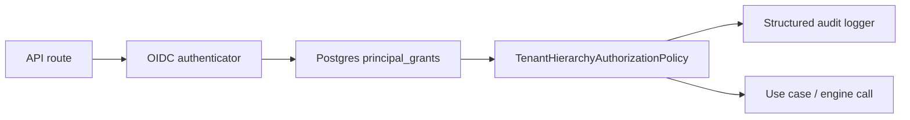
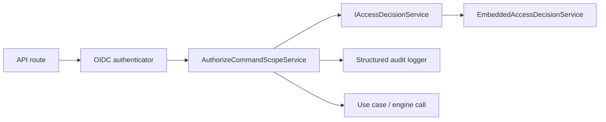
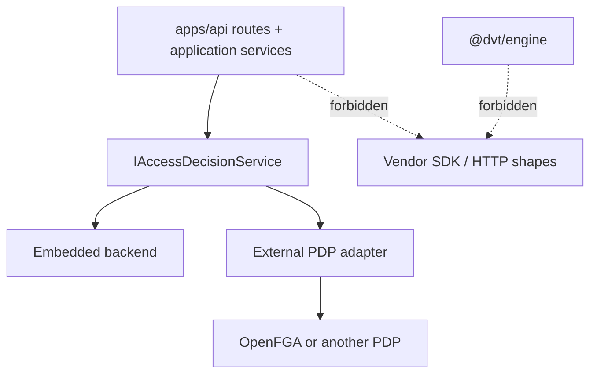

# ADR-0051 - Access decision service and embedded-first adapter boundary

## Status

Accepted.

## Context

The current protected API authorization stack mixes three concerns inside
`apps/api`:

- principal authentication through OIDC/JWKS;
- policy evaluation through app-local grant storage and hierarchy logic;
- authorization audit emission.

That shape is not the target state for a multi-tenant control plane:

- `apps/api` becomes the effective owner of RBAC policy semantics;
- the authorization model is physically tied to `principal_grants` storage;
- the rest of the API can import authorization details as app-local
  implementation instead of through one explicit boundary;
- replacing the policy engine requires application-layer rewrites.

The system review on 2026-04-23 also accepted a hard-cut direction:

- no fallback local policy;
- no dual-write or compatibility layer;
- no direct vendor calls outside one adapter seam;
- no general RBAC ownership inside `@dvt/engine`.

The first implementation decision was refined the same day:

- the first backend should be embedded to avoid introducing another remote
  network hop in the protected request path;
- the boundary must still stay pluggable so a future external PDP such as
  OpenFGA can replace the backend without rewriting route or use-case code.

## Decision

### 1. `apps/api` uses one application-owned access-decision contract

Protected API routes MUST authorize through one application-facing port:
`IAccessDecisionService`.

That contract is DVT-owned. It expresses:

- authenticated principal;
- requested action and explicit resource scope;
- allow or deny decision;
- approved execution scope for downstream use cases.

The canonical action names and action objects live in
`apps/api/src/application/ports/accessDecision.ts` together with the explicit
resource discriminants `tenant`, `project`, `environment`, and
`workspace-graph-draft`.

The rest of `apps/api` MUST depend on this DVT contract, not on OpenFGA SDK
types, tuple shapes, relation names, or HTTP APIs.

### 2. The first concrete implementation is embedded

The first backend is an embedded access-decision service composed inside the
protected runtime.

That embedded backend is an implementation detail behind
`IAccessDecisionService`. It is allowed to evaluate the current DVT action and
scope vocabulary locally, but `apps/api` route and application code MUST still
depend only on the DVT-owned port.

The previous `PostgresPrincipalAccessRepository` plus
`TenantHierarchyAuthorizationPolicy` split is removed from the active runtime
path. The embedded backend becomes the single decision owner for the first
iteration.

### 3. External PDP adapters remain allowed behind the same contract

External PDPs such as OpenFGA MAY be introduced later, but only as additional
infrastructure adapters behind `IAccessDecisionService`.

Vendor-specific details such as:

- API URL;
- store id;
- authorization model id;
- bearer token;
- tuple-check HTTP payloads;
- vendor relation naming;
- object id formatting;

MUST stay inside that adapter and its tests.

`apps/api` MUST NOT call vendor-specific authorization APIs directly from
routes, use cases, or application services.

### 4. The API boundary is the policy enforcement point

The protected API remains the policy enforcement point (PEP):

- authenticate bearer token;
- build requested scope;
- call `IAccessDecisionService`;
- deny or allow before use-case execution;
- audit every decision.

The policy decision point (PDP) is provided by the configured
`IAccessDecisionService` backend.

### 5. `@dvt/engine` does not own general RBAC policy

`@dvt/engine` MUST NOT own user or role-based authorization policy.

The engine may continue to validate runtime scope integrity, tenant context,
and any future signed authorization envelope integrity required by security
invariants, but it MUST NOT import or depend on backend-specific authorization
details or app-local route policy code.

### 6. No fallback authorization policy remains in the protected runtime

The protected runtime MUST NOT keep a second authorization policy engine for
normal user calls.

The previous app-local grant store and hierarchy policy split are removed from
the active runtime path. There is one configured access-decision backend. If
that backend cannot return a decision, the request fails closed.

### 7. Route-to-resource mapping is DVT-owned

The DVT contract owns the route-facing action vocabulary and its mapping to
resource scopes. The initial canonical mapping is:

| API route family                              | DVT action                   | DVT scope resource owner              |
| --------------------------------------------- | ---------------------------- | ------------------------------------- |
| `POST /runs/start`                            | `run:start`                  | environment scope                     |
| `POST /plans/preview`                         | `run:start`                  | environment scope                     |
| `POST /plans/compile`                         | `run:start`                  | environment scope                     |
| `POST /plans/import`                          | `run:start`                  | environment scope                     |
| `GET /runs`                                   | `run:list`                   | tenant, project, or environment scope |
| `GET /runs/:runId`                            | `run:view`                   | tenant scope                          |
| `GET /runs/:runId/events`                     | `run:logs:view`              | tenant scope                          |
| `POST /runs/:runId/signal` for `PAUSE/RESUME` | `run:signal`                 | tenant scope                          |
| `POST /runs/:runId/signal` for `CANCEL`       | `run:cancel`                 | tenant scope                          |
| `POST /runs/:runId/cancel`                    | `run:cancel`                 | tenant scope                          |
| `POST /runs/:runId/recover`                   | `run:retry`                  | tenant scope                          |
| `GET /workspace/graph/draft`                  | `workspace:graph-draft:view` | workspace draft scope                 |
| `PUT /workspace/graph/draft`                  | `workspace:graph-draft:save` | workspace draft scope                 |
| `POST /admin/runs/:runId/rebuild-snapshot`    | `admin:rebuild-snapshot`     | tenant scope                          |

Any backend maps this DVT contract into its own internal decision model.

## Architecture

### Previous shape

### Target shape

### Future externalization path

## Consequences

- The authorization boundary becomes explicit and replaceable.
- `apps/api` stops owning a scattered app-local repository-plus-policy stack.
- The first cut avoids a remote authorization hop in the protected request
  path.
- Future external PDP adoption remains a backend swap as long as the
  DVT-owned contract stays stable.
- Security and architecture docs must describe the DVT-owned contract and the
  embedded-first posture instead of treating OpenFGA as a mandatory first
  dependency.

## Validation Requirements

The implementation of this ADR must include:

- unit tests for the DVT-owned access decision contract service;
- architecture tests proving the protected security builder wires the embedded
  access-decision service instead of the removed Postgres grant repository and
  hierarchy policy;
- documentation updates for the protected runtime auth/authz component map.

If an external adapter is introduced later, that slice must also add:

- backend-specific adapter mapping tests;
- conformance tests that prove the embedded and external backends satisfy the
  same DVT-owned contract.

## Related Sources

- `docs/planning/reviews/architecture-and-governance/20260423-dvt-plus-system-architecture-review.md`
- `docs/architecture/components/api/api-current-to-target-architecture.md`
- `docs/architecture/components/engine/security/SECURITY_INVARIANTS.v1.md`
- `docs/adr/ADR-0003-execution-model.md`
- `docs/adr/ADR-0034-bounded-context-boundaries-and-communication-rules.md`
