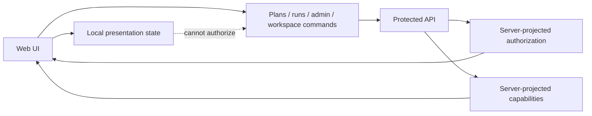

# ADR-0056: Web UI Authority Is Server-Projected

## Status

Accepted.

## Context

The web/API integration hardcut removed product mock runtime selection from the
web composition root. The remaining authority drift is smaller but still
material:

- `authorizationStore` can expose optimistic permissions before an API read
  model grants them.
- runtime capabilities can fall back to frontend-local data when `/capabilities`
  cannot be reached.
- the static plugin registry can interpret missing backend plugin capability
  rows as availability.

Those behaviors are acceptable for presentation-only route chrome, but they are
not acceptable as authority for plan, run, admin, plugin, or workspace mutation
decisions.

## Decision

The web UI does not own execution, authorization, or backend capability
authority.

The web may:

- keep presentation state locally;
- show static plugin declarations;
- show disabled or degraded affordances when backend authority is unavailable;
- cache server-projected authorization and capability read models.

The web must not:

- default executable permissions to allowed;
- convert backend capability failures into executable readiness;
- treat a missing backend plugin capability row as available;
- use static plugin registry declarations as proof that backend execution is
  possible.

Server-owned authority is projected into web state by explicit API read models,
including `GET /session`, `GET /workspace/context`, and `/capabilities`.

## Architecture

## Consequences

- Default web authorization is fail-closed until hydrated by an authoritative
  read model or an explicit test double.
- Capability query failures remain visible as degraded UI state and do not
  enable backend-backed plugins.
- Static plugin contributions remain useful for route composition, but backend
  plugin execution readiness requires an explicit backend capability row.
- Static route declarations may remain in the route tree for guarded direct-link
  handling, but shell navigation and runtime plugin registries must still derive
  availability from backend capability rows.
- Tests may still inject permissions and capability payloads, but those doubles
  must stay explicit and test-only.

## Validation

- `apps/web/src/app/stores/authorizationStore.test.ts`
- `apps/web/src/app/plugins/registry.test.ts`
- `apps/web/src/app/services/composition/appServices.test.ts`
- `apps/web/src/app/services/composition/appServicesAuthorityHardcut.architecture.test.ts`
- `apps/web/src/app/views/PluginsView.test.tsx`

## Related Sources

- `docs/adr/ADR-0051-access-decision-service-and-openfga-adapter.md`
- `docs/adr/ADR-0055-server-owned-effective-workspace-context.md`
- `docs/planning/reviews/20260510-web-api-integration-gap-review.md`
- `docs/architecture/command-query-rail-governance.md`
