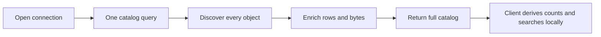
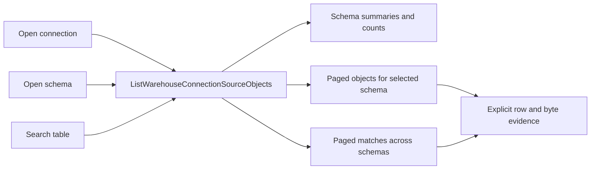

# ADR-0058: Warehouse Source Import Rails

## Status

Accepted. Extended 2026-09-06 by GH-2904 to admit explicit physical Source rebind and
2026-09-07 by GH-2173 to bound large source catalogs behind one paged query rail.

## Context

The Canvas source import capability requires backend-owned warehouse connection discovery,
source-object discovery and source registration. Browser fixtures and frontend constants
cannot be authority for API mode.

The same bounded context must also support replacing the physical binding of an already
persisted logical Source without reminting that Source or silently rewriting downstream
identity. Treating a connection/relation name as the Source identity would violate the
command/query rail rule and ADR-0064.

## Decision

Warehouse source import and physical rebind are owned by the protected runtime workspace
context.

The accepted rails are:

- `ListWarehouseConnections` query: returns the server-owned
  `WarehouseConnectionCatalog` read model.
- `ListWarehouseConnectionSourceObjects` query: returns the sole canonical, bounded
  `SourceObjectCatalogResponse` for one authorized connection. One rail exposes three
  request projections over the same live catalog authority: schema summaries with
  discoverable-object counts, an opaque-cursor page for one selected schema, and an
  opaque-cursor search page across every authorized schema in the connection. `SourceObject`
  remains provider-neutral and discriminates relation, file, endpoint and stream locators
  while keeping row-count and byte-size evidence explicit for each returned object.
- `ImportWarehouseSources` command: accepts a non-empty set of unique object-ID-only
  selections, resolves authoritative metadata from the server catalog, and appends new
  logical Source nodes to the authoritative `WorkspaceGraphAuthoringDraft`.
- `RebindWarehouseSource` command: identifies one existing logical Source by its persisted
  node ID and one requested target `connectionId/sourceObjectId`, discovers the target on
  the server, verifies schema compatibility, and replaces only physical binding/provenance
  coordinates while preserving logical graph and Substrait identity.

All rails require the existing authenticated protected runtime scope. Reads use
`workspace:source-import:view`; import uses `workspace:source-import:import`; rebind uses
`workspace:source-import:rebind`. Tenant, project and environment scope come from the
protected runtime request scope.

## Scope and storage authority

Authorization and storage scope are one boundary. `DVT_WORKSPACE_FILES_ROOT` is a storage
namespace, not a workspace. Every workspace-file and warehouse connection catalog operation
receives authorized `tenantId/projectId/environmentId` explicitly and resolves a
deterministic child root before reading or writing.

```text
authorized scope A --> scope storage key A --> workspace root A --> catalog/files
authorized scope B --> scope storage key B --> workspace root B --> catalog/files
```

Scope is an explicit application-port argument. It is not read from ambient request context
and is not inferred from a caller-supplied path. Local filesystem adapters own safe scope-key
projection/path containment; HTTP routes own authentication/authorization; application
services own command orchestration.

## Bounded catalog browsing

The catalog query loads the smallest useful projection for the user action. Opening a
connection returns schema summaries and object counts before object details. Opening one
schema returns only that schema's bounded object page. Search is evaluated server-side across
all schemas authorized for the connection and returns qualified `database.schema.object`
identity, including the schema needed to disambiguate equal table names.





The initial object counts describe discoverable catalog objects; they are not warehouse row
counts. Row-count and byte-size evidence remain object facts and preserve explicit
unavailable or estimated provenance. Catalog browsing must not perform exact `COUNT(*)` data
scans by default.

Opaque cursors, page limits, deadlines and truncation posture are server-owned. A cursor is
bound to authorized tenant, project, environment, connection, projection and filter state.
Unknown, stale, malformed or cross-scope cursors fail closed. Search accepts data, never SQL,
and cannot broaden connection authorization.

This is an evolution of `ListWarehouseConnectionSourceObjects`, not a new command/query
rail. The canonical lazy contract replaces the eager full-catalog contract in one hard cut;
transports, provider adapters and the web port implement the same product intent. No suffixed
v1/v2 contract family, version selector, compatibility parser, dual read, dual write or
forwarding export is retained. `SourceObjectCatalogRequest` and
`SourceObjectCatalogResponse` are the only public catalog request/response authority.

Import continues to resolve selected objects through server authority and must not trust a
partial client page as a complete catalog snapshot.

## Rationale

A full catalog is unnecessary before the user chooses a schema and grows provider work,
response bytes and browser memory with warehouse size. Schema-first summaries give immediate
orientation, scoped pages bound provider cost, and server-side search preserves discovery
across schemas. Keeping one rail avoids a second authorization and catalog authority while a
single canonical contract makes the behavior and authority explicit.

## Import identity

New graph-draft Sources receive DVT-owned opaque persisted node IDs. `ConnectedSourceRef`
is the exact connected physical binding used for import deduplication/resolution and is not
the logical Source identity.

An idempotency-key replay must never construct its response from a candidate draft the store
did not apply. A deduplicated save is answered from the persisted authoritative draft after
verifying the requested postcondition. Duplicate bindings, malformed input, unknown
connections/objects, unsupported locator kinds, unavailable discovery, missing scope/auth or
unauthorized actions fail closed.

## Rebind verification and atomicity

`RebindWarehouseSource` is not a generic draft-edit fallback. The server owns target facts
and verifies the operation before mutation:

1. the target node is one canonical imported warehouse Source with one `ConnectedSourceRef`;
2. the persisted logical Source has complete, unambiguous column schema evidence;
3. the target is a discovered relational object with complete, unambiguous columns;
4. column names, normalized provider type strings and nullability match independent of
   presentation order;
5. the requested connected binding is not already owned by another logical Source in the
   Canvas;
6. the target connection exposes the governed database user needed by the dbt source
   declaration;
7. a single logical Source cannot change source-group database/schema when that dbt source
   declaration contains sibling tables.

Missing evidence or semantic drift fails closed and requires explicit reconciliation outside
this command. There is no name fallback, old-connection lookup requirement, schema coercion,
dual read or dual write.

The command plans both mutations first. The dbt source artifact is written with revision CAS,
then the graph draft is written with draft CAS. If graph CAS fails, the artifact change is
compensated using the exact applied artifact revision. No split state is accepted as success.

A successful rebind preserves the Source node ID, graph edges, Substrait Plan bytes,
`RelationId` and `FieldId`. Only the exact matching semantic `sourceRef` plus physical
database/schema/identifier/connection metadata changes.

## Connector boundary

The connector adapter boundary is server-side. Postgres is the current supported relation
adapter. File, endpoint, stream and unsupported providers are rejected before graph or
workspace-file side effects; future adapters may implement the provider-neutral discovery
contract without changing logical Source identity semantics.

## Consequences

The Canvas/source workflows consume backend-owned warehouse metadata. Import creates logical
Source identity once; rebind can replace a compatible physical origin without rewriting
logical dependencies.

The dbt source declaration remains a projection/binding artifact. Source-group constraints
are protected explicitly rather than allowing one table-level command to mutate siblings.

## Validation

- `apps/api/test/entrypoints/http/warehouseSourceImportRoutes.test.ts`
- `apps/api/test/application/services/graphDraftWarehouseSourceImportStrategy.test.ts`
- `apps/api/test/application/services/rebindWarehouseSourceUseCase.test.ts`
- `packages/@dvt/contracts/test/dvt-substrait-source-rebind.contract.test.ts`
- `apps/web/src/app/views/canvas/canvasColumnProjectionAuthority.identity.test.ts`
- `apps/web/src/app/services/workspace/workspacePorts.api.test.ts`
- `packages/@dvt/contracts/test/source-import/SourceObjectCatalog.test.ts`
