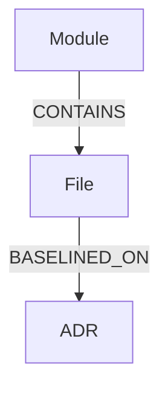

# Traceability Graph Model (Neo4j)

## Node Labels

- ADR
- File
- Module

## Relationships



```code
- (:File)-\[:BASELINED_ON\]-\>(:ADR)
- (:Module)-\[:CONTAINS\]-\>(:File)

```

---

## Constraints

```cypher
CREATE CONSTRAINT adr_number IF NOT EXISTS
FOR (a:ADR) REQUIRE a.number IS UNIQUE;

CREATE CONSTRAINT file_path IF NOT EXISTS
FOR (f:File) REQUIRE f.path IS UNIQUE;

CREATE CONSTRAINT module_name IF NOT EXISTS
FOR (m:Module) REQUIRE m.name IS UNIQUE;
```

---

## Example Query: ADRs without baselined files

```cypher
MATCH (a:ADR {status:"Accepted"})
WHERE NOT (:File)-[:BASELINED_ON]->(a)
RETURN a.number, a.title;
```

---

## Example Query: Blast radius (files affected by ADR)

```cypher
MATCH (a:ADR {number:$adr})<-[:BASELINED_ON]-(f:File)
RETURN f.path;
```

---

## References

- Neo4j: https://neo4j.com/docs/
- Cypher Manual: https://neo4j.com/docs/cypher-manual/current/
