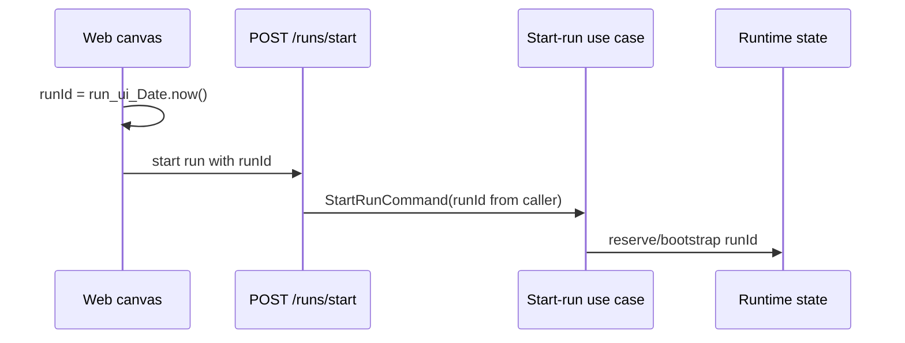
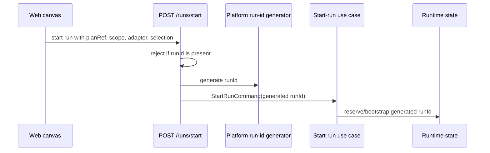
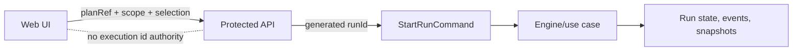
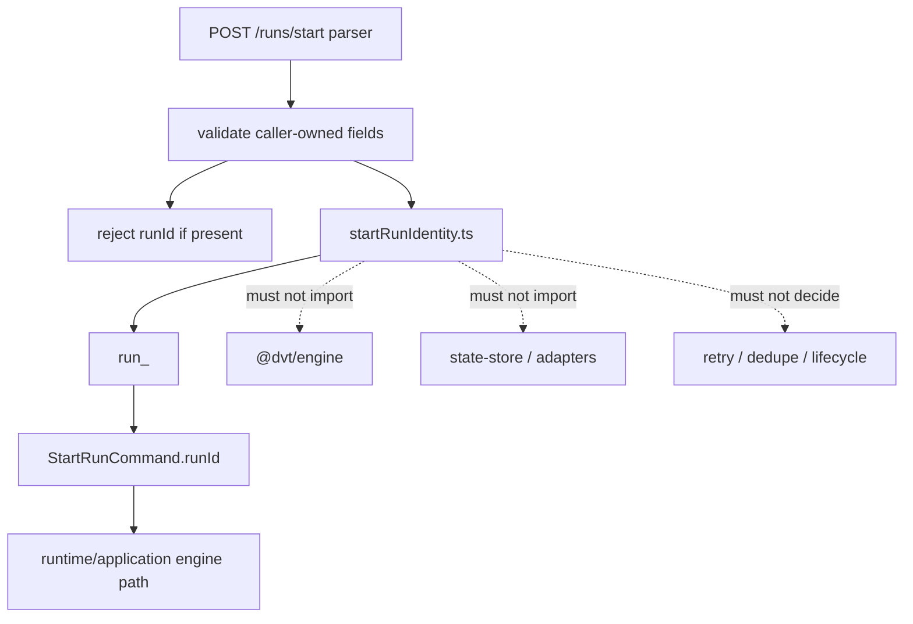

# ADR-0050 - Platform-owned start-run identity

## Status

Accepted.

## Context

The 2026-04-23 DVT+ system architecture review found an unstable identity
boundary in the start-run path:

- the web canvas generated execution ids with `run_ui_${Date.now()}`;
- the API accepted a caller-provided `runId` in `POST /runs/start`;
- the runtime state model treats `runId` as the canonical run key;
- `ADR-0031` requires tenant-owned storage rows to be tenant-isolated, while
  existing run metadata storage still depends on a globally unique `run_id`.

This mixes two different authority models:

- client-chosen ids scoped only by client convention;
- platform/runtime ids used as canonical state and event identity.

That is not safe enough for multi-tenant runtime admission. A caller-visible UI
identifier is not a runtime authority token.

## Decision

### 1. `runId` is platform-owned at start-run admission

`POST /runs/start` MUST NOT accept a client-supplied execution `runId`.

The protected API boundary generates the canonical `runId` after request-shape
validation and before authorization/use-case delegation. The generated id is
then passed into the existing internal `StartRunCommand` boundary.

The API boundary is an identity allocator and transport adapter here. It MUST
NOT become a second engine: lifecycle transitions, duplicate-run policy,
retries, recovery, event ordering, and adapter execution remain owned by the
runtime/application layers that already own those semantics.

### 2. Identifier format is `run_<UUIDv7>`

The generated start-run identity MUST use the `run_<UUIDv7>` shape.

The UUIDv7 payload gives the API boundary:

- millisecond time locality for storage and operational inspection;
- cryptographic random entropy for multi-instance collision resistance;
- no dependency on host, process, tenant, browser, or provider workflow ids.

Consumers MUST treat the full `runId` as opaque. The timestamp portion is for
platform-side locality and diagnostics only; frontend, plugins, engine
consumers, and adapters MUST NOT parse it for authorization, ordering, retry,
or lifecycle decisions.

The generator MUST stay local to the API HTTP entrypoint boundary. It MUST NOT
import `@dvt/engine`, state-store adapters, provider adapters, or the
authenticated start-run facade. Persistence uniqueness remains the final
collision guard.

### 3. Client-provided `runId` is rejected, not ignored

If a start-run HTTP request includes `runId`, the API MUST reject it with a
stable bad-request reason.

Rejecting the field is required because silently ignoring it would preserve a
false contract: clients could still believe they control execution identity.

### 4. Existing engine and state internals continue to receive a concrete `runId`

This ADR does not remove `runId` from engine/runtime internals.

The engine, event store, intent store, snapshots, outbox ordering, and adapter
run refs still require a stable run identity. The change is ownership:

- external start-run callers do not provide `runId`;
- the API generates it;
- internal command and state boundaries consume the generated value.

### 5. Preview-time context ids are not execution identity

Plan preview and local contract guards may still build a `RunContext` where a
context-shaped id is required by an existing preview contract.

That id MUST NOT be treated as an execution `runId`, and the canvas must not
mint timestamp-based `run_ui_*` ids for run execution.

### 6. Retry idempotency must not be inferred from client-owned `runId`

Start-run retry idempotency cannot depend on clients replaying the same
execution id. Any future caller retry contract must use an explicit
idempotency key or an equivalent governed request identity field.

This ADR makes no claim that repeated `POST /runs/start` calls create the same
run. Without an explicit idempotency contract, each admitted request receives a
new platform-owned `runId`.

## Architecture

### Previous flow

### Target flow

### Authority boundary

### Identifier allocation boundary

## Consequences

- The API can preserve globally unique run identity without trusting a tenant or
  browser-generated value.
- `runId` values are time-sortable for platform diagnostics while staying
  opaque to callers and runtime consumers.
- API identity allocation stays narrower than engine semantics; it does not
  own retry, lifecycle, recovery, or duplicate-run policy.
- Existing state and adapter internals keep their concrete `runId` dependency.
- Client integrations that still send `runId` fail fast with a caller-fixable
  error instead of creating ambiguous identity ownership.
- Tenant-scoped plan-record indexing remains governed by plan-record tenancy
  work; this ADR only closes start-run execution identity ownership.
- Existing global run-key storage remains valid for this slice because the
  platform is the owner of the generated id, the id carries cryptographic
  entropy, and persistence uniqueness remains the final collision guard.

## Validation Requirements

The implementation of this ADR must include:

- API route tests proving omitted `runId` is accepted and generated by the API;
- API route tests proving provided `runId` is rejected;
- API architecture tests proving the generated id uses `run_<UUIDv7>` and the
  allocator does not import engine, persistence, adapter, or facade semantics;
- web service tests proving `/runs/start` payloads do not include `runId` or
  `context.runId`;
- canvas action tests proving the UI no longer mints `run_ui_*` execution ids.

## Related Sources

- `docs/planning/reviews/architecture-and-governance/20260423-dvt-plus-system-architecture-review.md`
- `docs/adr/ADR-0004-event-sourcing-strategy.md`
- `docs/adr/ADR-0031-adapter-tenant-isolation.md`
- `packages/@dvt/contracts/src/contracts/engine/StartRunBoundary.v1.ts`
- `apps/api/docs/start-run-platform-identity-component.md`
- `apps/api/src/entrypoints/http/startRunRouteCommandBuilder.ts`
- `apps/web/src/app/views/canvas/canvasRunStartAction.ts`
