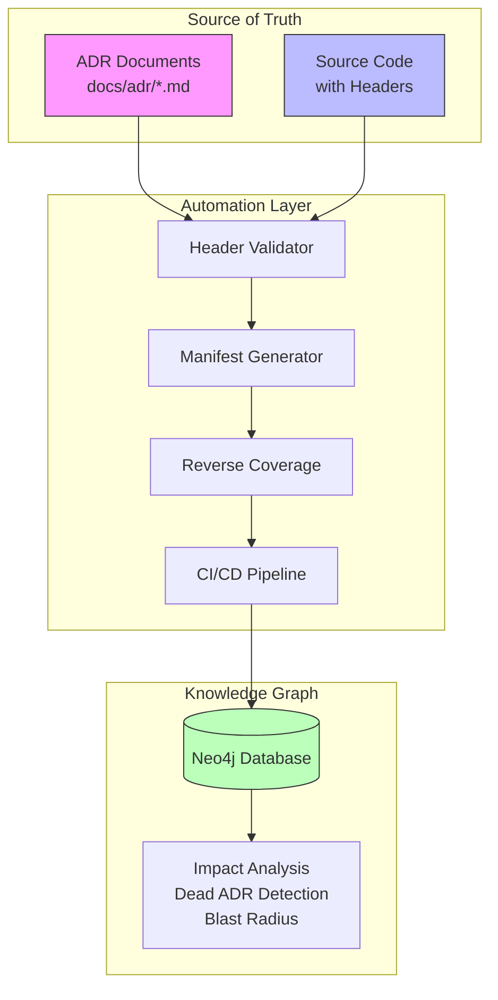

# DVT+ — ADR Traceability Graph (Mermaid)

Below is a Mermaid **flowchart** diagram that models ADR documents and code as sources of truth, an automation layer, and a knowledge graph for impact analysis.

