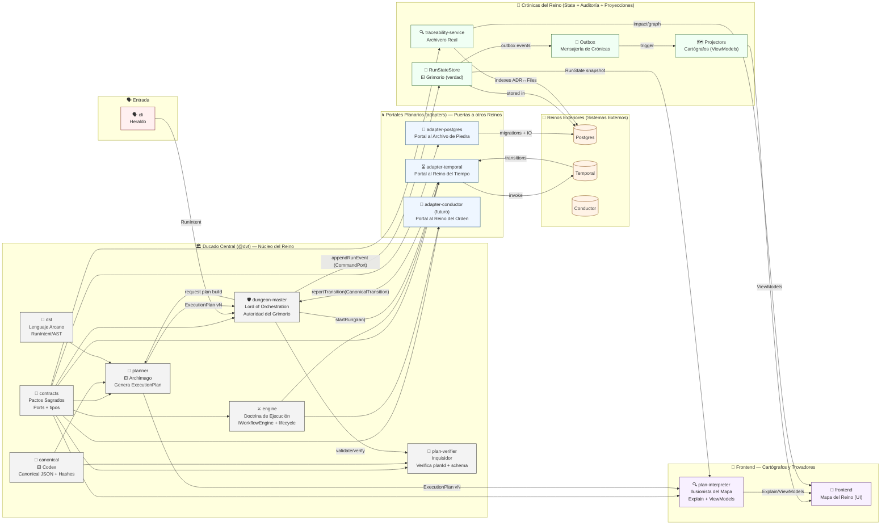

# 🏰 DVT+ — El Reino de los Datos (con Mermaid)

_Versión consolidada con ontología D&D coherente_
Generado: 2026-02-25T02:41:52.075271 UTC

---

## 🗺️ Diagrama del Reino (Mermaid)



---

## 📜 El Mapa del Reino (Árbol)

```text
DVT/
├── 📜 docs/                     # La Gran Biblioteca del Reino
├── ⚙️ infra/                    # Infraestructura (castillos y caminos)
├── 📦 packages/
│   └── @dvt/
│       ├── 🧙 planner/              # El Archimago
│       ├── 🛡 dungeon-master/       # El Señor del Control Plane
│       ├── 📖 plan-verifier/        # El Inquisidor del Grimorio
│       ├── 🔍 plan-interpreter/     # El Ilusionista del Mapa
│       ├── 🔢 canonical/            # El Codex (Ley del Reino)
│       ├── 🎲 dsl/                  # El Lenguaje Arcano
│       ├── ⚔ engine/                # La Doctrina de Ejecución
│       ├── 🤝 contracts/            # Los Pactos Sagrados
│       ├── 🔮 adapter-postgres/     # Portal al Archivo de Piedra
│       ├── ⏳ adapter-temporal/     # Portal al Reino del Tiempo
│       ├── 🔍 traceability-service/ # El Archivero Real
│       ├── 🗣 cli/                  # Los Heraldos
│       └── 🧪 tests/                # Pruebas internas por módulo
├── 🎨 frontend/                # Los Cartógrafos y Trovadores (UI)
├── 📚 runbooks/                # Pergaminos Operacionales
└── 📜 scripts/                 # Conjuros de Automatización
```

---

# 🧙 Habitantes del Reino (Responsabilidades)

## 🧙 planner/ — El Archimago

Genera `ExecutionPlan` determinista.
No ejecuta. No persiste. No depende de portales.

> “El plan es la ley.”

## 🛡 dungeon-master/ — El Señor del Control Plane

Autoridad única del flujo de ejecución:

- recibe RunIntent (jugadores)
- recibe transiciones (portales)
- valida secuencia e idempotencia
- ordena escritura al Grimorio (RunStateCommandPort)
- dispara auditoría y proyecciones

> “Sin mí, hay caos.”

## 📖 plan-verifier/ — El Inquisidor

Verifica planId y schema versionado. No canoniza; solo comprueba.

> “Confía, pero verifica.”

## 🔍 plan-interpreter/ — El Ilusionista del Mapa

Traduce `ExecutionPlan + RunState` a ViewModels y “Explain” para UI.
No participa en el camino caliente.

> “Hacemos visible lo invisible.”

## 🔢 canonical/ — El Codex

Canonical JSON + hashing determinista + True Names.

> “Solo hay una verdad.”

## 🎲 dsl/ — El Lenguaje Arcano

Gramática de intención (RunIntent) y AST.

> “Los dioses hablan en DSL.”

## ⚔ engine/ — La Doctrina de Ejecución

Abstracción universal de ejecución (`IWorkflowEngine`), lifecycle y transiciones canónicas.
No es Temporal ni Conductor.

> “La guerra tiene reglas.”

## 🔮 adapter-\*/ — Los Portales Planarios

Traducción hacia sistemas externos (Temporal/Conductor/Postgres). Sin autoridad y sin escritura directa de estado.

> “Abrimos puertas. Nada más.”

## 🔍 traceability-service/ — El Archivero Real

Grafo ADR↔Files, impacto, auditoría estructural.

> “La historia no se pierde.”

## 🧪 Tests — Pruebas del Canon

Tests internos por módulo, enfocados a contratos y a invariantes locales.

> “Falla aquí, no en combate.”

---

# 🏆 Juramento del Reino

> El Archimago escribe el plan.  
> El Señor del Control Plane gobierna la ejecución.  
> El Codex preserva la verdad.  
> Los Portales abren caminos entre planos.  
> El Archivero recuerda todo.  
> Los Cartógrafos muestran el mundo.

Y el Reino permanece coherente.
