# 🏰 DVT+ — El Reino de los Datos (v2, con mejoras)

_Versión consolidada + mejoras propuestas por el Conjurador Veterano_
Generado: 2026-02-25T02:50:38.828632 UTC

---

## ✅ Cambios incorporados (Resumen)

1. **🔮 `divination/`** añadido como módulo propio (El Oráculo).
2. **📜 `state-store/`** añadido como módulo propio (El Escriba — contrato de persistencia).
3. **Relación explícita**: `engine/` define la Doctrina, `adapter-*/` la implementa (Portales).
4. **docs/** reorganizado en subcarpetas con semántica D&D (sin romper practicidad).
5. **“Almas Gemelas”**: pares naturales de módulos para gobernanza y revisiones cruzadas.

---

## 🗺️ Diagrama del Reino (Mermaid)

```mermaid
flowchart LR

%% ============ Biblioteca ============
subgraph DOCS["📜 docs/ — La Gran Biblioteca"]
  ADRS["📜 grimorios/<br/>ADRs (decisiones)"]
  RFCS["🔮 profecías/<br/>RFCs (futuros)"]
  MAPS["🗺️ mapas/<br/>diagramas"]
  CHRON["📚 crónicas/<br/>releases/changelog"]
  OMENS["🔮 augurios/<br/>roadmap/issues"]
end

%% ============ Core / Ducado Central ============
subgraph CORE["🏛️ Ducado Central (@dvt) — Núcleo del Reino"]
  PLANNER["🧙 planner<br/>El Archimago<br/>Genera ExecutionPlan"]
  VERIFIER["📖 plan-verifier<br/>El Inquisidor<br/>Verifica planId + schema"]
  DM["🛡 dungeon-master<br/>Lord of Orchestration<br/>Autoridad del Grimorio"]
  CANON["🔢 canonical<br/>El Codex<br/>Canonical JSON + Hashes"]
  DSL["🎲 dsl<br/>Lenguaje Arcano<br/>RunIntent/AST"]
  ENGINE["⚔ engine<br/>Doctrina de Ejecución<br/>IWorkflowEngine + lifecycle"]
  STATEPORT["📜 state-store<br/>El Escriba (contrato)<br/>IRunStateStore / ICommandPort"]
  DIV["🔮 divination<br/>El Oráculo<br/>Simulación/Visiones"]
  CONTRACTS["🤝 contracts<br/>Pactos Sagrados<br/>Ports + tipos"]
end

%% ============ Portales (Adapters) ============
subgraph PORTALS["🌀 Portales Planarios (adapters) — Implementan la Doctrina"]
  APOST["🔮 adapter-postgres<br/>Portal al Archivo de Piedra<br/>Implementa state-store"]
  ATEMP["⏳ adapter-temporal<br/>Portal al Reino del Tiempo<br/>Implementa engine"]
  ACOND["🧭 adapter-conductor (futuro)<br/>Portal al Reino del Orden<br/>Implementa engine"]
end

%% ============ Reinos Externos ============
subgraph OUTER["🌌 Reinos Exteriores (Sistemas Externos)"]
  POSTGRES[(Postgres)]
  TEMPORAL[(Temporal)]
  CONDUCTOR[(Conductor)]
end

%% ============ Registro / Proyecciones / Trazabilidad ============
subgraph RECORD["📜 Crónicas Operacionales (Estado + Proyecciones + Trazabilidad)"]
  OUTBOX["📨 Outbox<br/>Mensajería de Crónicas"]
  PROJ["🗺 Projectors<br/>Cartógrafos (ViewModels)"]
  TRACE["🔍 traceability-service<br/>Archivero Real"]
end

%% ============ UI ============
subgraph UI["🎨 Frontend — Cartógrafos y Trovadores"]
  FE["🧭 frontend<br/>Mapa del Reino (UI)"]
  INTERP["🔍 plan-interpreter<br/>Ilusionista del Mapa<br/>Explain + ViewModels"]
end

%% ============ Entradas ============
subgraph ENTRY["🗣 Entrada"]
  CLI["🗣 cli<br/>Heraldo"]
end

%% ============ Dependencias permitidas (Pactos primero) ============
CONTRACTS --> PLANNER
CONTRACTS --> VERIFIER
CONTRACTS --> DM
CONTRACTS --> DSL
CONTRACTS --> ENGINE
CONTRACTS --> STATEPORT
CONTRACTS --> DIV
CONTRACTS --> INTERP
CONTRACTS --> TRACE
CONTRACTS --> APOST
CONTRACTS --> ATEMP
CONTRACTS --> ACOND

CANON --> PLANNER
CANON --> VERIFIER

DSL --> PLANNER
ENGINE --> ATEMP
ENGINE --> ACOND
STATEPORT --> APOST

%% ============ Flujos principales ============

%% (A) Ejecución (camino caliente)
CLI -- "RunIntent" --> DM
DM -- "verify plan" --> VERIFIER
DM -- "request plan build" --> PLANNER
PLANNER -- "ExecutionPlan vN" --> DM
DM -- "startRun(plan)" --> ATEMP
ATEMP -- "invoke" --> TEMPORAL
TEMPORAL -- "transitions" --> ATEMP
ATEMP -- "reportTransition(CanonicalTransition)" --> DM
DM -- "appendRunEvent (CommandPort)" --> STATEPORT
STATEPORT -- "persist via portal" --> APOST
APOST -- "IO" --> POSTGRES
STATEPORT -- "outbox" --> OUTBOX
OUTBOX -- "trigger" --> PROJ
PROJ -- "ViewModels" --> FE

%% (B) Divination (simulación)
PLANNER -- "ExecutionPlan vN" --> DIV
DIV -- "history/query via projections" --> PROJ
DIV -- "Vision (cost/time/risk)" --> FE

%% (C) UI / Explain (no caliente)
PLANNER -- "ExecutionPlan vN" --> INTERP
STATEPORT -- "RunState snapshots" --> INTERP
INTERP -- "Explain/ViewModels" --> FE

%% (D) Trazabilidad
TRACE -- "indexes ADR↔Files" --> POSTGRES
TRACE -- "impact/graph" --> FE

%% ============ Estilos ============
classDef core fill:#f3f3f3,stroke:#333,stroke-width:1px;
classDef portal fill:#eef6ff,stroke:#1f4e79,stroke-width:1px;
classDef outer fill:#fff3e6,stroke:#7a3e00,stroke-width:1px;
classDef record fill:#f0fff4,stroke:#256029,stroke-width:1px;
classDef ui fill:#f8f0ff,stroke:#5b2c83,stroke-width:1px;
classDef entry fill:#fff0f0,stroke:#7a1f1f,stroke-width:1px;
classDef docs fill:#fdf7e3,stroke:#6b5b2a,stroke-width:1px;

class PLANNER,DM,VERIFIER,CANON,DSL,ENGINE,STATEPORT,DIV,CONTRACTS core;
class APOST,ATEMP,ACOND portal;
class POSTGRES,TEMPORAL,CONDUCTOR outer;
class OUTBOX,PROJ,TRACE record;
class FE,INTERP ui;
class CLI entry;
class ADRS,RFCS,MAPS,CHRON,OMENS docs;
```



---

## 📜 Estructura del Reino (Árbol)

```text
DVT/
├── 📜 docs/                           # La Gran Biblioteca
│   ├── 📜 grimorios/                  # ADRs (decisiones del Consejo)
│   ├── 🔮 profecías/                  # RFCs (futuros posibles)
│   ├── 🗺️ mapas/                      # Diagramas de arquitectura
│   ├── 📚 crónicas/                   # Releases, changelog
│   └── 🔮 augurios/                   # Roadmap, issues
│
├── ⚙️ infra/                          # Fortalezas (infraestructura)
│
├── 📦 packages/
│   └── @dvt/
│       ├── 🧙 planner/                # El Archimago — escribe grimorios (planes)
│       ├── 🛡 dungeon-master/         # El Señor del Control Plane
│       ├── 📖 plan-verifier/          # El Inquisidor — verifica grimorios
│       ├── 🔍 plan-interpreter/       # El Ilusionista — explain + viewmodels
│       ├── 🔮 divination/             # El Oráculo — ve futuros posibles
│       ├── 🔢 canonical/              # El Codex — verdad universal
│       ├── 🎲 dsl/                    # El Lenguaje Arcano
│       ├── ⚔ engine/                  # La Doctrina de Ejecución
│       ├── 📜 state-store/            # El Escriba — contrato de persistencia
│       ├── 🤝 contracts/              # Los Pactos Sagrados
│       ├── 🔮 adapter-postgres/       # Portal al Archivo de Piedra
│       ├── ⏳ adapter-temporal/       # Portal al Reino del Tiempo
│       ├── 🧭 adapter-conductor/      # (futuro) Portal al Reino del Orden
│       ├── 🔍 traceability-service/   # El Archivero Real
│       ├── 🗣 cli/                    # Los Heraldos
│       └── 🧪 tests/                  # Pruebas internas por módulo
│
├── 🎨 frontend/                       # Cartógrafos (UI)
├── 📚 runbooks/                       # Pergaminos de Batalla
└── 📜 scripts/                        # Conjuros de Automatización
```

---

# 🧙 Habitantes del Reino (Responsabilidades)

## 🧙 planner/ — El Archimago

Genera `ExecutionPlan` determinista. **Escribe grimorios** (planes).

**No ejecuta. No persiste. No depende de Portales.**

> “El plan es la ley.”

---

## 📖 plan-verifier/ — El Inquisidor

Verifica que el grimorio es válido:

- `planId` correcto
- schema versionado
- invariantes de frontera (p.ej. sin secretos inline)

**No canoniza; solo comprueba.**

> “Confía, pero verifica.”

---

## 🛡 dungeon-master/ — Lord of Orchestration

Autoridad única del flujo:

- Recibe **RunIntent**
- Recibe **transiciones** de Portales
- Valida **secuencia** e **idempotencia**
- Ordena escritura al Escriba (CommandPort)
- Dispara auditoría/proyecciones

> “Sin mí, hay caos.”

---

## ⚔ engine/ — La Doctrina de Ejecución

Define reglas universales:

- `IWorkflowEngine`
- lifecycle
- transiciones canónicas

**Los Portales Planarios la IMPLEMENTAN.**

> “La guerra tiene reglas. Los Portales las siguen.”

---

## 🌀 adapter-\*/ — Portales Planarios

Implementan contratos para hablar con otros planos.

- `adapter-temporal` implementa `engine`
- `adapter-postgres` implementa `state-store`
- `adapter-conductor` implementa `engine` (futuro)

> “Abrimos puertas. Nada más.”

---

## 📜 state-store/ — El Escriba (contrato)

Define el contrato de persistencia y comandos de estado.
**No hace IO. No conoce Postgres.**

El IO ocurre en el Portal (`adapter-postgres`).

> “Yo no viajo al archivo. Yo dicto cómo se escribe.”

---

## 🔮 divination/ — El Oráculo

Simula y predice:

- coste/tiempo/riesgo por step
- “what-if runs”
- predicción basada en historia (vía proyecciones/trace)

**No ejecuta SQL real.**

> “Veo futuros posibles. Ninguno es real, todos son ciertos.”

---

## 🔢 canonical/ — El Codex

Canonical JSON + hashing determinista + True Names.

> “Solo hay una verdad.”

---

## 🎲 dsl/ — El Lenguaje Arcano

Gramática de intención (RunIntent) y AST.

> “Los dioses hablan en DSL.”

---

## 🔍 plan-interpreter/ — El Ilusionista del Mapa

Traduce `ExecutionPlan + RunState` a ViewModels / Explain para UI.
No es parte del camino caliente.

> “Hacemos visible lo invisible.”

---

## 🔍 traceability-service/ — El Archivero Real

Grafo ADR↔Files, impacto, auditoría estructural.

> “La historia no se pierde.”

---

## 🧪 Tests — Pruebas del Canon (por módulo)

Tests internos por módulo (casas independientes) enfocados a:

- contratos
- determinismo
- invariantes locales
- smoke tests de adapters

> “Falla aquí, no en combate.”

---

# 🤝 Almas Gemelas (Vigilancia Cruzada)

| Módulo              | Alma gemela                   | Por qué                                             |
| ------------------- | ----------------------------- | --------------------------------------------------- |
| `planner/`          | `plan-verifier/`              | El Inquisidor vigila al Archimago (planId + schema) |
| `dungeon-master/`   | `state-store/`                | El DM ordena; el Escriba registra (write-boundary)  |
| `engine/`           | `adapter-*/`                  | Doctrina vs Portales que la implementan             |
| `divination/`       | `traceability-service/`       | El Oráculo necesita historia y grafo                |
| `plan-interpreter/` | `frontend/`                   | Explain/ViewModels aterrizan en UI                  |
| `canonical/`        | `planner/` + `plan-verifier/` | Verdades deterministas (hashes/IDs)                 |

---

# ⚔ Flujo Correcto de la Aventura

## Camino de Ejecución (caliente)

```text
CLI (Heraldo)
   ↓
Dungeon Master
   ↓
Plan Verifier (frontera de confianza)
   ↓
Portal Planario (adapter-*)
   ↓
Reino Exterior (Temporal / Conductor)
   ↓
Transiciones → Dungeon Master
   ↓
State-Store (CommandPort) → Portal Postgres → Postgres
   ↓
Outbox → Projectors
   ↓
Frontend (Cartógrafos)
```

## Camino de Profecía (divination)

```text
Planner (ExecutionPlan) → Divination (Visión) → Frontend
            ↑
      Historia (Projectors / Traceability)
```

---

# 🏆 Juramento Revisado del Reino

> El Archimago escribe el plan.  
> El Inquisidor verifica el grimorio.  
> El Señor del Control Plane gobierna la ejecución.  
> La Doctrina define las reglas del combate.  
> Los Portales abren caminos entre planos.  
> El Oráculo ve futuros posibles.  
> El Escriba guarda la verdad.  
> El Archivero recuerda todo.  
> Los Cartógrafos muestran el mundo.

Y el Reino permanece coherente.
