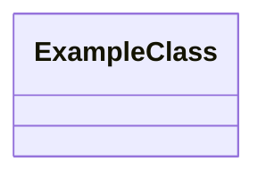

---
title: <Component Name> Constraints & Invariants
status: Draft
owner: <Domain>
last_reviewed: <YYYY-MM-DD>
topics:
  - Constraints & Invariants
  - Validation Examples
  - Key Files & References
---

# <Component Name> Constraints & Invariants

## DDD Diagram

## Constraints and Invariants

| Constraint / Invariant | Where Enforced          | Description               |
| ---------------------- | ----------------------- | ------------------------- |
| `<constraint>`         | `<component or policy>` | `<what must remain true>` |

## Validation Examples

- Example 1: ...
- Example 2: ...

## Key Files & References

- [File1.ts](./path/to/File1.ts): Description
- [File2.md](./path/to/File2.md): Description

## Component File List

List of all files in the component folder:

- `<file1>`
- `<file2>`
- `...`
