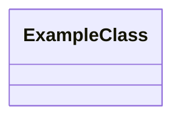

# <Component Name> DDD Structure

## DDD Diagram

## Aggregates & Entities

- Aggregate 1: Description
- Entity 1: Description

## Main Methods

- Method 1: Description
- Method 2: Description

## Key Files & References

- [File1.ts](./path/to/File1.ts): Description
- [File2.md](./path/to/File2.md): Description

## Component File List

List of all files in the component folder:

- <file1>
- <file2>
- ...
