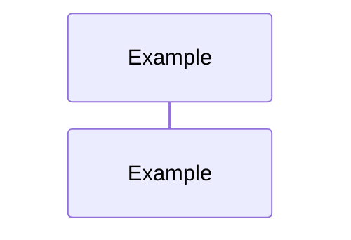

# <Component Name> Sequence

## Sequence Diagram

## Global Flow Position

Explain where this component fits in the overall system flow.

## Key Files & References

- [File1.ts](path/to/File1.ts): Description
- [File2.md](path/to/File2.md): Description

## Component File List

List of all files in the component folder:

- <file1>
- <file2>
- ...
