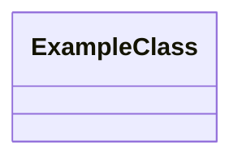
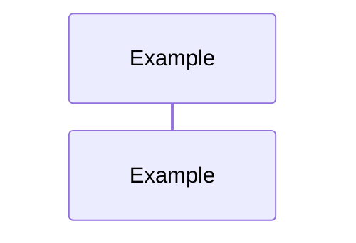

---
title: <Component Name>
status: Draft
owner: <Domain>
last_reviewed: <YYYY-MM-DD>
topics:
  - Overview
  - DDD Diagram
  - Sequence Diagram
  - Constraints & Invariants
  - Validation Examples
  - Main Methods & Functionalities
  - Key Files & References
  - Global Flow Position
  - Related Links
---

# <Component Name>

## Overview

Brief description of the component, its purpose, domain, and main
responsibilities.

## DDD Diagram

## Sequence Diagram

## Constraints & Invariants

| Constraint / Invariant | Where Enforced          | Description               |
| ---------------------- | ----------------------- | ------------------------- |
| `<constraint>`         | `<component or policy>` | `<what must remain true>` |

## Validation Examples

- Example 1: ...
- Example 2: ...

## Main Methods & Functionalities

- Method 1: Description
- Method 2: Description

## Key Files & References

- [File1.ts](path/to/File1.ts): Description
- [File2.md](path/to/File2.md): Description

## Global Flow Position

Explain where this component fits in the overall system flow.

## Related Links

- [Link1](url)
- [Link2](url)

## Component File List

List of all files in the component folder:

- `<file1>`
- `<file2>`
- `...`
