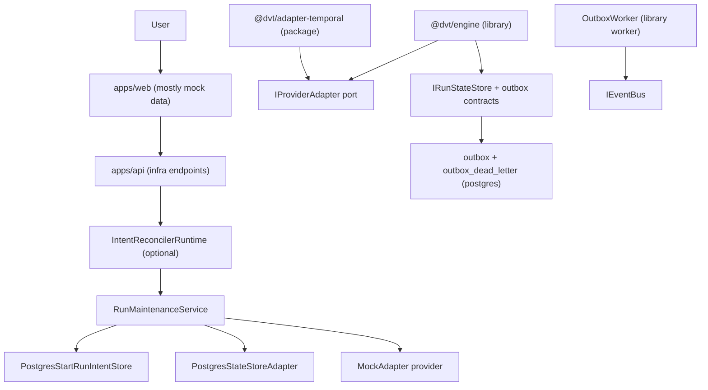
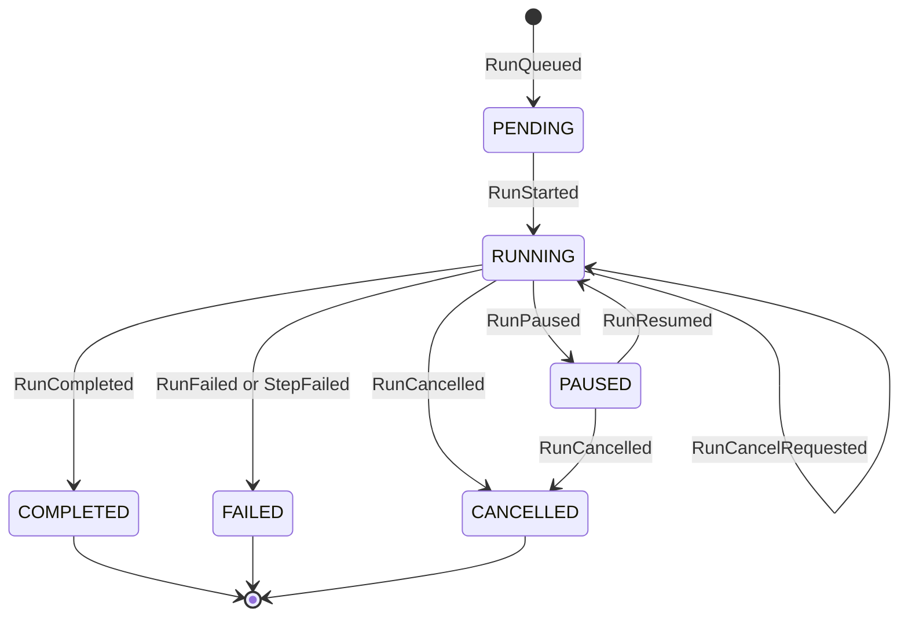
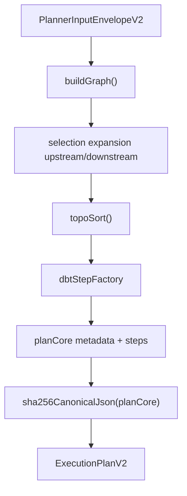
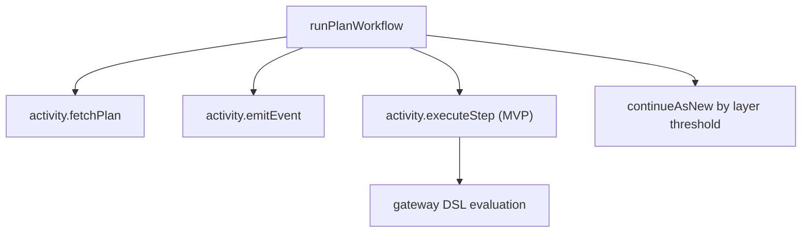
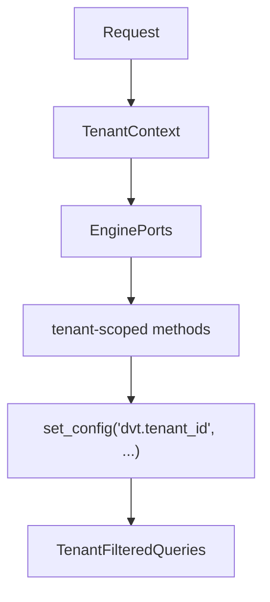

# DVT+ Architecture Atlas Historical Snapshot

Snapshot date: 2026-03-06
Source basis: repository code only (`apps/*`, `packages/@dvt/*`) as inspected on
that date.

This page is retained as a historical snapshot. It does not describe the
current repository-wide runtime posture.

For current truth, read:

- [System Delivery Status](../../system-delivery-status.md)
- [Architecture Surface Inventory 2026-04-02](../../architecture-surface-inventory-20260402.md)
- [Canonical Doc Code Matrix](../../../planning/status/canonical-doc-code-matrix.md)

## Navigation

- [Atlas Home](../README.md)
- [Atlas Index](../index.md)
- [Engineering Playbook](../engineering/engineering_playbook.md)
- [Completion Assessment](../status/code_completion_assessment_2026-03-06.md)
- [Current System Delivery Status](../../system-delivery-status.md)

## Historical Snapshot Notes

The sections below capture the 2026-03-06 topology assumptions. Several points
are now superseded by current code and status:

- `apps/api` now exposes protected run-domain endpoints in addition to infra
  endpoints.
- the runtime is no longer limited to intent reconciliation plus a mock-only
  provider composition path.
- delivery, projector, archive, and lineage workers now have dedicated shipped
  runtime surfaces tracked in current status docs.

Use the remainder of this page only to understand the earlier repository
snapshot that informed subsequent remediation work.

## 2026-03-06 Reality Snapshot

- Engine orchestration is implemented as a library (`@dvt/engine`), but not yet composed as a runtime API service.
- Temporal adapter exists in `@dvt/adapter-temporal`, but API runtime currently boots only intent reconciliation with `mock` provider.
- Postgres state + outbox are implemented in `@dvt/adapter-postgres`.
- API exposes infra endpoints (`/healthz`, `/readyz`, `/version`, `/db/ready`) and no run-domain endpoints.
- Web app is mostly wired to local mock datasets.
- Plugin runtime package is not present under `packages/@dvt`.

## Implemented Topology (Today)

## Canonical Run Lifecycle (Implemented Contract)

## Event Catalog (Code Contract)

Persisted event types are defined in `packages/@dvt/contracts/src/engine/IRunStateStore.v1.ts`:

- RunQueued
- RunStarted
- RunPaused
- RunResumed
- RunCancelRequested
- RunCancelled
- RunCompleted
- RunFailed
- StepStarted
- StepCompleted
- StepFailed
- StepSkipped

## Planner Topology (Implemented)

Notes:

- Planner determinism is implemented with canonical JSON hashing.
- 10/100/500 manifest fixtures and 1000-node slow test exist in code.

## Temporal Workflow Topology (Implemented + Limits)

Current limits from code:

- `RETRY_RUN` remains explicitly not implemented on the provider signal path.
- `RETRY_STEP` is no longer part of the canonical signal boundary.
- `executeStep` still states real step dispatch is Phase 2+.

## Multi-Tenant Boundary (Implemented)

Notes:

- Tenant-scoped reads/writes are implemented in `PostgresStateStoreAdapter` and tested in integration tests.

## What Is Not Implemented Yet

- Domain API (start run, signal, status, run list/events) in `apps/api`.
- Runtime wiring of `WorkflowEngine` + `TemporalAdapter` in API process.
- Outbox dispatcher runtime process in API (worker exists as library, not bootstrapped).
- Cost attribution backend modules.
- Plugin runtime package (sandbox + capability enforcement).

## References in This Atlas

- Completion and effort model: `../status/code_completion_assessment_2026-03-06.md`
- Current execution status:
  `../../system-delivery-status.md`
- Current planning route:
  `../../../planning/roadmap/index.md`

## Next

- Continue with [Engineering Playbook](../engineering/engineering_playbook.md)
