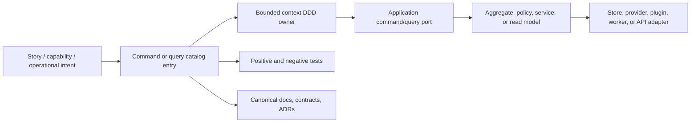
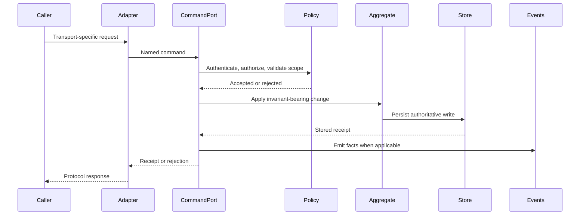
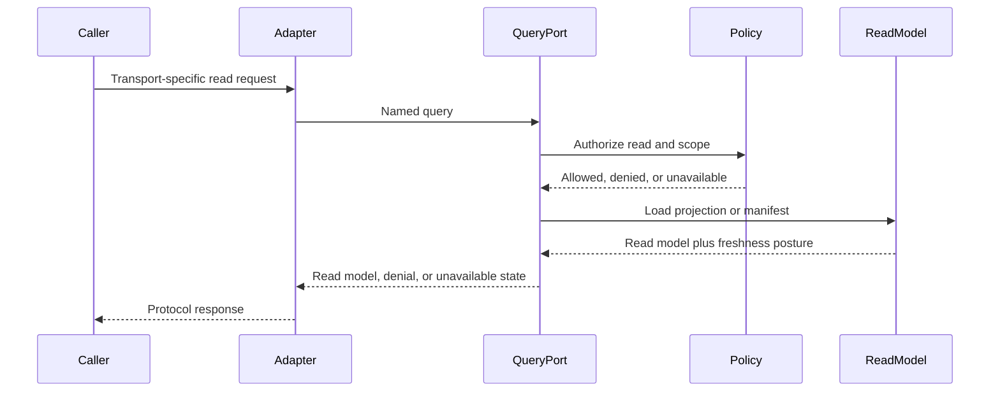

# Command And Query Rail Governance

This document is the repository-wide rule for command and query design. It
exists to prevent invented behavior, duplicated application seams, and route- or
adapter-shaped product logic.

## Purpose

DVT changes MUST flow through an explicit command or query rail before
implementation when the change introduces or modifies externally observable
behavior.

The rail gives every slice one named product intent, one owning bounded context,
one application port, one DDD object or read model, and one negative-test
expectation before code is added.

Commands and queries MUST NOT exist as loose application labels. Each command or
query must be part of the DDD model of its bounded context. A command expresses
an intent against an aggregate, entity, policy, domain service, or value-object
invariant. A query returns a named read model or projection owned by that same
bounded context or by an explicitly documented read-model context.

## Scope

This rule applies to behavior added or changed in:

- UI routes, views, actions, hooks, and Cypress user workflows.
- API routes, controllers, handlers, and application use cases.
- Engine, planner, adapter, worker, state-store, and contract surfaces.
- CLI commands, workflow activities, plugin operations, and provider adapters.
- Architecture tests and documentation that describe executable behavior.

Private helpers do not need their own catalog entry unless they represent a
separate product, system, or operational intent. A helper that merely implements
part of an accepted command or query remains internal to that rail.

## Core Rule

No route, endpoint, controller, workflow, activity, application service, adapter
method, plugin operation, CLI command, UI action, Cypress workflow, architecture
test, or contract operation may introduce externally observable behavior unless
that behavior is represented by an accepted or proposed command or query in the
owning bounded context.

Adding behavior outside the rail is architecture drift.

Adding a command or query without DDD ownership is also drift. The rail is not a
flat service catalog; it is the application-facing expression of the domain
model.

## Command And Query Semantics

Commands:

- request a state change, side effect, lifecycle transition, external action, or
  authoritative write;
- are admitted through an authenticated and tenant-scoped command boundary when
  user or tenant data is involved;
- return receipts, identifiers, accepted-state summaries, or rejection reasons;
- do not return screen-shaped read models as their primary purpose;
- carry idempotency and concurrency policy when repeat delivery or stale writes
  are possible.

Queries:

- read authoritative state, projections, manifests, status, or read models;
- do not mutate state or grant permission by themselves;
- are tenant-scoped whenever tenant data can be observed;
- return read models, unavailable states, or explicit denials;
- document freshness, projection, or consistency-window assumptions when those
  assumptions matter to callers.

Events:

- are facts emitted after accepted commands or external observations;
- are not substitutes for commands;
- may feed query read models, projections, audit logs, or operational evidence;
- must keep event ownership aligned with the governing ADR or contract.

Adapters and transports:

- implement commands and queries;
- are not the canonical command or query names;
- may expose route, queue, CLI, SDK, plugin, or worker-specific details only at
  the adapter boundary.

## Required Catalog Entry

Every cataloged command or query MUST record:

- name;
- type: `command` or `query`;
- owning bounded context;
- governing story, task, ADR, contract, or proposal;
- product or system intent;
- DDD ownership: aggregate, entity, value object, policy, domain service, read
  model, or projection that owns the semantics;
- input value objects;
- output receipt, event, rejection, unavailable state, or read model;
- aggregate, entity, policy, projection, or read model touched;
- inbound port or use case;
- outbound port, store, provider, plugin, or adapter dependency when needed;
- authentication, authorization, tenant, and project scope rules;
- idempotency, concurrency, ordering, or consistency policy when relevant;
- negative tests proving fail-closed behavior;
- implementation surfaces that are allowed to execute the rail;
- status: `proposed`, `accepted`, `implemented`, or `deprecated`.

## Exhaustiveness Workflow

When adding or changing behavior:

1. Search the owning bounded context for an existing command or query.
2. Reuse the existing command or query when the intent is the same.
3. If the intent is new, add or update the catalog entry before implementation.
4. Map the entry to DDD objects, policies, ports, and outbound adapters.
5. Add negative tests for denied permission, invalid scope, stale inputs,
   unavailable dependencies, malformed input, and duplicate delivery where
   applicable.
6. Implement through the named rail, not through a direct route, store, or
   component shortcut.
7. Add an architecture guard when a boundary can be mechanically enforced.
8. Update the governing documentation and generated indexes before closeout.

## Anti-Duplication Rules

- Do not create a synonym for an existing command or query just because a new
  route, component, adapter, or plugin needs it.
- Do not create free-floating commands or queries that are not owned by a DDD
  bounded context and a concrete aggregate, policy, domain service, value
  object, projection, or read model.
- Do not split a read model into a new query unless the caller, authorization
  posture, projection, freshness, or consistency contract is materially
  different.
- Do not mix command and query concerns in one broad service method.
- Do not treat `pending backend`, `mock-only`, or `fixture-only` as behavior
  categories. Those states must map to a missing command, missing query,
  unavailable capability, or accepted explicit demo mode.
- Do not use transport names as the domain rail. `POST /projects` implements
  `CreateProject`; it is not the command.
- Do not let mock adapters define semantics that API adapters are not expected
  to satisfy.

## Canonical Placement

Each bounded context owns its local catalog in the most authoritative surface
for that context:

- accepted architecture or component docs for implemented behavior;
- contract docs for public API or package boundary behavior;
- ADRs when the rail changes architecture, lifecycle, compatibility, or
  ownership semantics;
- planning proposals only while the rail is still proposed.

A proposal may define the first version of a rail. Before implementation is
presented as complete, accepted behavior must be promoted into the canonical
context doc, contract, or ADR that owns the long-lived semantics.

## Mature-System Comparison

Mature systems avoid route-driven product behavior. They keep product intent in
application commands and read intent in queries, then attach transports and
adapters around those seams. The DVT rule follows that posture:

- Domain language owns the intent.
- Application ports own orchestration.
- Aggregates and policies own invariants.
- Read models own query shape and freshness.
- Adapters own protocol details.
- Tests prove rejection paths as first-class behavior.

The mature pattern is not "many service methods with CQRS names". The mature
pattern is domain-owned commands and read-model-owned queries, with service and
transport code acting as adapters around those decisions.

## Rail Flow

## Command Path

## Query Path

## Review Checklist

Use this checklist in Fowler, SOLID, DDD, hexagonal, and QA reviews:

- Is each externally observable behavior mapped to one command or query?
- Does the command/query name express product intent instead of transport?
- Is the owning bounded context clear?
- Is the DDD owner explicit: aggregate, entity, value object, policy, domain
  service, projection, or read model?
- Are command outputs receipts and query outputs read models?
- Are authorization, tenant scope, and project scope explicit?
- Are idempotency, ordering, concurrency, and consistency rules recorded where
  relevant?
- Are negative tests named in the catalog and present in the test suite?
- Are mock, fixture, and demo paths prevented from becoming product truth?
- Is there one canonical catalog entry instead of repeated local names?
- Are docs, contracts, tests, and implementation surfaces aligned?
