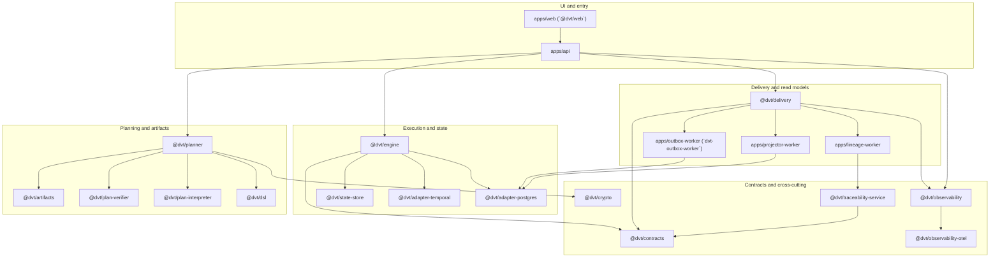

# DVT Component Map

This page is the supporting architecture map for the components that exist in
the repository today.

It is grounded in current code and the active workboard, but it still does not
replace topic-specific specs or the current status surface. Use it to answer
three practical questions:

- which deployable app, package, or worker owns a responsibility today;
- how the component families interact at runtime;
- which queued deltas are already accepted into planning.

## Read This With

1. [Reference Architecture](reference-architecture.md)
2. [System Delivery Status](system-delivery-status.md)
3. [Canonical Doc Code Matrix](../planning/status/canonical-doc-code-matrix.md)
4. [Planning Control Tower](../planning/state/planning-control-tower.md)

## Current Topology

## Entry And UI Surfaces

| Surface                 | Current role                                                                                                      | Code anchors                                                                                                                                                                                                  | Planned delta                                                                                                                                      |
| ----------------------- | ----------------------------------------------------------------------------------------------------------------- | ------------------------------------------------------------------------------------------------------------------------------------------------------------------------------------------------------------- | -------------------------------------------------------------------------------------------------------------------------------------------------- |
| `apps/api`              | HTTP composition root for auth, admission, runtime commands, queries, health, readiness, and reconciler bootstrap | [app.ts](../../apps/api/src/app.ts), [server.ts](../../apps/api/src/server.ts), [buildProtectedRuntimeModule.ts](../../apps/api/src/modules/buildProtectedRuntimeModule.ts)                                   | keep frontend-facing contract and admission/runtime health alignment explicit; related active work includes `MVP-E1` and residual Lane C hardening |
| `apps/web` (`@dvt/web`) | browser application shell, client routing, platform-health probes, run views, and operator-facing UX              | [main.tsx](../../apps/web/src/main.tsx), [App.tsx](../../apps/web/src/app/App.tsx), [httpPlatformHealthClient.ts](../../apps/web/src/capabilities/platform-health/infrastructure/httpPlatformHealthClient.ts) | retire direct mock-driven view wiring and finish backend-backed shell behavior; related active work includes `F-01`, `F-03`, `F-04`, and `MVP-E1`  |

## Planning And Artifact Surfaces

| Surface                                                   | Current role                                                                                | Code anchors                                                                                                                                                                                                     | Planned delta                                                                                                                                           |
| --------------------------------------------------------- | ------------------------------------------------------------------------------------------- | ---------------------------------------------------------------------------------------------------------------------------------------------------------------------------------------------------------------- | ------------------------------------------------------------------------------------------------------------------------------------------------------- |
| `@dvt/planner`                                            | planner facade, graph-source derivation, manifest handling, and execution-plan assembly     | [PlannerFacade.ts](../../packages/@dvt/planner/src/application/PlannerFacade.ts), [derivePlannerGraphSourceFromManifest.ts](../../packages/@dvt/planner/src/application/derivePlannerGraphSourceFromManifest.ts) | formalize the plan-record and plan-store model without widening shared-kernel drift; active work centers on `S08` and ownership cleanup under `RC-G1-D` |
| `@dvt/plan-verifier`, `@dvt/plan-interpreter`, `@dvt/dsl` | verification, DAG interpretation, and deterministic DSL evaluation around planner output    | [verify.ts](../../packages/@dvt/plan-verifier/src/verify.ts), [dagAnalyzer.ts](../../packages/@dvt/plan-interpreter/src/dagAnalyzer.ts), [index.ts](../../packages/@dvt/dsl/src/index.ts)                        | stay narrow and verifiable; changes should track planner compatibility work rather than grow into parallel policy engines                               |
| `@dvt/artifacts`                                          | compiled-code attachment and storage adapters used by planner output and traceability flows | [index.ts](../../packages/@dvt/artifacts/src/index.ts), [attachCompiledCodeRefs.ts](../../packages/@dvt/artifacts/src/compiledCode/attachCompiledCodeRefs.ts)                                                    | absorb storage behavior that should not remain planner-private as `S08` lands                                                                           |

## Execution And State Surfaces

| Surface                                         | Current role                                                                                                        | Code anchors                                                                                                                                                                                                                                              | Planned delta                                                                                                                                  |
| ----------------------------------------------- | ------------------------------------------------------------------------------------------------------------------- | --------------------------------------------------------------------------------------------------------------------------------------------------------------------------------------------------------------------------------------------------------- | ---------------------------------------------------------------------------------------------------------------------------------------------- |
| `@dvt/engine`                                   | owns run lifecycle semantics, access policy, start-run coordination, snapshot projection, and maintenance services  | [WorkflowEngine.ts](../../packages/@dvt/engine/src/core/WorkflowEngine.ts), [StartRunCoordinator.ts](../../packages/@dvt/engine/src/application/StartRunCoordinator.ts), [RunAccessPolicy.ts](../../packages/@dvt/engine/src/security/RunAccessPolicy.ts) | continue hardening and modularization without moving authority out of the engine; active work includes `S02`, `S03`, `S04`, `DHM`, and `RC-G1` |
| `@dvt/state-store` plus `@dvt/adapter-postgres` | state-store boundary, snapshot/query persistence, intent logging, outbox persistence, and plan-store implementation | [index.ts](../../packages/@dvt/state-store/src/index.ts), [PostgresStateStoreRuntime.ts](../../packages/@dvt/adapter-postgres/src/PostgresStateStoreRuntime.ts), [PostgresPlanStore.ts](../../packages/@dvt/adapter-postgres/src/PostgresPlanStore.ts)    | keep ownership explicit while plan-store and state-store responsibilities are separated cleanly under `S02` and `S08`                          |
| `@dvt/adapter-temporal`                         | Temporal provider implementation and worker-host integration behind engine/provider contracts                       | [index.ts](../../packages/@dvt/adapter-temporal/src/index.ts), [TemporalAdapter.ts](../../packages/@dvt/adapter-temporal/src/TemporalAdapter.ts)                                                                                                          | preserve equivalence and provider isolation while engine hardening continues; new behavior must stay behind the provider contract              |

## Delivery, Projection, And Traceability Surfaces

| Surface                                                                                                       | Current role                                                                                                     | Code anchors                                                                                                                                                                                                                                                                                        | Planned delta                                                                                                                |
| ------------------------------------------------------------------------------------------------------------- | ---------------------------------------------------------------------------------------------------------------- | --------------------------------------------------------------------------------------------------------------------------------------------------------------------------------------------------------------------------------------------------------------------------------------------------- | ---------------------------------------------------------------------------------------------------------------------------- |
| `@dvt/delivery`                                                                                               | delivery-runtime library for outbox draining, projection, lineage bridging, and admission guarding helpers       | [OutboxWorkerRuntime.ts](../../packages/@dvt/delivery/src/application/OutboxWorkerRuntime.ts), [ProjectorWorkerRuntime.ts](../../packages/@dvt/delivery/src/application/ProjectorWorkerRuntime.ts), [LineageWorkerRuntime.ts](../../packages/@dvt/delivery/src/application/LineageWorkerRuntime.ts) | tighten remaining contract seams and event-envelope policy; active work includes `S05`, `S07`, and `S11`                     |
| `apps/outbox-worker` (`dvt-outbox-worker`)                                                                    | delivery composition root with shard ownership, ops endpoints, retention, and purge runtime wiring               | [server.ts](../../apps/outbox-worker/src/server.ts), [runOutboxWorkerHost.ts](../../apps/outbox-worker/src/host/runOutboxWorkerHost.ts), [DeliveryBufferPurgeRuntime.ts](../../apps/outbox-worker/src/runtime/DeliveryBufferPurgeRuntime.ts)                                                        | keep operational ownership explicit while retention and purge policy continue to harden                                      |
| `apps/projector-worker` and `apps/lineage-worker`                                                             | dedicated worker processes for snapshot rebuilding and OpenLineage emission                                      | [projector server](../../apps/projector-worker/src/server.ts), [lineage server](../../apps/lineage-worker/src/server.ts), [compiledCodeResolver.ts](../../apps/lineage-worker/src/compiledCodeResolver.ts)                                                                                          | keep projection and lineage as downstream consumers of runtime facts, not lifecycle authorities                              |
| `@dvt/contracts`, `@dvt/observability`, `@dvt/observability-otel`, `@dvt/traceability-service`, `@dvt/crypto` | shared transport contracts, telemetry ports, OTel binding, lineage mapping, and hashing/canonicalization helpers | [contracts index](../../packages/@dvt/contracts/src/index.ts), [observability index](../../packages/@dvt/observability/src/index.ts), [traceability service](../../packages/@dvt/traceability-service/src/service.ts), [crypto index](../../packages/@dvt/canonical/src/index.ts)                   | keep shared-kernel scope tight and explicit; related deltas include `RC-G1` ownership cleanup and production OTel validation |

## Relationship Rules

- `apps/web` talks to the product backend through `apps/api`; it is not a
  second orchestration authority and it should not couple directly to execution
  adapters.
- `apps/api` composes planner, engine, and delivery surfaces, but it should not
  redefine lifecycle or contract invariants that already belong to the engine
  and shared contracts.
- `@dvt/delivery` owns downstream publication and projection behavior; worker
  apps are composition roots and operational shells around that runtime.
- Shared packages stay small on purpose. When ownership is ambiguous, the fix is
  to narrow the shared surface, not to hide the ambiguity in a generic "common"
  bucket.

## Related Pages

- [DVT Domain Map](domain-map.md)
- [Architecture Component Surfaces](components/index.md)
- [System Delivery Status](system-delivery-status.md)
- [Planning Control Tower](../planning/state/planning-control-tower.md)
