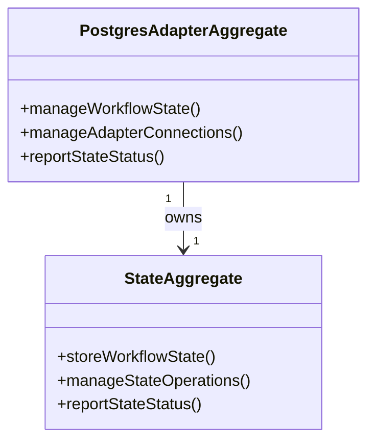

# adapter-postgres DDD Structure

## DDD Diagram

## Aggregates & Entities

- **PostgresAdapterAggregate**: Root aggregate representing the central Postgres adapter model. Owns state management and is the primary entry point for all Postgres persistence operations.
- **StateAggregate**: Subordinate aggregate responsible for storing and managing workflow state within Postgres. Reports state status back to the root aggregate.

## Domain Events

- `StateStored`: Emitted when a workflow state record is successfully persisted to Postgres.
- `StateUpdated`: Emitted when an existing workflow state record is updated.
- `StateQueryExecuted`: Emitted when a state read operation completes and results are returned to the engine.
- `AdapterConnectionEstablished`: Emitted when the Postgres connection pool is initialized and ready.

## Key Files

- `packages/@dvt/adapter-postgres/src/PostgresStateStoreAdapter.ts`
- `packages/@dvt/adapter-postgres/src/PostgresAdapterAggregate.ts`
- `packages/@dvt/adapter-postgres/src/StateAggregate.ts`
