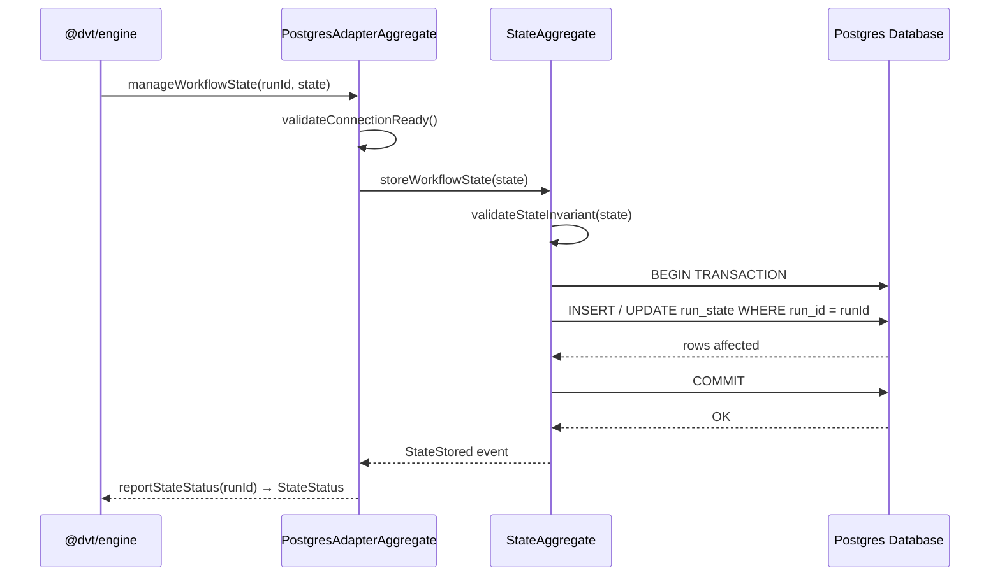

# adapter-postgres Sequence

## Main Flow: Persisting Workflow State

## Global Flow Position

`@dvt/adapter-postgres` sits at the persistence boundary of the Execution Domain. The engine calls it whenever it needs to durably record or retrieve the state of a workflow run. It does not call any other DVT package — it is a leaf in the dependency graph, depending only on the Postgres driver (`pg`) and the contracts defined in `@dvt/contracts`. Upstream: `@dvt/engine` is the sole caller. Downstream: the Postgres database.

## Key Files

- `packages/@dvt/adapter-postgres/src/PostgresStateStoreAdapter.ts`
- `packages/@dvt/adapter-postgres/src/PostgresAdapterAggregate.ts`
- `packages/@dvt/adapter-postgres/src/StateAggregate.ts`
