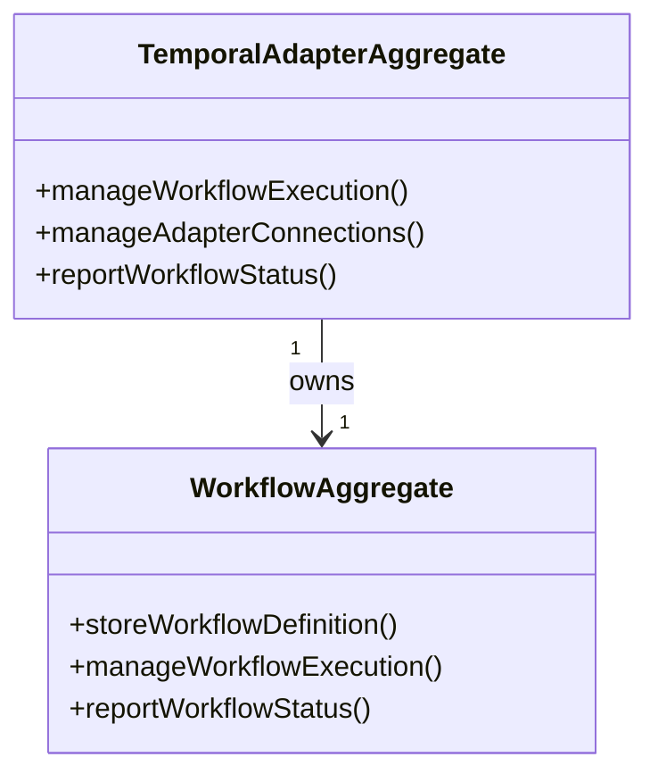

# adapter-temporal DDD Structure

## DDD Diagram

## Aggregates & Entities

- **TemporalAdapterAggregate**: Root aggregate representing the central Temporal adapter model. Owns workflow execution and is the primary entry point for all Temporal integration operations within the Execution Domain.
- **WorkflowAggregate**: Subordinate aggregate responsible for storing workflow definitions and managing individual workflow execution lifecycle within the Temporal service.

## Domain Events

- `WorkflowStarted`: Emitted when a new Temporal workflow execution is successfully initiated.
- `WorkflowCompleted`: Emitted when a Temporal workflow execution reaches a terminal success state.
- `WorkflowFailed`: Emitted when a Temporal workflow execution terminates with an error.
- `AdapterConnectionEstablished`: Emitted when the Temporal client connection is initialised and ready to accept workflow commands.
- `RunRefResolved`: Emitted when `lookupRunRef` successfully maps an external run ID to a Temporal workflow execution handle.

## Key Files

- `packages/@dvt/adapter-temporal/src/TemporalAdapterAggregate.ts`
- `packages/@dvt/adapter-temporal/src/WorkflowAggregate.ts`
- `packages/@dvt/adapter-temporal/src/TemporalRunAdapter.ts`
