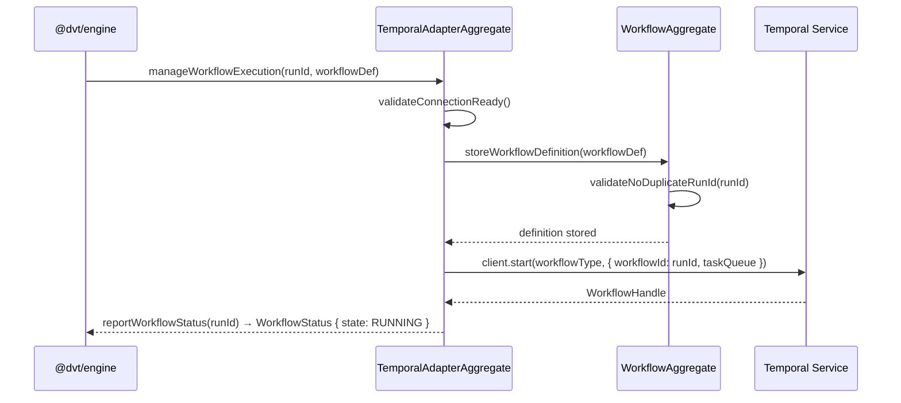

# adapter-temporal Sequence

## Main Flow: Starting a Temporal Workflow Execution

## Global Flow Position

`@dvt/adapter-temporal` sits at the workflow-orchestration boundary of the Execution Domain. The engine calls it to start, query, and signal Temporal workflows that back DVT run executions. It depends on the Temporal SDK client and on contracts from `@dvt/contracts`, but it does not call any other DVT package. Upstream: `@dvt/engine` is the sole caller. Downstream: the Temporal service.

## Key Files

- `packages/@dvt/adapter-temporal/src/TemporalAdapterAggregate.ts`
- `packages/@dvt/adapter-temporal/src/WorkflowAggregate.ts`
- `packages/@dvt/adapter-temporal/src/TemporalRunAdapter.ts`
