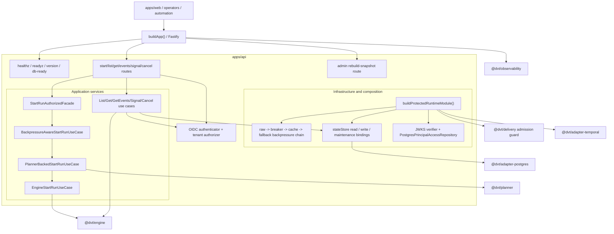
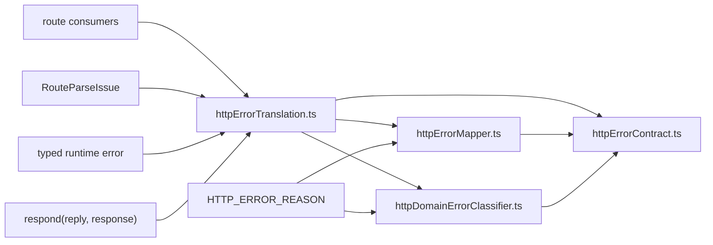
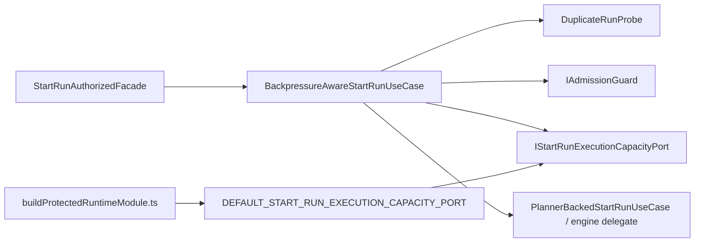
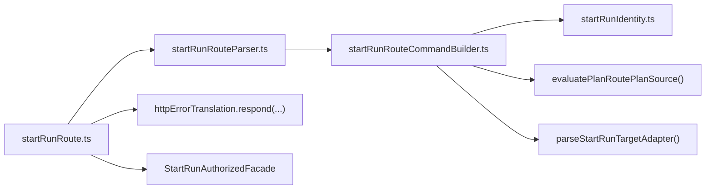
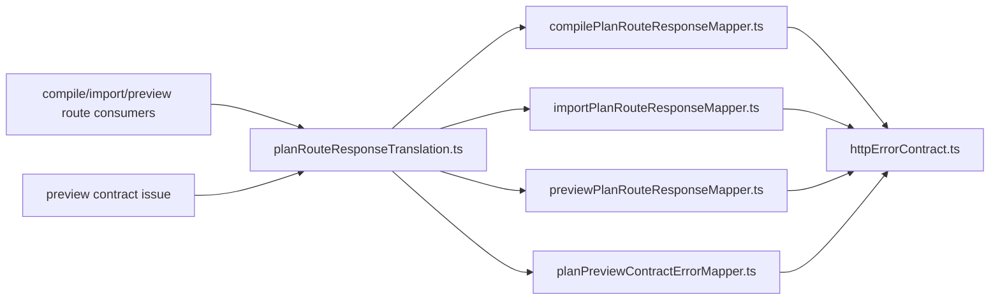
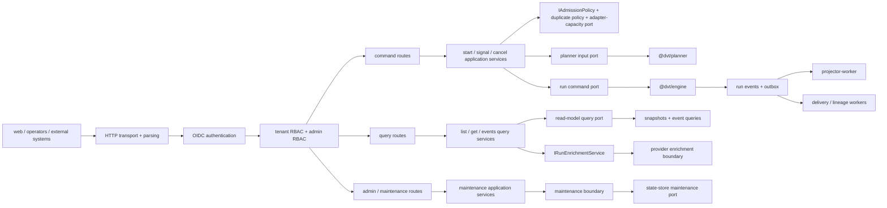

---
title: API Current To Target Architecture
status: Active
owner: Architecture / API / Docs
last_reviewed: 2026-04-23
---

# API Current To Target Architecture

This page is the code-grounded walkthrough for the API component.

It explains:

- the current `apps/api` system as shipped today
- the target API shape the repository should converge toward
- the governed task route already registered in Lane A, C, D, and E

This page does not create a parallel roadmap. It routes the target state
through the existing planning registry.

## Read This With

- [Reference Architecture](../../reference-architecture.md)
- [API / Entry Domain](../../domain-api.md)
- [System Delivery Status](../../system-delivery-status.md)
- [Canonical Doc Code Matrix](../../../planning/status/canonical-doc-code-matrix.md)
- [DVT+ Design Guide - Boundaries, Ports, Composition, and CQRS](../../../guides/dvt-code-style-solid-hexagonal-cqrs.md)
- [MVP-A1 Backend Contractual Inventory](../../../planning/proposals/superseded/runtime-and-contracts/mvp-a1-backend-contractual-inventory-20260329.md)
- [Deep Technical Architectural Review - DVT+ System](../../../planning/reviews/architecture-and-governance/20260402-deep-architectural-review.md)

## Current System

`apps/api` is already a real composition root, not a stub. It bootstraps
Fastify, health and readiness routes, protected runtime routes, OIDC
authentication, tenant-scoped authorization, admission control, Postgres state
access, and provider adapters.

The current API already applies several of the desired principles:

- SOLID at the module level: route parsing, authorization, use cases, and
  infrastructure concerns are separated into distinct modules
- single-responsibility ownership at the package level: `apps/api` composes,
  `@dvt/engine` owns lifecycle semantics, `@dvt/planner` builds plans,
  `@dvt/adapter-postgres` owns persistence, and `@dvt/adapter-temporal` owns
  provider execution
- CQRS and Fowler-style event-sourcing patterns: command operations drive the
  engine and event log, while query operations read snapshots and event history
- hexagonal directionality: application code depends on ports, and
  infrastructure is composed at the edge

### Current Topology

### Current Layer Responsibilities

- **Transport and composition**
  `buildApp()` bootstraps Fastify, public ops routes, request tracing,
  operational hooks, and OIDC-gated protected runtime registration.
  Anchors:
  `apps/api/src/app.ts`, `apps/api/src/routes/health.ts`,
  `apps/api/src/modules/registerOperationalHooks.ts`
- **Application command path**
  Start-run still drives authorization, duplicate probing, admission, optional
  planner execution, plan validation, and engine dispatch.
  The API-to-engine `StartRunCommand` / `StartRunResult` boundary now lives in
  `@dvt/contracts` rather than app-local shadow types.
  `/runs/:runId/cancel` dispatches `engine.cancelRun(...)` and rejects
  non-empty `reason` payloads.
  `/runs/:runId/signal` remains the cooperative path, including
  `signalType=CANCEL` for reason-carrying requests.
  Anchors:
  `apps/api/src/entrypoints/http/startRunRoute.ts`,
  `apps/api/src/application/services/PlannerBackedStartRunUseCase.ts`,
  `apps/api/src/application/services/cancelRunUseCase.ts`,
  `apps/api/src/application/services/signalRunUseCase.ts`
- **Application query path**
  `GET /runs`, `GET /runs/:runId`, and `GET /runs/:runId/events` authorize
  first and then read through the state-store read boundary.
  `GET /runs/:runId` optionally uses enriched engine status.
  Anchors:
  `apps/api/src/application/services/listRunsUseCase.ts`,
  `apps/api/src/application/services/getRunStatusUseCase.ts`,
  `apps/api/src/application/services/getRunEventsUseCase.ts`
- **Auth and RBAC**
  Authentication is handled through OIDC/JWKS.
  Authorization is tenant-scoped and action-scoped through
  `AuthorizeCommandScopeService` and domain policy.
  Anchors:
  `apps/api/src/infrastructure/auth/oidcAuthenticator.ts`,
  `apps/api/src/infrastructure/auth/jwksJwtVerifier.ts`,
  `apps/api/src/application/services/authorizeCommandScopeService.ts`,
  `apps/api/src/domain/auth/policy.ts`
- **Infrastructure composition**
  The protected runtime module wires Postgres state access, plan storage,
  admission telemetry, backpressure fallback, provider adapters, and engine
  construction. The authenticated start-run chain is now assembled through the
  dedicated `startRun/buildProtectedStartRunRuntime.ts` subcomponent instead
  of being re-constructed inline in the outer root.
  Anchors:
  `apps/api/src/modules/buildProtectedRuntimeModule.ts`,
  `apps/api/src/modules/startRun/buildProtectedStartRunRuntime.ts`,
  `apps/api/src/modules/buildProviderAdapters.ts`,
  `apps/api/src/modules/stateStoreRoles.ts`,
  `apps/api/src/application/services/WorkflowEngineFactory.ts`

Native cancel and cooperative cancel are now intentionally split:

- `POST /runs/:runId/cancel` is the provider-native cancel route and rejects a
  non-empty structured `reason`.
- `POST /runs/:runId/signal` with `signalType=CANCEL` remains the explicit
  cooperative, reason-carrying path.

### Current Strengths

- The API already behaves as a composition root instead of leaking provider or
  database concerns into route handlers.
- Query endpoints are authorization-first and state-store/read-model backed.
- The command path already has explicit duplicate-run probing and admission
  control before engine dispatch.
- The HTTP error translation boundary now has a clearer local seam:
  `httpErrorContract.ts` owns the canonical envelope primitives,
  `httpErrorTranslation.ts` is the public component API and writer facade,
  `routeParseIssue.ts` owns parser rejection semantics,
  `httpErrorMapper.ts` owns parse/auth/facade/engine translation, and
  `httpDomainErrorClassifier.ts` owns typed runtime-domain error translation.
  Translated `HttpResponseModel` values are now written through
  `httpErrorTranslation.respond(...)`, which delegates to the contract-owned
  serializer instead of route-local manual serialization.
- Architectural guardrails exist in code through dependency-cruiser rules for
  domain/application/entrypoint separation.
- The protected runtime is feature-complete enough to support real frontend and
  operator work, not just health checks.

### HTTP Error Translation Boundary

The error-envelope slice now behaves like a real local component instead of a
loose utility cluster.

Use the local component guide for public API, invariants, transitions, and
consumers:

- [HTTP runtime error translation component](../../../../apps/api/docs/http-runtime-error-translation-component.md)

The component seam now also owns feature-level static envelopes for
`adminRoutes.ts` and `workspaceGraphDraftRoutes.ts`, so those consumers no
longer need direct `createHttpErrorResponse(...)` imports for component-owned
semantic failures.

The same seam policy now applies to response writing: production entrypoint
consumers and generic route helpers emit `HttpResponseModel` values through
`httpErrorTranslation.respond(...)` rather than calling `sendHttpResponse(...)`
directly.

### Start-run execution-capacity admission boundary

`AR-C3-A` introduces an abstract execution-capacity seam into the start-run
admission path without teaching the API application layer about Temporal queue
internals.

Use the local component guide for the public API, invariants, transitions, and
consumers of this seam:

- [Start-run execution capacity admission component](../../../../apps/api/docs/start-run-execution-capacity-admission-component.md)

The caller-visible result vocabulary for this seam is documented separately in
the shared contract component guide:

- [Start-run boundary component](../engine/contracts/engine/start-run-boundary-component.md)
- [Start-run application component](../../../../apps/api/docs/start-run-application-component.md)

The wider authenticated start-run path is also documented as its own local
component. That guide makes two rules explicit:

- `apps/api` imports canonical command/result vocabulary directly from
  `@dvt/contracts`
- app-local command/result re-export shims are not part of the target state

### Start-run HTTP entrypoint boundary

The transport edge for `start-run` is now explicit as its own local
subcomponent instead of living only as scattered parser files.

Use the local component guide for the public API, invariants, transitions, and
consumers of that entrypoint seam:

- [Start-run HTTP entrypoint component](../../../../apps/api/docs/start-run-http-entrypoint-component.md)
- [Start-run platform identity component](../../../../apps/api/docs/start-run-platform-identity-component.md)

That entrypoint also owns the platform-owned execution identity insertion from
`ADR-0050`. Caller-provided `runId` is rejected at parse time, and the internal
`StartRunCommand.runId` is generated as `run_<UUIDv7>` inside the protected API
boundary before the command crosses into the authenticated start-run
application component.

The identity seam is deliberately narrower than a runtime engine seam:

- it allocates an opaque, time-local, collision-resistant resource id;
- it does not own retry, duplicate-run, lifecycle, recovery, provider workflow,
  engine, or state-store semantics;
- persistence uniqueness remains the final collision guard.

The paired frontend component guide documents the caller-owned side of that
same boundary:

- [Start-run client identity boundary](../web/runs/start-run-client-identity-boundary.md)

Current slice status:

- `AR-C3-A` is the abstract seam and fail-closed default binding
- `AR-C3-B` remains the concrete adapter-backed capacity binding
- `AR-C3-C` remains telemetry/runbook/operational closure

### Plan Route Response Translation Boundary

The `preview/compile/import` family now has its own sibling local component
instead of leaning on scattered route-local mapper imports.

Use the local component guide for the public API, invariants, transitions, and
consumers of this seam:

- [Plan route response translation component](../../../../apps/api/docs/plan-route-response-translation-component.md)

This keeps two adjacent but separate entrypoint components explicit:

- `httpErrorTranslation.ts` for runtime protected-route parse/auth/runtime/admin
  failures
- `planRouteResponseTranslation.ts` for `preview/compile/import` response
  mapping in the plan-route family

### Current Gaps

| Gap                                                               | Why it matters                                                                                                                   | Governed tasks                              |
| ----------------------------------------------------------------- | -------------------------------------------------------------------------------------------------------------------------------- | ------------------------------------------- |
| Admin route RBAC hardening follow-through remains                 | Explicit admin-scope RBAC is now wired in admin routes; remaining work is test-shape and composition hardening (`AR-C1-T1..T4`). | `AR-C1-T1..T4`                              |
| SLA and consistency expectations are still implicit               | The API exposes freshness and backpressure behavior, but healthy thresholds remain scattered across config and runbooks.         | `AR-C2`                                     |
| Concrete execution-capacity binding is still pending              | The API now has an abstract admission seam, but the real adapter-backed capacity signal is not yet bound in production.          | `AR-C3-B`, `AR-C3-C`                        |
| Temporal activity writes depend directly on the state store       | State-store failures can cascade into execution stalls without an explicit breaker boundary.                                     | `AR-C4`                                     |
| Query purity is incomplete                                        | `enrichRunStatus()` still lives on `IWorkflowEngine`, which weakens the read/write separation story.                             | `AR-A3`                                     |
| Snapshot rebuild concurrency is not yet a contract invariant      | Current mutual exclusion exists in the PostgreSQL implementation, but the contract does not require it.                          | `AR-A6`                                     |
| Step-specific config is still too implicit                        | `stepTypeConfig` remains opaque at admission time, so failures can surface too late in adapter execution.                        | `S08-4`, `MW-A1`                            |
| The API still inherits dbt-first assumptions upstream             | Planner input, artifact shape, and Temporal execution are not yet fully generalized for non-dbt workflows.                       | `MW-A2`, `MW-A3`, `MW-C1`, `MW-D1`, `MW-D2` |
| Frontend-facing runtime contract is not yet canonically published | The backend route surface exists, but the web consumption contract is not yet frozen in one frontend-facing artifact.            | `MVP-E1`, `F-07`, `F-08`                    |

## Target System

The target API is not a bigger controller layer. It is a cleaner boundary.

The desired system applies these principles together:

- SOLID:
  route handlers stay thin, command and query application services stay
  separated, and engine enrichment becomes a separate capability rather than a
  mixed concern on the core engine contract
- single-responsibility ownership:
  `apps/api` owns transport and composition, never lifecycle semantics or
  shared-kernel convenience drift
- hexagonal architecture:
  all runtime dependencies cross explicit ports, with concrete adapters bound in
  the API composition root or worker roots
- CQRS:
  commands mutate run state through the engine, queries read through governed
  projections and event history, and optional enrichment stays degradable
- Fowler-style patterns:
  event sourcing, transactional outbox, composition root, and explicit
  read-model separation remain the architectural baseline

### Target Topology

### Target Characteristics

| Concern                     | Current posture                                                                                     | Target posture                                                                                                |
| --------------------------- | --------------------------------------------------------------------------------------------------- | ------------------------------------------------------------------------------------------------------------- |
| Command boundary            | start-run path is explicit but still concentrated in one large protected-runtime composition module | command orchestration stays explicit but is split across smaller, clearer ports with capacity-aware admission |
| Query boundary              | query services already use read paths, but enrichment still shares the engine contract              | core query path is pure CQRS; enrichment is optional and isolated behind `IRunEnrichmentService`              |
| Authorization               | tenant and action checks are real, but admin path hardening is incomplete                           | runtime and admin paths use explicit, action-specific RBAC without relying on feature flags                   |
| Admission                   | duplicate detection, delivery backpressure, and an abstract execution-capacity seam are real        | admission uses a concrete adapter-backed capacity signal and publishes measurable SLA outcomes                |
| Concurrency and operability | snapshot freshness and health are visible, but some guarantees are still implementation-level       | concurrency, freshness, and degradation rules are contract-backed and observable                              |
| Extensibility               | planner and execution still lean dbt-first in key seams                                             | planner input, step validation, artifacts, and worker routing are step-kind and graph-source agnostic         |

## Governed Transition Route

The transition already exists as governed work. Use these phases instead of
creating a separate API backlog.

### Phase 1: Secure And Operational Boundary

- `AR-C1`
  Add explicit RBAC to admin routes and close the remaining authorization and
  test-hardening gaps around maintenance endpoints.
- `AR-C2`
  Publish formal API-adjacent SLA targets for freshness, delivery latency, plan
  compilation, and run start latency.
- `AR-C3`
  Introduce and operationalize execution-capacity admission so start-run can
  reject work the runtime cannot currently absorb without coupling the API
  boundary to a provider-specific queue model.
- `AR-C4`
  Insert a circuit-breaker boundary between Temporal activity writes and the
  state store.

### Phase 2: Purify Hexagonal And CQRS Boundaries

- `AR-A3`
  Extract `enrichRunStatus` into `IRunEnrichmentService` so the core engine
  read path stays pure.
- `AR-A6`
  Make snapshot rebuild concurrency a contract requirement, not just a
  PostgreSQL implementation detail.
- `AR-A7`
  Split `@dvt/delivery` domain rules from runtime orchestration to reduce
  cross-boundary leakage at the API/admission seam.

### Phase 3: Replace Implicit Contracts With Governed Step Semantics

- `S08-4`
  Reject invalid `stepTypeConfig` at admission rather than inside adapter
  execution.
- `MW-A1`
  Introduce a `StepKindRegistry` with schema, capability, and adapter routing
  metadata.
- `MW-A3`
  Replace dbt-shaped `compiledCodeRef` assumptions with a step-kind-agnostic
  artifact model.
- `MW-A4`
  Publish the governed extension protocol so adding a new step kind does not
  require reverse-engineering runtime internals.

### Phase 4: Reach A DBT-Agnostic API

- `MW-A2`
  Make `GenericGraphSource` the canonical planner input so external systems do
  not have to speak dbt manifest as the product's native language.
- `MW-C1`
  Dispatch Temporal activity execution by `StepKind` instead of hard-coding a
  dbt-only execution path.
- `MW-D1`
  Expose an SDK or API for external plan definition against the generalized
  planner input.
- `MW-D2`
  Define worker routing by step kind so runtime deployment matches the new
  execution model.

### Phase 5: Close The Consumer Contract

- `MVP-E1`
  Publish the frontend-facing backend contract for the routes that already
  exist.
- `F-07`
  Freeze typed runtime DTOs and align the frontend to the governed route set.
- `F-08`
  Use that contract to wire the real plan-to-run flow without mock drift.

## Design Rules To Keep

- Do not move runtime semantics from `@dvt/engine` into route handlers or API
  services.
- Do not let feature flags act as security controls.
- Do not bypass the read-model boundary with ad hoc provider or database reads
  from route handlers.
- Do not describe dbt as the product core once `MW-A2` and `MW-C1` begin
  landing; dbt is a supported adapter path, not the system identity.
