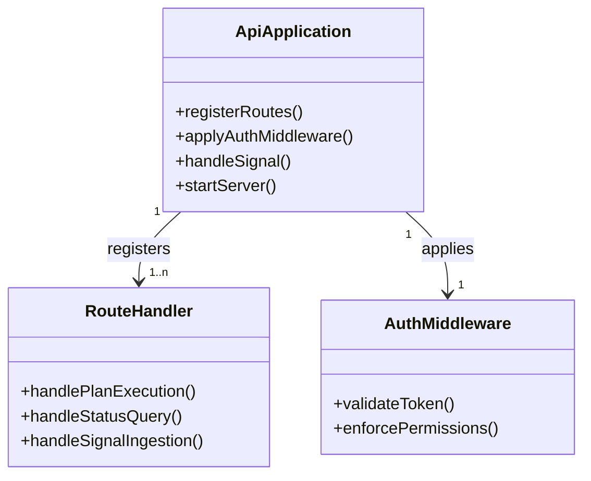

# api DDD Structure

## DDD Diagram

## Aggregates & Entities

- **ApiApplication**: The root application model for `apps/api`. Owns route registration, authentication middleware wiring, and server lifecycle. Acts as the entry point for all inbound HTTP traffic.
- **RouteHandler**: Encapsulates a single HTTP endpoint's request/response logic, including input validation, delegation to the engine or delivery layer, and response serialisation.
- **AuthMiddleware**: Enforces authentication and authorisation on incoming requests before they reach route handlers.

## Domain Events

- `PlanExecutionRequested`: Emitted when a valid plan execution HTTP request is received and forwarded to the engine.
- `StatusQueried`: Emitted when a run status HTTP query is received and a response has been dispatched.
- `SignalReceived`: Emitted when an inbound HTTP signal is validated and forwarded for processing.
- `AuthenticationFailed`: Emitted when an inbound request fails token validation or permission checks.

## Key Files

- `apps/api/src/index.ts`
- `apps/api/src/routes/`
- `apps/api/src/middleware/auth.ts`
