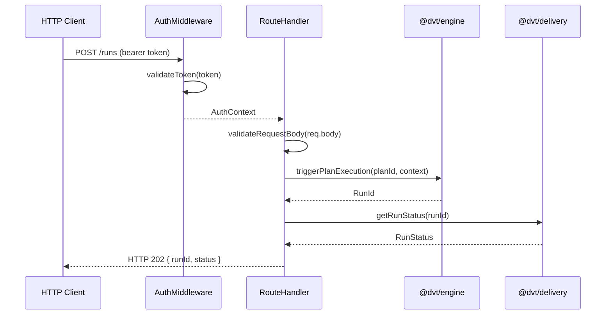

# api Sequence

## Main Flow: Plan Execution Request

## Global Flow Position

`apps/api` is the outermost entry point of the DVT system. All external traffic — from CI pipelines, the web UI (`@dvt/web`), or other services — enters through this component. It delegates plan execution and signal handling to `@dvt/engine`, and delegates status queries to `@dvt/delivery`. It does not interact with adapters, the database, or Temporal directly. It is called by external HTTP clients and calls `@dvt/engine` and `@dvt/delivery`.

## Key Files

- `apps/api/src/index.ts`
- `apps/api/src/routes/`
- `apps/api/src/middleware/auth.ts`
