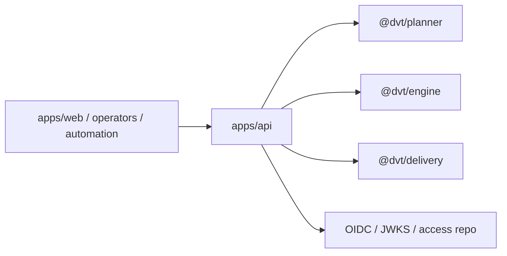

# apps/api

`apps/api` is the authenticated HTTP composition root for DVT.

It owns route parsing, auth and tenant checks, admission, runtime command and
query wiring, operational probes, and reconciler bootstrap inside the API
process.

## Current Responsibilities

- expose protected runtime routes for start, list, get, events, signal, and cancel;
- compose planner, engine, delivery, and operational dependencies;
- surface readiness, health, version, and reconciler state;
- keep auth and admission decisions at the entry boundary.

## Interface Map

## Code Anchors

- [app.ts](../../../../apps/api/src/app.ts)
- [server.ts](../../../../apps/api/src/server.ts)
- [buildProtectedRuntimeModule.ts](../../../../apps/api/src/modules/buildProtectedRuntimeModule.ts)
- [startRunRoute.ts](../../../../apps/api/src/entrypoints/http/startRunRoute.ts)
- [getRunRoute.ts](../../../../apps/api/src/entrypoints/http/getRunRoute.ts)

## Current Posture

This component is active product code. The remaining work is about contract
clarity and incremental hardening, not about inventing the API layer.

## Current To Target

Use the main walkthrough below for the real current system, the target API
shape, and the governed transition route:

- [API Current To Target Architecture](api-current-to-target-architecture.md)
- [API Control-Plane User Manual](../../../guides/api-control-plane-user-manual-20260404.md)
- [API Control-Plane Technical Manual](../../../guides/api-control-plane-technical-manual-20260404.md)
- [API Runtime SLA Canonical](../../../runbooks/api-runtime-sla-canonical-20260404.md)

## Planned Delta

- keep the frontend-consumable contract explicit under `MVP-E1`;
- preserve admission and health semantics that the UI health work (`F-03`)
  relies on.

## Historical Deep Dives

These notes are older decomposition artifacts. Use them only as supporting
detail after the current page:

- [DDD Structure](api-ddd.md)
- [Functionalities](api-functional.md)
- [Constraints and invariants](api-constraints.md)
- [Sequence diagrams](api-sequence.md)
