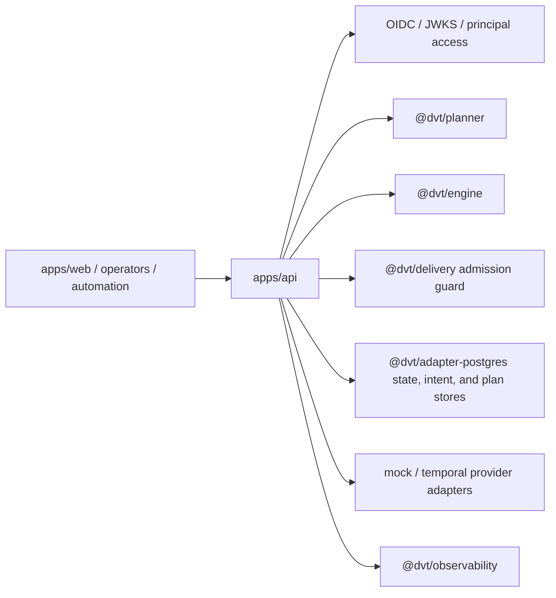

# apps/api

`apps/api` is the authenticated HTTP composition root for DVT.

It owns route parsing, auth and tenant checks, admission, runtime command and
query wiring, operational probes, and reconciler bootstrap inside the API
process.

## Current Responsibilities

- expose protected runtime routes for start, list, get, events, signal, and cancel;
- expose plan preview/import routes used by the frontend planning flow;
- expose optional admin rebuild routes when operationally enabled;
- compose planner, engine, delivery, and operational dependencies;
- surface readiness, health, version, and reconciler state;
- keep auth and admission decisions at the entry boundary.

## Interface Map

## Code Anchors

- [app.ts](../../../../apps/api/src/app.ts)
- [server.ts](../../../../apps/api/src/server.ts)
- [buildProtectedRuntimeModule.ts](../../../../apps/api/src/modules/buildProtectedRuntimeModule.ts)
- [buildProtectedRuntimeStorage.ts](../../../../apps/api/src/modules/protectedRuntime/buildProtectedRuntimeStorage.ts)
- [buildProtectedAdmissionRuntime.ts](../../../../apps/api/src/modules/protectedRuntime/buildProtectedAdmissionRuntime.ts)
- [buildProtectedSecurityRuntime.ts](../../../../apps/api/src/modules/protectedRuntime/buildProtectedSecurityRuntime.ts)
- [buildProtectedExecutionRuntime.ts](../../../../apps/api/src/modules/protectedRuntime/buildProtectedExecutionRuntime.ts)
- [buildProtectedStartRunRuntime.ts](../../../../apps/api/src/modules/startRun/buildProtectedStartRunRuntime.ts)
- [buildWorkspaceGraphDraftRuntime.ts](../../../../apps/api/src/modules/workspaceGraphDraft/buildWorkspaceGraphDraftRuntime.ts)
- [buildProviderAdapters.ts](../../../../apps/api/src/modules/buildProviderAdapters.ts)
- [planCompileBoundary.ts](../../../../apps/api/src/modules/planCompileBoundary.ts)
- [planRoutePolicyCatalog.ts](../../../../apps/api/src/application/services/planRoutePolicyCatalog.ts)
- [resolveAuthorizedPlannerInputEnvelope.ts](../../../../apps/api/src/application/services/resolveAuthorizedPlannerInputEnvelope.ts)
- [executePlanRouteFacade.ts](../../../../apps/api/src/entrypoints/http/executePlanRouteFacade.ts)
- [startRunRoute.ts](../../../../apps/api/src/entrypoints/http/startRunRoute.ts)
- [previewPlanRoute.ts](../../../../apps/api/src/entrypoints/http/previewPlanRoute.ts)
- [importPlanRoute.ts](../../../../apps/api/src/entrypoints/http/importPlanRoute.ts)
- [compilePlanRoute.ts](../../../../apps/api/src/entrypoints/http/compilePlanRoute.ts)
- [adminRoutes.ts](../../../../apps/api/src/entrypoints/http/adminRoutes.ts)
- [getRunRoute.ts](../../../../apps/api/src/entrypoints/http/getRunRoute.ts)

## Current Posture

This component is active product code. The protected plan-route family now
shares one remote-facade executor, one declarative request-resolution recipe,
one declarative route-policy catalog, and one canonical authorized
planner-input assembler for the preview and compile planner-backed flows.
Preview and planner-backed start-run now also resolve selected closure from the
protected workspace graph draft through one local executable-subgraph seam
before planner build, so `apps/api` no longer relies on whole-draft compile
assumptions for selected execution.
Preview observability enrichment now binds once at the request boundary used
by the preview flow, while import keeps canonical ownership checks separate
from planner ingress. The `plan compile` boundary now converges catalog
policy, typed profile selection, and planner construction in one root-owned
boundary module.

## Current To Target

Use the main walkthrough below for the real current system, the target API
shape, and the governed transition route:

- [API Current To Target Architecture](./api-current-to-target-architecture.md)
- [Protected Runtime And Plan Compile Component](./protected-runtime-and-plan-compile-component.md)
- [Temporal Fowler provider-truth follow-up review](../../../planning/reviews/architecture-and-governance/20260421-temporal-fowler-provider-truth-follow-up-review.md)
- [API Control-Plane User Manual](../../../guides/api-control-plane-user-manual-20260404.md)
- [API Control-Plane Technical Manual](../../../guides/api-control-plane-technical-manual-20260404.md)
- [API Runtime SLA Canonical](../../../runbooks/api-runtime-sla-canonical-20260404.md)

## Local Component Guides

- [Protected Runtime And Plan Compile Component](./protected-runtime-and-plan-compile-component.md):
  public API, invariants, transitions, consumers, focused file map, and
  semantic test anchors for the protected runtime composition seam.
- [HTTP runtime error translation component](../../../../apps/api/docs/http-runtime-error-translation-component.md):
  local guide for the HTTP error-envelope boundary with public API,
  invariants, transitions, consumers, and focused diagrams.
- [Plan route response translation component](../../../../apps/api/docs/plan-route-response-translation-component.md):
  local guide for the preview/compile/import response-mapping boundary with
  public API, invariants, transitions, consumers, and focused diagrams.
- [Start-run application component](../../../../apps/api/docs/start-run-application-component.md):
  local guide for the authenticated start-run application component, its
  facade/use-case boundaries, invariants, transitions, consumers, and
  canonical shared-contract import rules.
- [Start-run control boundary component](../../../../apps/api/docs/start-run-control-boundary-component.md):
  local guide for the grouped API start-run control boundary spanning caller
  intent parsing, platform-owned identity insertion, authenticated admission,
  and delegate dispatch.
- [Start-run runtime composition component](../../../../apps/api/docs/start-run-runtime-composition-component.md):
  local guide for the protected-runtime subcomponent that assembles the
  authenticated start-run chain from abstract runtime dependencies.
- [Executable-subgraph resolution component](../../../../apps/api/docs/executable-subgraph-resolution-component.md):
  local guide for the API seam that resolves protected selected-closure truth
  for preview and planner-backed start-run before planner build.
- [Protected runtime dependency builders component](../../../../apps/api/docs/protected-runtime-dependency-builders-component.md):
  local guide for the protected-runtime builder cluster that assembles storage,
  admission, security, and execution dependency slices for the outer root.
- [Protected security access decision component](../../../../apps/api/docs/protected-security-access-decision-component.md):
  local guide for the protected auth/authz language and decision component,
  including public API, invariants, transitions, consumers, and semantic
  ownership rules.
- [Start-run execution capacity admission component](../../../../apps/api/docs/start-run-execution-capacity-admission-component.md):
  local guide for the abstract start-run execution-capacity admission seam,
  its fail-closed default binding, invariants, transitions, and consumers.
- [Start-run admission observability component](../../../../apps/api/docs/start-run-admission-observability-component.md):
  local guide for the canonical start-run admission telemetry cluster,
  bounded metric-label rules, invariants, transitions, and consumers.
- [Workspace graph draft runtime composition component](../../../../apps/api/docs/workspace-graph-draft-runtime-composition-component.md):
  local guide for the protected-runtime subcomponent that assembles the
  workspace-graph-draft store, capability service, and use-case chain.
- [Workspace graph draft application component](../../../../apps/api/docs/workspace-graph-draft-application-component.md):
  local guide for the protected workspace-graph-draft application component,
  its capability service, read/write use cases, invariants, and semantic
  ownership rules.
- [Temporal Fowler provider-truth follow-up review](../../../planning/reviews/architecture-and-governance/20260421-temporal-fowler-provider-truth-follow-up-review.md):
  Fowler-style architecture analysis for the Temporal branch work, residual
  drift map, mature-system comparison, and recommended next moves.

## Planned Delta

- keep the frontend-consumable contract explicit under `MVP-E1`;
- preserve admission and health semantics that the UI health work (`F-03`)
  relies on.
- keep planner preview/import and runtime command routes aligned so the API
  stays the only browser-facing backend entry surface.

## Historical Deep Dives

These notes are older decomposition artifacts. Use them only as supporting
detail after the current page:

- [DDD Structure](./api-ddd.md)
- [Functionalities](./api-functional.md)
- [Constraints and invariants](./api-constraints.md)
- [Sequence diagrams](./api-sequence.md)
