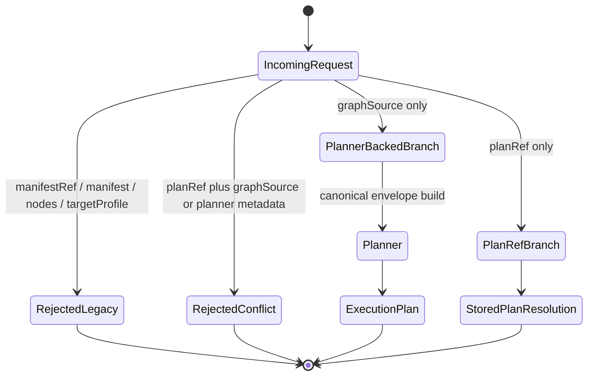
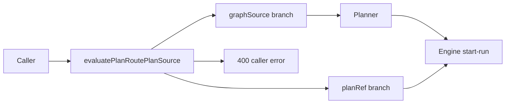

# Planner Ingress Hard-Cut Component

## Owned Concern

This component owns the protected runtime API rule that planner-backed routes
admit canonical `graphSource` only. It prevents legacy DBT-native source aliases
from re-entering `POST /runs/start` or `POST /plans/preview`.

## Public API

- `POST /runs/start`: accepts either persisted `planRef` or planner-backed
  `graphSource`, but not both.
- `POST /plans/preview`: accepts planner-backed `graphSource` and preview
  policy fields.
- `evaluatePlanRoutePlanSource`: shared route policy that classifies
  `planRef` versus planner-backed `graphSource`.
- `parsePlanRoutePlannerEnvelope`: canonical planner-envelope parser.
- `buildPlannerBackedStartRunCommand`: constructs the planner-backed
  start-run command after policy classification.
- `previewPlanRoute`: executes preview through the same canonical source
  posture.

## Invariants

- `graphSource` is the only live planner-backed source at protected runtime.
- `manifestRef`, raw `manifest`, and raw `nodes` are forbidden runtime planner
  source fields.
- `targetProfile` is not accepted as runtime planner-backed input because it is
  not part of a live decision path.
- `planRef` and planner-backed metadata cannot appear in the same request.
- Preview and planner-backed start-run must share the same plan-source policy.
- HTTP parsers must fail closed instead of trimming or repairing source values.
- A future manifest-native product must translate into `graphSource` through a
  separate boundary before protected runtime admission.

## Transitions

## Consumers

- `apps/api/src/entrypoints/http/protectedRuntimePlanRoutes.ts`
- `apps/api/src/entrypoints/http/previewPlanRoute.ts`
- `apps/api/src/entrypoints/http/startRunRouteCommandBuilder.ts`
- `apps/api/src/application/services/PlannerBackedStartRunUseCase.ts`
- `apps/api/src/application/services/PreviewPlanUseCase.ts`
- `packages/@dvt/contracts/src/contracts/engine/StartRunBoundary.v1.ts`

## Flow

## Verification

- `planRoutePlanSourcePolicy.test.ts`: direct shared-policy branch and rejection
  coverage.
- `previewPlanRoute.inputPolicy.test.ts`: preview route rejection for legacy
  source fields and conflicting plan inputs.
- `startRunRouteCommandBuilder.test.ts`: start-run command construction after
  policy classification.
- `planRoutePlanSourcePolicy.test.ts`: executable acceptance and rejection
  behavior for canonical and legacy plan-source inputs.
