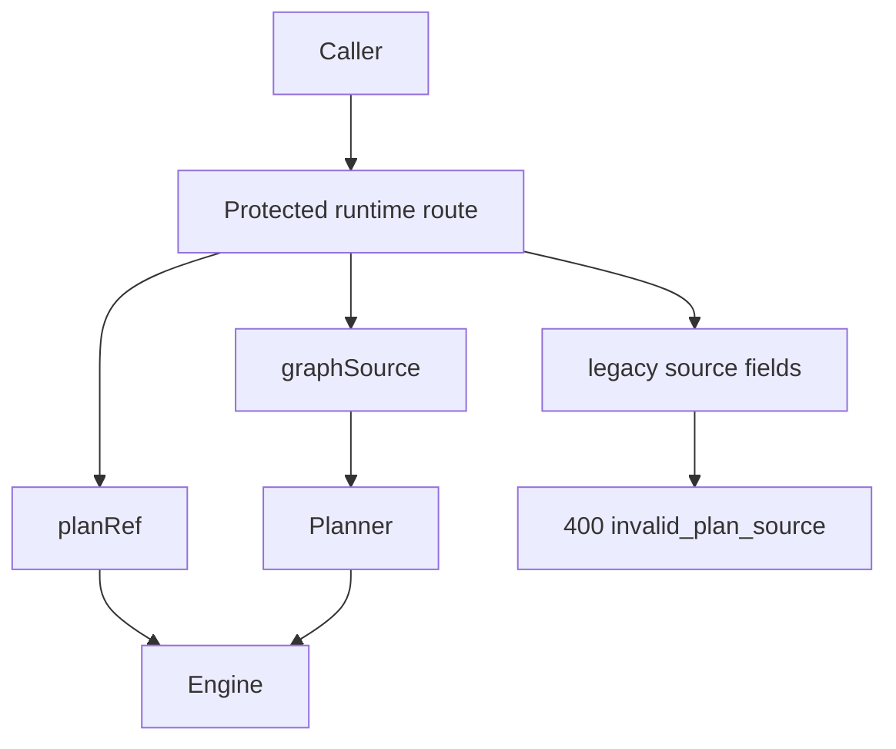

# Planner Ingress Hard-Cut User Stories

## User Stories

### US-PLANNER-HC-001: Start Run Uses Canonical Graph Source

As an API caller starting a planner-backed run, I want to provide `graphSource`
so the runtime planner boundary receives one canonical source shape.

Acceptance:

- `graphSource` is accepted when `planRef` is absent.
- `manifestRef`, raw `manifest`, and raw `nodes` are rejected.
- Invalid source shape returns `400 invalid_plan_source`.

### US-PLANNER-HC-002: Preview Uses The Same Source Policy

As an API caller previewing a plan, I want preview to reject the same legacy
source fields as start-run so route behavior does not diverge.

Acceptance:

- Preview accepts `graphSource` with a valid `previewProfile`.
- Preview rejects `manifestRef`.
- Preview does not invoke the planner after source-policy rejection.

### US-PLANNER-HC-003: Persisted Plan And Planner-Backed Branches Do Not Mix

As a runtime operator, I want `planRef` requests and planner-backed requests to
be mutually exclusive so execution cannot combine stale stored-plan identity
with new planner input.

Acceptance:

- `planRef` with planner metadata returns `400 conflicting_plan_inputs`.
- `planRef` with `graphSource` returns `400 conflicting_plan_inputs`.

### US-PLANNER-HC-004: Dead Compatibility Fields Are Rejected

As an architecture reviewer, I want `targetProfile` to remain out of protected
runtime planner input unless it owns a real decision path.

Acceptance:

- `targetProfile` under planner environment is rejected.
- The component doc keeps `targetProfile` listed as forbidden runtime input.

### US-PLANNER-HC-005: Future Manifest-Native Ingestion Is Separate

As a product owner, I want any future manifest-native ingestion to be designed
as its own command/query rail so protected runtime remains canonical.

Acceptance:

- Runtime hard-cut docs state that manifest-native ingestion must translate to
  `graphSource` before protected runtime admission.
- No runtime route silently repairs legacy source payloads.

## Scenario Map

