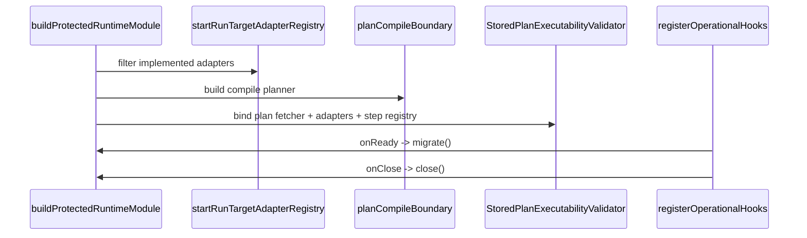

# Protected Runtime And Plan Compile Component

This page explains one concrete `apps/api` component instead of the whole API:
the protected runtime composition seam plus the plan-compile boundary that feeds
it.

## Why This Is A Component

These files form one component because together they answer one question:

> How does `apps/api` wire protected runtime execution, validate a stored plan,
> and expose a compile-time planner surface without duplicating runtime policy?

The files are related by responsibility, not by shared mutable state. That is
why the right grouping is a documented component, not one exported object that
acts as a fake namespace.

## File Responsibilities

| File                                                                                                                     | Responsibility                                                      | Role in the component                                                    |
| ------------------------------------------------------------------------------------------------------------------------ | ------------------------------------------------------------------- | ------------------------------------------------------------------------ |
| [buildProtectedRuntimeModule.ts](../../../../apps/api/src/modules/buildProtectedRuntimeModule.ts)                        | Main composition root for protected runtime wiring                  | Binds stores, adapters, planner, validator, auth, and runtime services   |
| [buildProviderAdapters.ts](../../../../apps/api/src/modules/buildProviderAdapters.ts)                                    | Builds the live provider-adapter map                                | Keeps provider construction separate from the rest of module composition |
| [registerOperationalHooks.ts](../../../../apps/api/src/modules/registerOperationalHooks.ts)                              | Fastify lifecycle hook registration                                 | Connects `migrate()` and `close()` to process lifecycle                  |
| [planCompileBoundary.ts](../../../../apps/api/src/modules/planCompileBoundary.ts)                                        | Owns compile-profile catalog and compile planner construction       | Prevents compile policy from being scattered across unrelated modules    |
| [startRunTargetAdapterRegistry.ts](../../../../apps/api/src/application/services/startRunTargetAdapterRegistry.ts)       | Canonical supported-adapter registry for `startRun`                 | Supplies the implemented adapter truth used by admission                 |
| [StoredPlanExecutabilityValidator.ts](../../../../apps/api/src/application/services/StoredPlanExecutabilityValidator.ts) | Validates stored plan refs against adapter support and capabilities | Fail-closed admission seam for planner-backed execution                  |
| [StoredExecutablePlanResolver.ts](../../../../apps/api/src/application/services/StoredExecutablePlanResolver.ts)         | Reads and parses stored executable plans                            | Shared read seam for plan-backed runtime flows                           |

## Public API

| API                                                                 | Kind              | Meaning                                                                                            |
| ------------------------------------------------------------------- | ----------------- | -------------------------------------------------------------------------------------------------- |
| `buildProtectedRuntimeModule(app, env, observability)`              | async factory     | Assembles the protected runtime component and returns the bound module contract used by `apps/api` |
| `buildProviderAdapters(env, deps)`                                  | async factory     | Produces the implemented provider-adapter map plus its shutdown contract                           |
| `registerOperationalHooks(app, module)`                             | lifecycle binder  | Connects Fastify startup/shutdown to `module.migrate()` and `module.close()`                       |
| `buildPlanCompilePlanner(boundary?)`                                | planner factory   | Builds the compile-only planner for the plan-compile boundary                                      |
| `resolvePlanCompileCatalog(boundary?)`                              | catalog query     | Returns the compile-time family/kind catalog owned by the boundary                                 |
| `createStartRunTargetAdapterRegistryFromValues(values)`             | registry factory  | Filters discovered adapter IDs to the canonical start-run adapter truth                            |
| `StoredPlanExecutabilityValidator.validatePlan(planRef, adapterId)` | admission service | Returns a fail-closed executability decision for a stored plan and adapter                         |
| `StoredExecutablePlanResolver.fetch(planRef)`                       | plan resolver     | Resolves a stored executable plan after integrity and metadata validation                          |

## Invariants

- `buildProtectedRuntimeModule.ts` is the only module allowed to assemble this
  component end-to-end.
- `planCompileBoundary.ts` must derive compile-time adapter truth from the same
  canonical runtime contract used by `startRun`.
- `StoredPlanExecutabilityValidator.ts` must fail closed before runtime
  dispatch if plan bytes, metadata, step-kind support, or capability
  requirements do not match.
- `registerOperationalHooks.ts` must remain lifecycle-only; it must not take on
  dependency construction or policy ownership.

## How The Files Fit Together

```mermaid
flowchart LR
    Root[buildProtectedRuntimeModule]
    Providers[buildProviderAdapters]
    Hooks[registerOperationalHooks]
    Compile[planCompileBoundary]
    Registry[startRunTargetAdapterRegistry]
    Validator[StoredPlanExecutabilityValidator]
    Resolver[StoredExecutablePlanResolver]
    Planner[@dvt/planner]
    Engine[@dvt/engine]
    Stores[Postgres stores]

    Root --> Providers
    Root --> Compile
    Root --> Registry
    Root --> Validator
    Root --> Resolver
    Root --> Planner
    Root --> Engine
    Root --> Stores
    Hooks --> Root
    Compile --> Registry
    Validator --> Registry
    Validator --> Stores
    Resolver --> Stores
```

## Transitions



Admission transition:

1. Adapter IDs are filtered to the canonical start-run registry.
2. Stored plan bytes are fetched and parsed.
3. Metadata alignment and step-kind support are validated.
4. Required capabilities are checked.
5. Only then can planner-backed runtime dispatch continue.

## Reading Order

1. Start with [planCompileBoundary.ts](../../../../apps/api/src/modules/planCompileBoundary.ts).
   It defines the compile-time catalog and explains which step kinds the API is
   allowed to compile in this boundary.
2. Read
   [startRunTargetAdapterRegistry.ts](../../../../apps/api/src/application/services/startRunTargetAdapterRegistry.ts).
   That file is the implemented adapter truth for command admission.
3. Read
   [StoredPlanExecutabilityValidator.ts](../../../../apps/api/src/application/services/StoredPlanExecutabilityValidator.ts).
   It turns stored-plan bytes plus adapter capabilities into a fail-closed
   executability decision.
4. Finish with
   [buildProtectedRuntimeModule.ts](../../../../apps/api/src/modules/buildProtectedRuntimeModule.ts).
   That file is the assembly root that binds the component together.

## Why Not Wrap These In One Object?

- `buildProtectedRuntimeModule`, `buildProviderAdapters`, and
  `registerOperationalHooks` do not share mutable state.
- `planCompileBoundary` and `StoredPlanExecutabilityValidator` are different
  policies with different reasons to change.
- Wrapping them in an object would not add lifecycle, invariants, or a useful
  interface. It would only hide file boundaries behind one extra name.

In other words: the missing abstraction was not a runtime object. The missing
abstraction was a clearer component map and smaller test units.

## Consumers

| Consumer                                      | Uses                                                                  | Why                                                                    |
| --------------------------------------------- | --------------------------------------------------------------------- | ---------------------------------------------------------------------- |
| `buildApp()` and protected route registration | `buildProtectedRuntimeModule()`                                       | Need one assembled runtime component for protected API routes          |
| Fastify lifecycle                             | `registerOperationalHooks()`                                          | Need startup migration and graceful shutdown ownership                 |
| Planner-backed runtime flows                  | `StoredPlanExecutabilityValidator` and `StoredExecutablePlanResolver` | Need stored-plan integrity and executability checks before dispatch    |
| Plan compile route and compile use cases      | `buildPlanCompilePlanner()` and `resolvePlanCompileCatalog()`         | Need one explicit compile boundary instead of scattered planner policy |
| Start-run route parsing and admission         | `createStartRunTargetAdapterRegistryFromValues()`                     | Need one implemented-adapter truth at the API boundary                 |

## Focused Test Map

| Anchor file                                                                                                                         | Companion files                                                                          | Why this shape exists                                                                                        |
| ----------------------------------------------------------------------------------------------------------------------------------- | ---------------------------------------------------------------------------------------- | ------------------------------------------------------------------------------------------------------------ |
| [modules.test.ts](../../../../apps/api/test/modules.test.ts)                                                                        | `test/modules/*.cases.ts`                                                                | Keeps the historic anchor path stable while splitting test concerns by module                                |
| [StoredPlanExecutabilityValidator.test.ts](../../../../apps/api/test/application/services/StoredPlanExecutabilityValidator.test.ts) | `test/application/services/storedPlanExecutabilityValidator/*.cases.ts` and `harness.ts` | Keeps the validator anchor path stable while separating capabilities, registry, and fetch/alignment behavior |

## Component Boundaries To Preserve

- Keep compile-time planner policy in `planCompileBoundary.ts`, not scattered in
  route files or runtime composition.
- Keep adapter support truth sourced from the canonical registry rather than
  local literals.
- Keep validation logic in `StoredPlanExecutabilityValidator.ts`, not in route
  handlers.
- Keep process lifecycle registration separate from dependency assembly.
