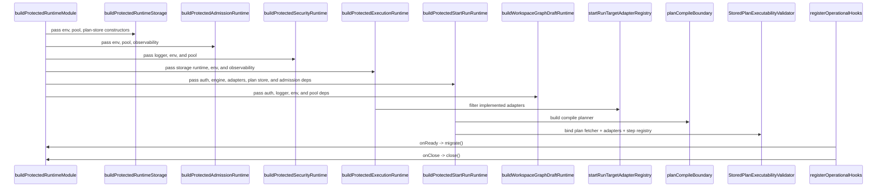

# Protected Runtime And Plan Compile Component

This page explains one concrete `apps/api` component instead of the whole API:
the protected runtime composition seam plus the plan-compile boundary that feeds
it.

Use the narrower local guides when you need subcomponent-level API,
invariants, transitions, and consumers:

- [Protected runtime dependency builders component](../../../../apps/api/docs/protected-runtime-dependency-builders-component.md)
- [Protected security access decision component](../../../../apps/api/docs/protected-security-access-decision-component.md)
- [Start-run runtime composition component](../../../../apps/api/docs/start-run-runtime-composition-component.md)
- [Executable-subgraph resolution component](../../../../apps/api/docs/executable-subgraph-resolution-component.md)
- [Workspace graph draft application component](../../../../apps/api/docs/workspace-graph-draft-application-component.md)
- [Workspace graph draft runtime composition component](../../../../apps/api/docs/workspace-graph-draft-runtime-composition-component.md)

## Why This Is A Component

These files form one component because together they answer one question:

> How does `apps/api` wire protected runtime execution, validate a stored plan,
> and expose a compile-time planner surface without duplicating runtime policy?

The files are related by responsibility, not by shared mutable state. That is
why the right grouping is a documented component, not one exported object that
acts as a fake namespace.

## File Responsibilities

- [buildProtectedRuntimeModule.ts](../../../../apps/api/src/modules/buildProtectedRuntimeModule.ts)
  Main protected composition root. Binds stores, adapters, planner,
  validator, auth, and runtime services.
- [buildProtectedRuntimeStorage.ts](../../../../apps/api/src/modules/protectedRuntime/buildProtectedRuntimeStorage.ts)
  Protected storage/runtime-store assembly. Binds state store, intent store,
  plan store, resolver, and execution-context policy.
- [buildProtectedAdmissionRuntime.ts](../../../../apps/api/src/modules/protectedRuntime/buildProtectedAdmissionRuntime.ts)
  Start-run admission runtime assembly. Binds duplicate probe,
  cached/fallback backpressure chain, and admission guard.
- [buildProtectedSecurityRuntime.ts](../../../../apps/api/src/modules/protectedRuntime/buildProtectedSecurityRuntime.ts)
  Protected auth/authz runtime assembly. Binds embedded access decision,
  audit logger, authorizer, and authenticator.
- [buildProtectedExecutionRuntime.ts](../../../../apps/api/src/modules/protectedRuntime/buildProtectedExecutionRuntime.ts)
  Protected execution runtime assembly. Binds provider adapters, workflow
  engine, enrichment, health, and adapter registry.
- [buildProtectedStartRunRuntime.ts](../../../../apps/api/src/modules/startRun/buildProtectedStartRunRuntime.ts)
  Start-run runtime composition seam. Binds the authenticated start-run
  facade/use-case chain from abstract dependencies.
- [resolveAuthorizedExecutableSubgraph.ts](../../../../apps/api/src/application/services/resolveAuthorizedExecutableSubgraph.ts)
  Protected selected-closure resolver. Binds workspace-draft read truth to the
  planner-owned executable-subgraph seam for preview and planner-backed
  start-run.
- [buildWorkspaceGraphDraftRuntime.ts](../../../../apps/api/src/modules/workspaceGraphDraft/buildWorkspaceGraphDraftRuntime.ts)
  Workspace-graph-draft runtime composition seam. Binds graph-draft store,
  capability service, audit, and read/write use cases.
- [buildProviderAdapters.ts](../../../../apps/api/src/modules/buildProviderAdapters.ts)
  Builds the live provider-adapter map and keeps provider construction out of
  the root assembler.
- [registerOperationalHooks.ts](../../../../apps/api/src/modules/registerOperationalHooks.ts)
  Fastify lifecycle hook registration. Connects `migrate()` and `close()` to
  process lifecycle.
- [planCompileBoundary.ts](../../../../apps/api/src/modules/planCompileBoundary.ts)
  Owns compile-profile catalog and compile planner construction.
- [startRunTargetAdapterRegistry.ts](../../../../apps/api/src/application/services/startRunTargetAdapterRegistry.ts)
  Canonical supported-adapter registry for `startRun`.
- [StoredPlanExecutabilityValidator.ts](../../../../apps/api/src/application/services/StoredPlanExecutabilityValidator.ts)
  Validates stored plan refs against adapter support and capabilities.
- [StoredExecutablePlanResolver.ts](../../../../apps/api/src/application/services/StoredExecutablePlanResolver.ts)
  Reads and parses stored executable plans for plan-backed runtime flows.

## Public API

- `buildProtectedRuntimeModule(app, env, observability)`
  Async factory. Assembles the protected runtime component and returns the
  bound module contract used by `apps/api`.
- `buildProtectedRuntimeStorage(deps)`
  Factory. Assembles storage, resolver, and execution-context dependencies
  from resolved Postgres constructors.
- `buildProtectedAdmissionRuntime(deps)`
  Factory. Assembles duplicate detection plus the fail-closed start-run
  admission chain.
- `buildProtectedSecurityRuntime(deps)`
  Factory. Assembles authenticator and command authorizer from protected
  runtime dependencies and returns the embedded access-decision backend
  lifecycle hook.
- `buildProtectedExecutionRuntime(deps)`
  Async factory. Assembles provider adapters, workflow engine, runtime
  services, and canonical adapter registry.
- `buildProtectedStartRunRuntime(deps)`
  Factory. Assembles the authenticated start-run runtime subcomponent from
  abstract runtime dependencies.
- `buildWorkspaceGraphDraftRuntime(deps)`
  Factory. Assembles the protected workspace-graph-draft runtime subcomponent
  from abstract runtime dependencies.
- `buildProviderAdapters(env, deps)`
  Async factory. Produces the implemented provider-adapter map plus its
  shutdown contract.
- `registerOperationalHooks(app, module)`
  Lifecycle binder. Connects Fastify startup/shutdown to `module.migrate()`
  and `module.close()`.
- `buildPlanCompilePlanner(boundary?)`
  Planner factory. Builds the compile-only planner for the plan-compile
  boundary.
- `resolvePlanCompileCatalog(boundary?)`
  Catalog query. Returns the compile-time family/kind catalog owned by the
  boundary.
- `createStartRunTargetAdapterRegistryFromValues(values)`
  Registry factory. Filters discovered adapter IDs to the canonical start-run
  adapter truth.
- `StoredPlanExecutabilityValidator.validatePlan(planRef, adapterId)`
  Admission service. Returns a fail-closed executability decision for a stored
  plan and adapter.
- `StoredExecutablePlanResolver.fetch(planRef)`
  Plan resolver. Resolves a stored executable plan after integrity and
  metadata validation.

## Invariants

- `buildProtectedRuntimeModule.ts` remains the only top-level protected
  composition root.
- `buildProtectedRuntimeStorage.ts` is the only module allowed to construct the
  protected storage and execution-context dependency cluster inside that root.
- `buildProtectedAdmissionRuntime.ts` is the only module allowed to construct
  the protected duplicate-probe and backpressure-admission cluster.
- `buildProtectedSecurityRuntime.ts` is the only module allowed to construct
  the protected auth/authz runtime cluster.
- `buildProtectedExecutionRuntime.ts` is the only module allowed to construct
  the provider-adapter and workflow-engine runtime cluster.
- `buildProtectedStartRunRuntime.ts` is the only module allowed to construct
  the authenticated start-run runtime chain inside that root.
- `resolveAuthorizedExecutableSubgraph.ts` is the only module allowed to parse
  protected draft payloads for selected-closure resolution in preview and
  planner-backed start-run flows.
- `buildWorkspaceGraphDraftRuntime.ts` is the only module allowed to construct
  the protected workspace-graph-draft runtime chain inside that root.
- `planCompileBoundary.ts` must derive compile-time adapter truth from the same
  canonical runtime contract used by `startRun`.
- `StoredPlanExecutabilityValidator.ts` must fail closed before runtime
  dispatch if plan bytes, metadata, step-kind support, or capability
  requirements do not match.
- `registerOperationalHooks.ts` must remain lifecycle-only; it must not take on
  dependency construction or policy ownership.

## How The Files Fit Together

```mermaid
flowchart LR
    Root[buildProtectedRuntimeModule]
    Storage[buildProtectedRuntimeStorage]
    Admission[buildProtectedAdmissionRuntime]
    Security[buildProtectedSecurityRuntime]
    Execution[buildProtectedExecutionRuntime]
    StartRun[buildProtectedStartRunRuntime]
    GraphDraft[buildWorkspaceGraphDraftRuntime]
    Providers[buildProviderAdapters]
    Hooks[registerOperationalHooks]
    Compile[planCompileBoundary]
    Registry[startRunTargetAdapterRegistry]
    Validator[StoredPlanExecutabilityValidator]
    Resolver[StoredExecutablePlanResolver]
    Planner[@dvt/planner]
    Engine[@dvt/engine]
    Stores[Postgres stores]

    Root --> Storage
    Root --> Admission
    Root --> Security
    Root --> Execution
    Root --> StartRun
    Root --> GraphDraft
    Root --> Compile
    Root --> Registry
    Root --> Resolver
    Root --> Planner
    Root --> Engine
    Root --> Stores
    StartRun --> Validator
    Execution --> Providers
    Storage --> Resolver
    Admission --> Stores
    Security --> Stores
    StartRun --> Compile
    StartRun --> Planner
    StartRun --> Engine
    Hooks --> Root
    Compile --> Registry
    Validator --> Registry
    Validator --> Stores
    Resolver --> Stores
```

## Transitions



Admission transition:

1. Adapter IDs are filtered to the canonical start-run registry.
2. Stored plan bytes are fetched and parsed.
3. Metadata alignment and step-kind support are validated.
4. Required capabilities are checked.
5. Only then can planner-backed runtime dispatch continue.

## Reading Order

1. Start with [planCompileBoundary.ts](../../../../apps/api/src/modules/planCompileBoundary.ts).
   It defines the compile-time catalog and explains which step kinds the API is
   allowed to compile in this boundary.
2. Read
   [startRunTargetAdapterRegistry.ts](../../../../apps/api/src/application/services/startRunTargetAdapterRegistry.ts).
   That file is the implemented adapter truth for command admission.
3. Read
   [StoredPlanExecutabilityValidator.ts](../../../../apps/api/src/application/services/StoredPlanExecutabilityValidator.ts).
   It turns stored-plan bytes plus adapter capabilities into a fail-closed
   executability decision.
4. Read
   [buildProtectedRuntimeStorage.ts](../../../../apps/api/src/modules/protectedRuntime/buildProtectedRuntimeStorage.ts).
   That file owns the protected storage/runtime-store dependency cluster.
5. Read
   [buildProtectedAdmissionRuntime.ts](../../../../apps/api/src/modules/protectedRuntime/buildProtectedAdmissionRuntime.ts).
   That file owns duplicate detection and the fail-closed backpressure
   admission chain.
6. Read
   [buildProtectedSecurityRuntime.ts](../../../../apps/api/src/modules/protectedRuntime/buildProtectedSecurityRuntime.ts).
   That file owns the protected authentication and authorization runtime.
7. Read
   [buildProtectedExecutionRuntime.ts](../../../../apps/api/src/modules/protectedRuntime/buildProtectedExecutionRuntime.ts).
   That file owns provider-adapter and workflow-engine runtime assembly.
8. Read
   [buildProtectedStartRunRuntime.ts](../../../../apps/api/src/modules/startRun/buildProtectedStartRunRuntime.ts).
   That file is the start-run subcomponent seam inside the protected runtime.
9. Read
   [buildWorkspaceGraphDraftRuntime.ts](../../../../apps/api/src/modules/workspaceGraphDraft/buildWorkspaceGraphDraftRuntime.ts).
   That file is the workspace-graph-draft subcomponent seam inside the
   protected runtime.
10. Finish with
    [buildProtectedRuntimeModule.ts](../../../../apps/api/src/modules/buildProtectedRuntimeModule.ts).
    That file is the top-level assembly root that binds the component together.

## Why Not Wrap These In One Object?

- `buildProtectedRuntimeModule`, `buildProviderAdapters`, and
  `registerOperationalHooks` do not share mutable state.
- `planCompileBoundary` and `StoredPlanExecutabilityValidator` are different
  policies with different reasons to change.
- Wrapping them in an object would not add lifecycle, invariants, or a useful
  interface. It would only hide file boundaries behind one extra name.

In other words: the missing abstraction was not a runtime object. The missing
abstraction was a clearer component map and smaller test units.

## Consumers

- `buildApp()` and protected route registration
  Uses `buildProtectedRuntimeModule()`.
  Need one assembled runtime component for protected API routes.
- Fastify lifecycle
  Uses `registerOperationalHooks()`.
  Need startup migration and graceful shutdown ownership.
- Protected runtime root
  Uses `buildProtectedRuntimeStorage()`,
  `buildProtectedAdmissionRuntime()`,
  `buildProtectedSecurityRuntime()`,
  and `buildProtectedExecutionRuntime()`.
  Need one explicit builder per protected runtime concern instead of one giant
  root file.
- Workspace graph draft routes
  Use `buildWorkspaceGraphDraftRuntime()` outputs.
  Need one protected graph-draft runtime chain without rebuilding it inline.
- Planner-backed runtime flows
  Use `StoredPlanExecutabilityValidator` and `StoredExecutablePlanResolver`.
  Need stored-plan integrity and executability checks before dispatch.
- Plan compile route and compile use cases
  Use `buildPlanCompilePlanner()` and `resolvePlanCompileCatalog()`.
  Need one explicit compile boundary instead of scattered planner policy.
- Start-run route parsing and admission
  Uses `createStartRunTargetAdapterRegistryFromValues()`.
  Need one implemented-adapter truth at the API boundary.

## Focused Test Map

| Anchor file                                                                                                                         | Companion files                                                                          | Why this shape exists                                                                                        |
| ----------------------------------------------------------------------------------------------------------------------------------- | ---------------------------------------------------------------------------------------- | ------------------------------------------------------------------------------------------------------------ |
| [modules.test.ts](../../../../apps/api/test/modules.test.ts)                                                                        | `test/modules/*.cases.ts`                                                                | Keeps the historic anchor path stable while splitting test concerns by module                                |
| [StoredPlanExecutabilityValidator.test.ts](../../../../apps/api/test/application/services/StoredPlanExecutabilityValidator.test.ts) | `test/application/services/storedPlanExecutabilityValidator/*.cases.ts` and `harness.ts` | Keeps the validator anchor path stable while separating capabilities, registry, and fetch/alignment behavior |

## Component Boundaries To Preserve

- Keep compile-time planner policy in `planCompileBoundary.ts`, not scattered in
  route files or runtime composition.
- Keep adapter support truth sourced from the canonical registry rather than
  local literals.
- Keep validation logic in `StoredPlanExecutabilityValidator.ts`, not in route
  handlers.
- Keep process lifecycle registration separate from dependency assembly.
