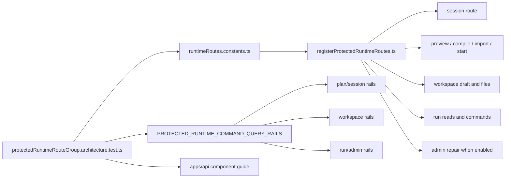
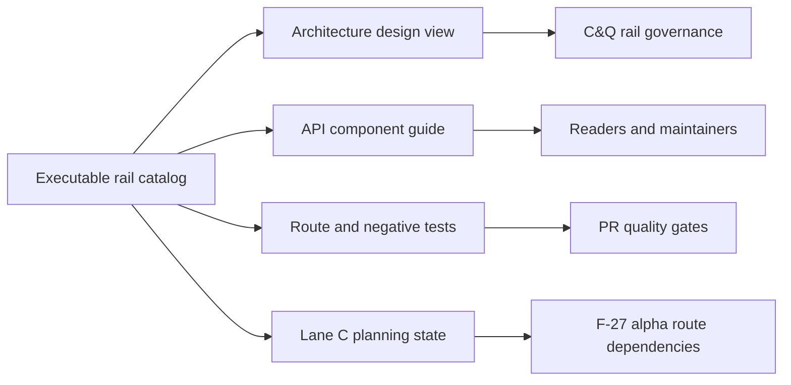

# Protected Runtime Command/Query Rail Design

This document is the canonical architecture and design view for the protected
runtime command/query rail closure tracked by `AR-C10`.

The executable source of truth is
`apps/api/src/application/ports/protectedRuntimeCommandQueryRails.ts` and its
concern-local catalog modules. This page explains the ownership model, source
of truth boundaries, design rationale, and remaining gaps without duplicating
the full route matrix by hand.

## Governing Sources

- `docs/planning/status/governance-document-rule-inventory.md`
- `docs/architecture/reference-architecture.md`
- `docs/architecture/command-query-rail-governance.md`
- `docs/architecture/fowler-opportunity-planning-governance.md`
- `docs/planning/proposals/mandatory/runtime-and-contracts/protected-runtime-rail-closure-plan-20260503.md`
- `docs/risk-register/quality/R-20260503-PROTECTED-RUNTIME-RAIL-CLOSURE.yaml`
- `docs/risk-register/quality/R-20260503-PROTECTED-RUNTIME-RAIL-SSOT-DEBT.yaml`
- `apps/api/docs/protected-runtime-route-group-component.md`

## Design Purpose

The protected runtime route group is an HTTP ingress over product-owned
commands and queries. It is not the source of planner semantics, engine
lifecycle semantics, authorization backend behavior, or read-model ownership.

`AR-C10` exists to make every protected runtime route answer the same design
questions before future changes land:

- which command or query owns the product intent;
- which bounded context owns the DDD object or read model;
- which application port or use case executes the behavior;
- which adapter surface exposes it;
- which authorization and tenant-scope rules admit it;
- which negative tests prove fail-closed behavior;
- which compatibility paths are intentional and bounded.

## Current State

Current implementation has a real executable rail catalog and an architecture
test that binds the catalog to the route inventory. The remaining architecture
risk is documentation source-of-truth drift: manual component and planning
tables can diverge from the executable catalog even when each local file still
looks coherent.

## Target State

The target posture is one executable rail catalog with multiple derived or
summary readers. Docs may explain and group the catalog, but they must not
become a second manually authoritative matrix.

## Source Of Truth Boundaries

| Surface                                                    | Design role                                                                                                                            | Must not own                                                    |
| ---------------------------------------------------------- | -------------------------------------------------------------------------------------------------------------------------------------- | --------------------------------------------------------------- |
| `runtimeRoutes.constants.ts`                               | Protected runtime route inventory and route summary                                                                                    | product rail names, DDD ownership, or test sufficiency          |
| `PROTECTED_RUNTIME_COMMAND_QUERY_RAILS`                    | Executable rail catalog, DDD owner, application port, adapter surface, authorization posture, negative coverage, compatibility posture | HTTP registration mechanics                                     |
| `registerProtectedRuntimeRoutes.ts`                        | Route composition and dependency binding                                                                                               | planner, engine, authorization backend, or read-model semantics |
| `apps/api/docs/protected-runtime-route-group-component.md` | Human component guide for local API maintainers                                                                                        | independent route matrix truth                                  |
| `protectedRuntimeRouteGroup.architecture.test.ts`          | Mechanical guard that routes, rails, test evidence, and docs stay aligned                                                              | business behavior beyond catalog conformance                    |
| Lane C `AR-C10`                                            | Planning state and closure evidence                                                                                                    | route behavior or application semantics                         |

## Closed Design Decisions

- Complete row-level rail truth lives in `PROTECTED_RUNTIME_COMMAND_QUERY_RAILS`.
  Component and planning docs summarize, group, and link to that catalog instead
  of owning a second full route matrix.
- Preview, compile, and import use canonical `run:start` authorization wording.
  They are canonical protected runtime plan rails; only `CANCEL` through
  `/signal` is modeled as compatibility.
- `signalRunRouteParser.constants.ts` is an intentional parser-local constants
  facade, not a generic barrel. It lets signal and cancel parser/route tests
  import one parser-boundary vocabulary while authorization and validation
  constants remain split by concern.

## Rail Families

This design groups rails by ownership family instead of repeating every catalog
row. The complete row-level matrix remains in the executable catalog.

| Family                     | Catalog module                                  | Route surfaces                                                                                                                                  | Primary ownership                                                                                              |
| -------------------------- | ----------------------------------------------- | ----------------------------------------------------------------------------------------------------------------------------------------------- | -------------------------------------------------------------------------------------------------------------- |
| Session and plan admission | `protectedRuntimePlanCommandQueryRails.ts`      | `GET /session`, `POST /runs/start`, `POST /plans/preview`, `POST /plans/compile`, `POST /plans/import`                                          | runtime session admission, runtime safety, planner/runtime admission, planner boundary, runtime plan ingestion |
| Workspace draft and files  | `protectedRuntimeWorkspaceCommandQueryRails.ts` | `GET/PUT /workspace/graph/draft`, `GET /workspace/files`, `GET /workspace/files/:path`                                                          | workspace graph drafting and operational evidence read models                                                  |
| Run reads and controls     | `protectedRuntimeRunCommandQueryRails.ts`       | `GET /runs`, `GET /runs/:runId`, `GET /runs/:runId/events`, `POST /runs/:runId/signal`, `POST /runs/:runId/cancel`, `POST /runs/:runId/recover` | runtime read model, runtime control, runtime recovery                                                          |
| Admin repair               | `protectedRuntimeRunCommandQueryRails.ts`       | `POST /admin/runs/:runId/rebuild-snapshot`                                                                                                      | runtime repair operations behind explicit admin enablement                                                     |

## Compatibility Posture

`POST /runs/:runId/cancel` is the canonical cancel command rail.

`POST /runs/:runId/signal` with `CANCEL` is compatibility behavior, not a
second canonical cancel rail. It is mapped back to `CancelRun`, is gated by
`DVT_SIGNAL_ROUTE_ALLOW_CANCEL`, and requires a separate governed deprecation
plan before removal.

No protected runtime rail accepts legacy behavior as canonical behavior.

## Negative Coverage Design

Negative coverage is part of the rail catalog, not an appendix. Each rail
declares required negative cases and executable test evidence. This keeps the
design review focused on fail-closed runtime behavior:

- missing token and authentication failure;
- missing action or insufficient authorization;
- tenant, project, workspace, or environment mismatch;
- malformed payload or unsupported option;
- unknown run, missing file, or disabled admin route;
- compatibility disabled for `CANCEL` through `/signal`.

## Architecture Gaps

`R-20260503-PROTECTED-RUNTIME-RAIL-SSOT-DEBT` is closed by this design slice.
The remaining route-governance rule is operational, not open debt: future
protected runtime route changes must update the route constants, executable rail
catalog, component guide, and architecture test together.

## Implementation Handoff

The next implementation slice should not add new route behavior. It should
reuse the existing executable rail catalog and fail closed through
`protectedRuntimeRouteGroup.architecture.test.ts` whenever a route, rail,
negative evidence reference, or compatibility posture drifts.

## Validation Baseline

For docs-only changes:

- `pnpm docs:sync`
- `pnpm docs:workboard:generate`
- `pnpm verify:prepush`

For the source-of-truth implementation follow-up:

- `pnpm --filter dvt-api exec vitest run test/entrypoints/http/protectedRuntimeRouteGroup.architecture.test.ts`
- `pnpm docs:feature-mechanization --feature PROTECTED-RUNTIME-RAIL-CLOSURE`
- `pnpm docs:feature-mechanization:implementation`
- `pnpm verify:prepush`
