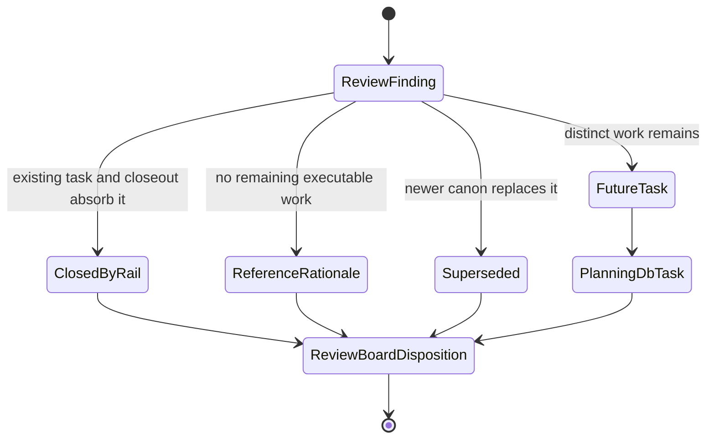
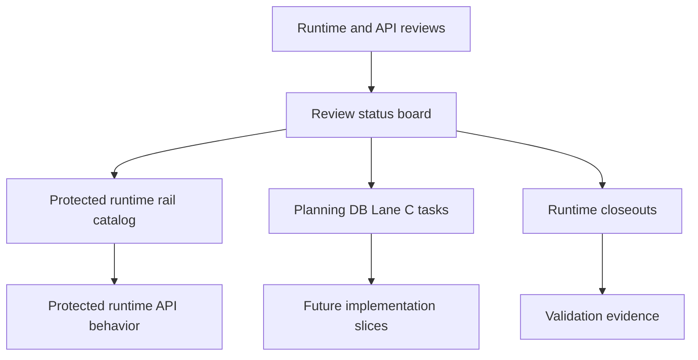

# Runtime Review Canon Component

## Owned Concern

This component owns the semantic disposition of runtime and API integration
reviews after the protected runtime rail closure. It prevents active review
documents from becoming a second backlog, and routes each review finding to a
canonical runtime rail, a closed task, or an explicit future task.

## Public API

- `RecordRuntimeReviewCanon`: command that records the canonical disposition
  for a runtime/API review and links it to the owning task, closeout, or future
  queue.
- `ClassifyRuntimeReviewDisposition`: query that classifies a runtime/API
  review as `closed`, `reference`, `future-task`, or `superseded`.
- `Review status board`: operational read model where active runtime reviews
  expose their disposition and no orphan execution queue remains.
- `Execution runtime domain page`: domain entrypoint that points maintainers to
  the active runtime canon plan and the protected runtime rail closure evidence.
- `Runtime review canon plan`: mandatory planning surface that carries the
  Fowler analysis, allowed surfaces, command/query rails, and TDD evidence for
  this canonization slice.

## Invariants

- Runtime review documents cannot own executable runtime semantics directly.
- Protected runtime behavior remains owned by the route rail catalog and
  application services, not by review prose.
- A review with actionable runtime/API work must link to a Planning DB task or
  explicitly state that an existing task/closeout already absorbed it.
- A reference review may stay in the board only when it is named as rationale,
  not as an implicit queue.
- New protected runtime route behavior must reuse the existing command/query
  rail catalog before creating another route, service, mock, or document name.
- The component guide, user stories, review board, and buzón analysis must stay
  aligned so docs do not drift from planning state.

## Transitions

## Consumers

- Runtime/API maintainers deciding whether a review finding requires code.
- Planning stewards routing Lane C work through Planning DB instead of review
  prose.
- PR reviewers checking that protected runtime changes update rail docs and
  semantic guards together.
- Frontend/API integration reviewers verifying that browser-facing runtime
  gaps are represented as command/query rails before implementation.
- CI and local gates that run `runtime-review-canon.test.mjs`.

## Command And Query Rail

| Rail                               | Type    | DDD owner                             | Surface                                        | Negative check                                                              |
| ---------------------------------- | ------- | ------------------------------------- | ---------------------------------------------- | --------------------------------------------------------------------------- |
| `RecordRuntimeReviewCanon`         | command | Runtime review canon aggregate        | Planning DB task plus review status board      | Rejects orphan reviews without task, closeout, or explicit reference status |
| `ClassifyRuntimeReviewDisposition` | query   | Runtime review disposition read model | Review board and execution-runtime domain page | Fails when an active runtime review lacks canonical disposition             |

## Semantic Fitness Function

`tools/ci/runtime-review-canon.test.mjs` validates the semantic contract rather
than file shape. It requires:

- a canonical review-board disposition for runtime/API review inputs;
- a component guide with public API, invariants, transitions, consumers, rails,
  and semantic fitness-function sections;
- user stories for runtime maintainer, API maintainer, and planning steward
  personas;
- a Fowler analysis in `buzon/`;
- execution-runtime domain navigation to the canon plan.

## Current Architecture

## Mature-System Comparison

Mature systems separate review intake from executable authority. Reviews are
evidence and rationale; bounded contexts own behavior through command/query
rails, contracts, and application services. This component applies that split
to runtime/API planning so future reviewers can ask one question: "which rail
or Planning DB task owns this finding?"
