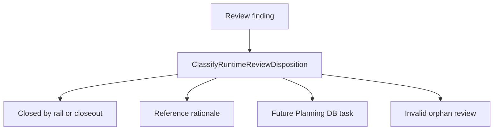

# Runtime Review Canon User Stories

## User Stories

### US-RUNTIME-CANON-001: Runtime Maintainer Finds The Owning Rail

As a Runtime maintainer, I want each runtime/API review finding to point to the
owning command/query rail or closeout so I do not infer behavior from review
prose.

Acceptance:

- Protected runtime route findings point to the protected runtime rail catalog
  or the AR-C10 closeout.
- Runtime read-surface findings point to TF-C2-B or its successor task.
- The review board states whether the review is `closed`, `reference`,
  `future-task`, or `superseded`.
- Negative evidence fails when a runtime review is marked active without an
  owner, task, or disposition.

### US-RUNTIME-CANON-002: API Maintainer Avoids Parallel Semantics

As an API maintainer, I want API integration review gaps to reuse existing
runtime rails before new route behavior is designed so the API does not grow
parallel commands or mock-only semantics.

Acceptance:

- API integration gaps name the existing route family before proposing a new
  endpoint.
- New browser-facing runtime behavior must identify command/query ownership.
- Review text cannot authorize a temporary compatibility path by itself.
- Negative evidence fails when a review introduces route intent without a rail.

### US-RUNTIME-CANON-003: Planning Steward Keeps Reviews Out Of The Backlog

As a Planning steward, I want review documents to be intake and rationale only
so Planning DB remains the operational work queue.

Acceptance:

- Remaining work becomes a Planning DB task before implementation starts.
- Closed findings link to closeouts and validation evidence.
- Reference reviews remain listed only for rationale.
- Negative evidence fails when the review board carries "open critique" with
  no task or explicit disposition.

### US-RUNTIME-CANON-004: Reviewer Sees Fowler Tradeoffs

As an architecture reviewer, I want the canon analysis to name Fowler signals,
antipatterns, and mature-system comparison so future work repeats the pattern
instead of repeating the drift.

Acceptance:

- The buzón analysis names improved patterns and detected antipatterns.
- The component guide names invariants and transitions.
- Future lessons and opportunities are documented.
- Negative evidence fails when analysis exists without the component contract.

## Scenario Map

