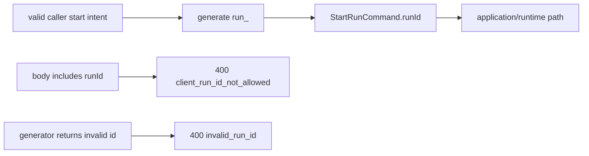

---
title: Start-run platform identity user stories
status: Active
owner: API / Runtime / Architecture
last_reviewed: 2026-05-23
planning_type: architecture
---

# Start-run Platform Identity User Stories

These stories cover the API-side scenarios for platform-owned start-run
identity. They complement:

- [Start-run HTTP entrypoint component](../../../../apps/api/docs/start-run-http-entrypoint-component.md)
- [Start-run platform identity component](../../../../apps/api/docs/start-run-platform-identity-component.md)
- [ADR-0050 platform-owned start-run identity](../../../adr/adr-0050-platform-owned-start-run-identity.md)
- [Start-run client identity boundary](../web/runs/start-run-client-identity-boundary.md)

## US-API-ID-01: Start Run Without Caller Run ID

**As** an authenticated runtime caller,
**I want** to start a run without supplying `runId`,
**So that** the platform remains the source of canonical execution identity.

**C&Q rail:** Command - `startRun`

**Scenario:**

- Given a valid `POST /runs/start` body with caller-owned `planRef`, workspace
  scope, target adapter, and execution selection
- And the body omits `runId`
- When the route parses the request
- Then the API generates a `run_<UUIDv7>` id
- And delegates `StartRunCommand.runId` to application/runtime orchestration

**Evidence:**

- `apps/api/test/entrypoints/http/startRunRoute.authAndSuccess.test.ts`
- `apps/api/test/entrypoints/http/startRunIdentity.architecture.test.ts`

## US-API-ID-02: Reject Caller-Provided Run ID

**As** a runtime platform maintainer,
**I want** caller-provided execution identity to fail fast,
**So that** stale or malicious clients cannot believe they control runtime
identity.

**C&Q rail:** Command - `startRun`

**Scenario:**

- Given a `POST /runs/start` body includes `runId`
- When the route parses the request
- Then the response is `400 bad_request`
- And the stable reason is `client_run_id_not_allowed`
- And application/runtime orchestration is not called

**Evidence:**

- `apps/api/test/entrypoints/http/startRunRoute.validation.test.ts`
- `apps/api/test/entrypoints/http/startRunIdentity.architecture.test.ts`

## US-API-ID-03: Reject Malformed Platform-Generated Run ID

**As** a runtime platform maintainer,
**I want** the command builder to validate the injected generated id,
**So that** test seams, future composition seams, or alternate allocators cannot
weaken the `run_<UUIDv7>` contract.

**C&Q rail:** Command - `startRun`

**Scenario:**

- Given caller-owned start-run fields are valid
- And the injected platform generator returns a non-`run_<UUIDv7>` value
- When the route parses the request
- Then the response is `400 bad_request`
- And the stable reason is `invalid_run_id`
- And application/runtime orchestration is not called

**Evidence:**

- `apps/api/test/entrypoints/http/startRunRoute.validation.test.ts`
- `apps/api/test/entrypoints/http/startRunIdentity.architecture.test.ts`

## US-API-ID-04: Identity Allocator Is Not Runtime Lifecycle

**As** a runtime architect,
**I want** the identity allocator to stay isolated from engine and persistence
semantics,
**So that** platform id allocation does not become retry, recovery, duplicate,
or lifecycle orchestration.

**C&Q rail:** Command - `startRun`

**Scenario:**

- Given the platform allocator creates `run_<UUIDv7>`
- When architecture tests inspect the allocator module
- Then it imports only platform allocation primitives
- And it does not import engine, persistence, adapter, facade, retry,
  idempotency, recovery, cancel, or workflow semantics

**Evidence:**

- `apps/api/test/entrypoints/http/startRunIdentity.architecture.test.ts`
- `apps/api/docs/start-run-platform-identity-component.md`

## Scenario Map

