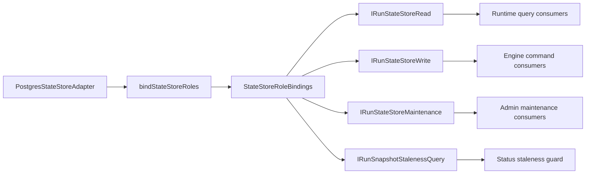
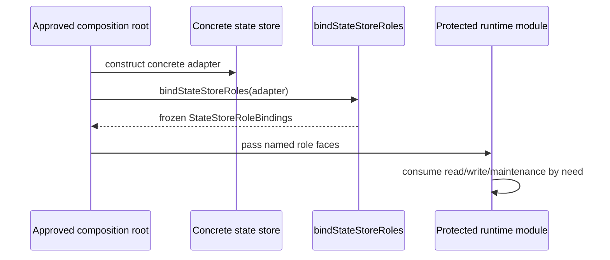

# State Store Role Boundary Component

This component owns the API-side state-store role boundary. It converts one
concrete runtime store into explicit read, write, maintenance, and snapshot
staleness faces at approved composition roots, then prevents downstream code
from reconstructing the aggregate by convenience.

## Public API

| Surface                       | Kind         | Owner                                     | Purpose                                                                                     |
| ----------------------------- | ------------ | ----------------------------------------- | ------------------------------------------------------------------------------------------- |
| `StateStoreRoleSource`        | input type   | `apps/api/src/modules/stateStoreRoles.ts` | Required concrete role capabilities before a store can enter protected runtime composition. |
| `StateStoreRoleBindings`      | value object | `apps/api/src/modules/stateStoreRoles.ts` | Root-owned bundle with `read`, `write`, `maintenance`, and `snapshotStaleness` faces.       |
| `bindStateStoreRoles(source)` | factory      | `apps/api/src/modules/stateStoreRoles.ts` | The only sanctioned API function that turns a concrete state store into a role bundle.      |

The governing rail is `StateStoreRoleBoundaryQuery`: composition code asks the
root-owned factory for named role faces. It does not create a new command or
query endpoint, and it does not change state-store persistence behavior.

## Export Semantics

`bindStateStoreRoles` is the only runtime export from
`apps/api/src/modules/stateStoreRoles.ts`. The role source and binding shapes
are type-only exports for compile-time narrowing, so callers can name the
contract without receiving a second construction path at runtime.

The brand symbol, required-method list, and source validator remain module
private. Consumers cannot import them to forge a bundle, bypass the factory, or
couple to validation internals. Invalid role sources fail at the boundary with
`STATE_STORE_ROLE_SOURCE_INVALID: missing function <method>`, which identifies
the first missing or non-function capability.

## Invariants

- `StateStoreRoleBindings` is a branded, frozen value produced only by
  `bindStateStoreRoles`.
- The runtime export surface is exactly `bindStateStoreRoles`; role shapes are
  type-only and validator internals are private.
- Production consumers depend on the narrowed role they need:
  `IRunStateStoreRead`, `IRunStateStoreWrite`, `IRunStateStoreMaintenance`, or
  `IRunSnapshotStalenessQuery`.
- Only approved composition roots import `bindStateStoreRoles`.
- No API source outside `stateStoreRoles.ts` may reconstruct the bundle as an
  intersection of `IRunStateStoreRead`, `IRunStateStoreWrite`, and
  `IRunStateStoreMaintenance`.
- No API source outside `stateStoreRoles.ts` may construct an object literal
  with `read`, `write`, `maintenance`, and `snapshotStaleness` as a substitute
  for `StateStoreRoleBindings`.

## Transitions

| State                                          | Trigger                                                    | Result                                                                               |
| ---------------------------------------------- | ---------------------------------------------------------- | ------------------------------------------------------------------------------------ |
| Concrete adapter exists                        | `buildProtectedRuntimeStorage` calls `bindStateStoreRoles` | Protected runtime receives explicit role bindings.                                   |
| Reconciler runtime store exists                | `createRuntimeStores` calls `bindStateStoreRoles`          | Reconciler composition passes read/write roles to provider and maintenance services. |
| Caller passes a partial source                 | `bindStateStoreRoles` validates required methods           | Factory throws `STATE_STORE_ROLE_SOURCE_INVALID` naming the missing function.        |
| Future code tries ad hoc bundle reconstruction | Architecture guard parses API source                       | Test fails before the drift becomes accepted composition style.                      |

## Consumers

| Consumer                            | Consumed role               | Reason                                                         |
| ----------------------------------- | --------------------------- | -------------------------------------------------------------- |
| `buildProtectedExecutionRuntime`    | `read`, `write`             | Engine and provider runtime assembly.                          |
| `protectedRuntimeRouteDependencies` | `read`, `snapshotStaleness` | Query routes and staleness-aware status reads.                 |
| `protectedRuntimeAdminRouteGroup`   | `maintenance`               | Admin snapshot rebuild route.                                  |
| `intentReconcilerRuntime`           | `read`, `write`             | Background reconciliation and maintenance service composition. |

## Drift Guards

The executable guard is
`apps/api/test/architecture/stateStoreRoleBoundary.architecture.test.ts`.

It validates:

- this component guide exists with API, invariants, transitions, consumers, and
  diagrams;
- the guide documents export semantics for runtime export and type-only role
  shapes;
- `stateStoreRoles.ts` declares its owned concern at the module boundary;
- `stateStoreRoles.test.ts` proves the runtime export surface, immutable role
  bundle shape, and negative paths for missing or non-function role members;
- only `buildProtectedRuntimeStorage.ts` and `intentReconcilerRuntime.ts`
  import `bindStateStoreRoles`;
- API source does not rebuild the state-store aggregate by role intersection;
- API source does not hand-build the role bundle with a lookalike object
  literal.

## Diagrams

