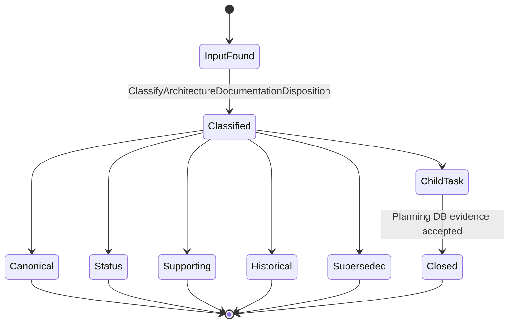
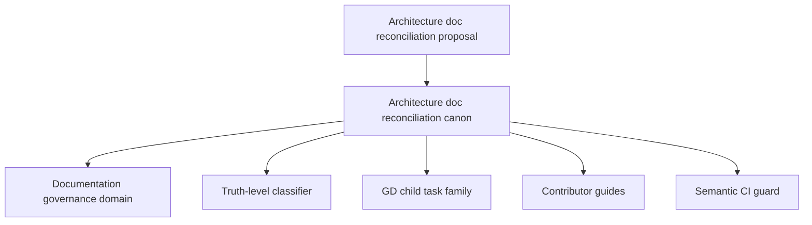

# Architecture Documentation Reconciliation Canon Component

> Owned concern: this component owns the classification and disposition of
> architecture documentation reconciliation work into canonical, status,
> supporting, historical, child-task, or superseded surfaces.

## Public API

- `RecordArchitectureDocumentationReconciliationCanon(input)`: records a
  reconciliation input with owner, disposition, evidence, and child-task
  linkage.
- `ClassifyArchitectureDocumentationDisposition(input)`: resolves a document or
  proposal into a truth level, owner, validation expectation, and downstream
  task posture.

## Invariants

- Planning DB is the execution queue; a mandatory proposal is not a queue by
  itself.
- Repository-wide architecture truth follows this order: reference
  architecture, system delivery status, canonical doc-code matrix, and concept
  system map.
- Drafts and snapshots must be marked supporting, historical, superseded, or
  child-task-owned before they guide implementation.
- Child remediation tasks remain separate from this parent canon task.
- Docs, domain page, component guide, user stories, canonical Fowler
  mechanization, and semantic test must name the same command/query rails.

## Transitions

## Consumers

- Architecture readers use the classification to know where principle, current
  implementation truth, supporting diagrams, and historical snapshots live.
- Documentation maintainers use the component before moving, rewriting, or
  archiving architecture documents.
- Planning stewards use it to keep child tasks linked to the parent
  reconciliation plan.
- Architecture reviewers use it to route review findings into task ownership
  instead of review prose.

## Command And Query Rail

| Rail                                                 | Type    | Owner                                                     | Surface                                   |
| ---------------------------------------------------- | ------- | --------------------------------------------------------- | ----------------------------------------- |
| `RecordArchitectureDocumentationReconciliationCanon` | command | Architecture documentation reconciliation canon aggregate | Planning DB and documentation domain page |
| `ClassifyArchitectureDocumentationDisposition`       | query   | Architecture documentation disposition read model         | Component guide and semantic CI test      |

## Semantic Fitness Function

`tools/ci/architecture-doc-reconciliation-canon.test.mjs` validates that the
canon plan, component guide, user stories, documentation-governance domain,
component index, and canonical Fowler mechanization tokens exist together and
name the same semantic rails.

It validates ownership and truth classification rather than only checking that
a barrel or index is thin.

## Component Grouping

## Related Docs

- [Architecture Documentation Reconciliation Canon User Stories](./architecture-doc-reconciliation-canon-user-stories.md)
- [Architecture Documentation Reconciliation Canon Plan 2026-05-23](../../../planning/proposals/mandatory/governance-and-docs/architecture-doc-reconciliation-canon-plan-20260523.md)
- [Architecture Documentation Reconciliation Mailbox Analysis](../../../../buzon/20260523-codex-fowler-architecture-doc-reconciliation-canon.md)
