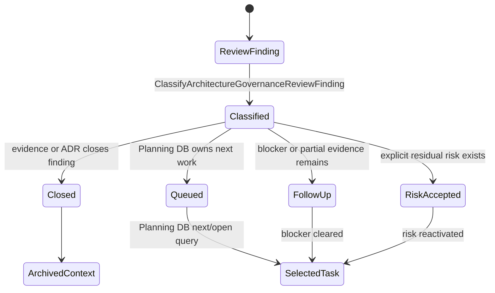
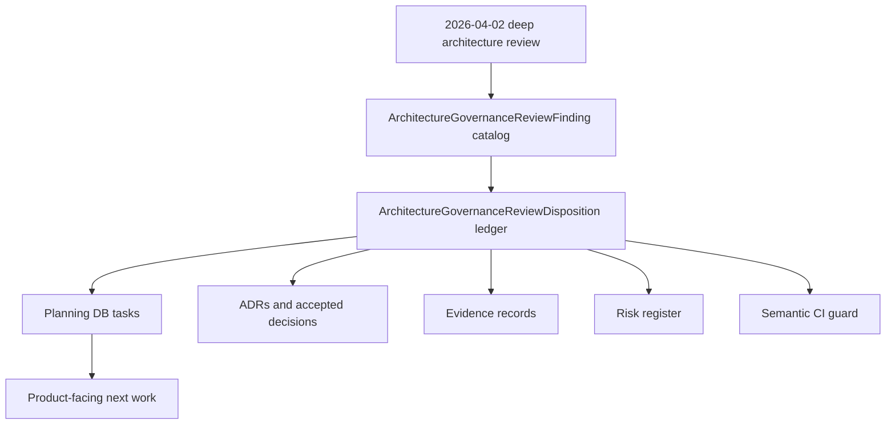
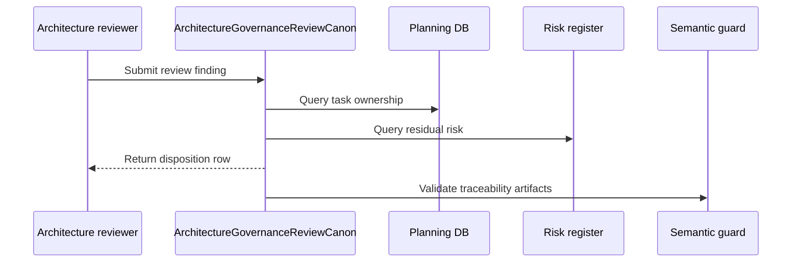

# Architecture Governance Review Canon Component

> Owned concern: this component owns architecture review canonization semantics:
> finding classification, disposition recording, traceability validation, and
> product-relevant follow-up selection.

## Public API

- `ClassifyArchitectureGovernanceReviewFinding(input)`: classifies a review
  finding as closed, queued, blocked, follow-up, risk-accepted, or candidate
  promotion.
- `RecordArchitectureGovernanceReviewDisposition(input)`: records the canonical
  task, ADR, evidence, risk, or planning owner for a finding.
- `ValidateArchitectureGovernanceReviewTraceability(input)`: validates that the
  review, plan, component guide, user stories, canonical Fowler mechanization,
  and semantic guard name the same ownership model.

## Invariants

- `GD-REV-ARCH-GOV-CANON` is a canonization task, not a runtime hardening task.
- A review finding cannot be considered actionable until it has one current
  owner: Planning DB task, ADR, evidence record, risk entry, or explicit
  risk-accepted disposition.
- Product-facing backlog rows must stay visible when architecture review prose
  also contains platform hygiene.
- Closed findings must point to closure evidence or status; stale review prose
  cannot reopen work by implication.
- The semantic guard must fail if the high-value findings lose disposition
  coverage.

## Transitions

## Consumers

- Architecture stewards use the component to convert principal/staff review
  findings into governed disposition rows.
- Product planners use the disposition matrix to separate product value from
  platform hygiene.
- Reviewers use the traceability policy to verify whether a finding is still
  open or already closed.
- Agents use the component after context compaction to continue from Planning
  DB state instead of guessing from historical review text.

## Command And Query Rail

<!-- markdownlint-disable MD060 -->

| Rail                                               | Type    | Owner                                  | Surface                                 |
| -------------------------------------------------- | ------- | -------------------------------------- | --------------------------------------- |
| `ClassifyArchitectureGovernanceReviewFinding`      | query   | Architecture review finding catalog    | Plan, guide, semantic test              |
| `RecordArchitectureGovernanceReviewDisposition`    | command | Architecture review disposition ledger | Disposition matrix and review note      |
| `ValidateArchitectureGovernanceReviewTraceability` | query   | Review traceability policy             | CI guard, component guide, user stories |

<!-- markdownlint-enable MD060 -->

## Semantic Fitness Function

`tools/ci/architecture-governance-review-canon.test.mjs` validates that:

- the plan, guide, stories, review note, and canonical Fowler mechanization
  tokens exist together;
- the command/query rails are named consistently;
- P0/P1/P2 findings from the deep review have explicit disposition rows;
- the component guide exposes public API, invariants, transitions, consumers,
  rails, diagrams, and the semantic guard.

The test protects semantic traceability. It does not claim that queued product
work is implemented.

## Diagrams

## Related Docs

- [Architecture Governance Review Canon User Stories](./architecture-governance-review-canon-user-stories.md)
- [Architecture Governance Review Canon Plan 2026-05-24](../../../planning/proposals/mandatory/governance-and-docs/architecture-governance-review-canon-plan-20260524.md)
- [Deep Technical Architectural Review 2026-04-02](../../../planning/reviews/architecture-and-governance/20260402-deep-architectural-review.md)
- [Architecture Governance Review Mailbox Analysis](../../../../buzon/20260524-codex-fowler-architecture-governance-review-canon.md)
