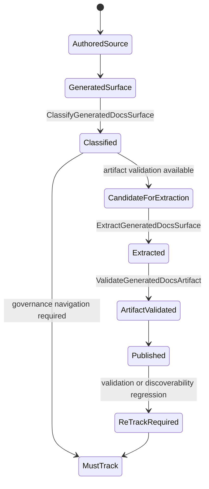
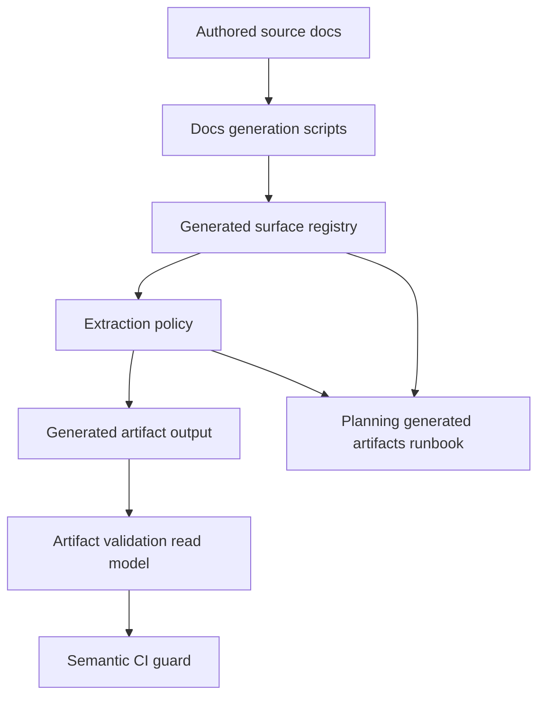

# Autogenerated Pages Canon Component

> Owned concern: this component owns generated documentation surface
> classification, extraction authorization, and artifact validation for
> generated pages that may stop being tracked in git.

## Public API

- `ClassifyGeneratedDocsSurface(input)`: returns `must-track` or
  `candidate-for-extraction` with owner, source generator, governing docs, and
  rollback rule.
- `ExtractGeneratedDocsSurface(input)`: authorizes a tracked generated surface
  to become an artifact-only output after classification and acceptance checks.
- `ValidateGeneratedDocsArtifact(input)`: validates artifact output
  determinism, marker integrity, discoverability, and CI publication posture.

## Invariants

- Authored docs are canonical source; generated pages are derived surfaces.
- `must-track` surfaces remain versioned until a replacement validation and
  publication path is proven.
- `candidate-for-extraction` is not removal approval; it only allows a focused
  extraction slice to begin.
- `ExtractGeneratedDocsSurface` cannot run without a prior
  `ClassifyGeneratedDocsSurface` decision.
- `ValidateGeneratedDocsArtifact` must prove deterministic output before an
  extracted surface is accepted.
- Docs, runbook, proposal, user stories, mailbox analysis, and semantic test
  must name the same rails.

## Transitions

## Consumers

- Documentation maintainers use `ClassifyGeneratedDocsSurface` to distinguish
  authored navigation from generated outputs.
- Governance operators use `ValidateGeneratedDocsArtifact` before allowing
  artifact-only docs surfaces to replace tracked pages.
- Architecture reviewers use the component guide to detect generated-surface
  ownership drift in PRs.
- Contributors use the runbook to recover from generated page drift without
  reintroducing broad tracked-page churn.

## Command And Query Rail

| Rail                            | Type    | Owner                                    | Surface                              |
| ------------------------------- | ------- | ---------------------------------------- | ------------------------------------ |
| `ClassifyGeneratedDocsSurface`  | query   | Generated docs surface registry          | Proposal, runbook, semantic CI guard |
| `ExtractGeneratedDocsSurface`   | command | Generated docs extraction policy         | Future extraction task and runbook   |
| `ValidateGeneratedDocsArtifact` | query   | Generated artifact validation read model | CI guard and runbook                 |

## Semantic Fitness Function

`tools/ci/autogenerated-pages-canon.test.mjs` validates that the canon plan,
component guide, user stories, documentation-governance domain, planning
generated artifacts runbook, original extraction proposal, and mailbox analysis
exist together and name the same rails.

The test protects semantic alignment, not only barrel thinness or generated
index freshness.

## Component Grouping

## Related Docs

- [Autogenerated Pages Canon User Stories](./autogenerated-pages-canon-user-stories.md)
- [Autogenerated Pages Canon Plan 2026-05-24](../../../planning/proposals/mandatory/governance-and-docs/autogenerated-pages-canon-plan-20260524.md)
- [Planning Generated Artifacts Operations](../../../runbooks/planning-generated-artifacts-operations-20260403.md)
- [Autogenerated Pages Mailbox Analysis](../../../../buzon/20260524-codex-fowler-autogenerated-pages-canon.md)
