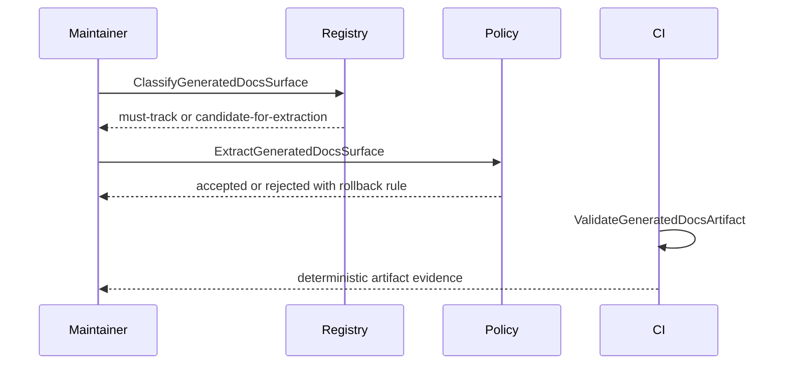

# Autogenerated Pages Canon User Stories

> Owned concern: this story set covers the generated documentation surface
> scenarios governed by `ClassifyGeneratedDocsSurface`,
> `ExtractGeneratedDocsSurface`, and `ValidateGeneratedDocsArtifact`.

## Stories

| Persona                  | Story                                                                                                                                 | Acceptance                                                                                                   |
| ------------------------ | ------------------------------------------------------------------------------------------------------------------------------------- | ------------------------------------------------------------------------------------------------------------ |
| Documentation maintainer | As a documentation maintainer, I want generated pages classified before extraction so canonical navigation remains explicit.          | `ClassifyGeneratedDocsSurface` records `must-track` or `candidate-for-extraction` with owner and generator.  |
| Governance operator      | As a governance operator, I want extracted pages validated as artifacts so CI stays deterministic.                                    | `ValidateGeneratedDocsArtifact` proves marker integrity, determinism, and discoverability before acceptance. |
| Architecture reviewer    | As an architecture reviewer, I want one component contract for generated pages so future PRs do not create parallel extraction rules. | Component guide, plan, runbook, proposal, stories, and mailbox analysis name the same rails.                 |
| Contributor              | As a contributor, I want generated page churn reduced so authored docs changes remain reviewable.                                     | `ExtractGeneratedDocsSurface` is allowed only after classification and rollback criteria are documented.     |

## Scenario Coverage

## Negative Scenarios

- `ExtractGeneratedDocsSurface` is rejected when no
  `ClassifyGeneratedDocsSurface` decision exists.
- `candidate-for-extraction` is rejected when the generated page carries
  governance-critical navigation without a replacement validation path.
- `ValidateGeneratedDocsArtifact` fails when marker checks, determinism, or
  discoverability checks regress.
- Incident rollback reclassifies the surface as `must-track` until validation
  is restored.
