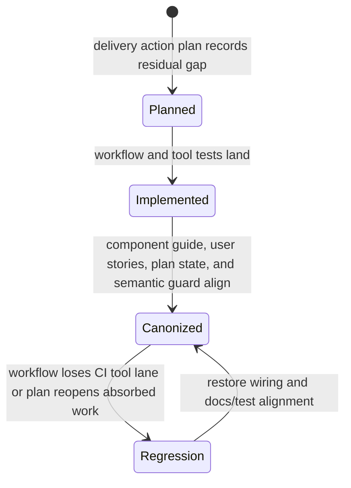
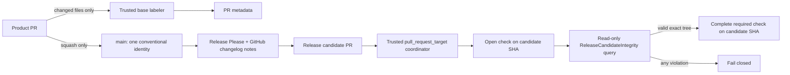
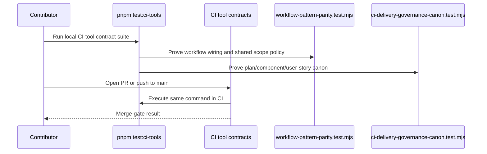
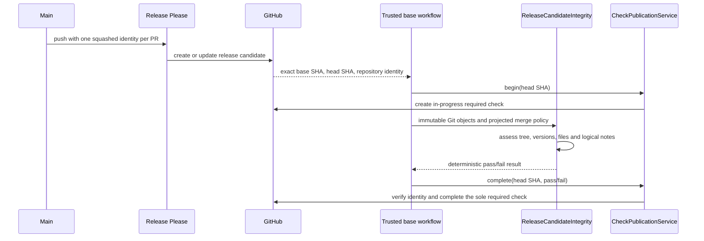

# CI Delivery Governance Component

Owned concern: canonical CI delivery governance semantics for required workflow
gates, local reproduction commands, and the absorbed delivery action-plan state.

This component turns the CI Delivery Governance Consolidated Action Plan into a
current architecture contract instead of leaving each wave as an open planning
assertion.

## Public API

| Surface                                             | Owner               | Contract                                                                                                                                                                                             |
| --------------------------------------------------- | ------------------- | ---------------------------------------------------------------------------------------------------------------------------------------------------------------------------------------------------- |
| `pnpm test:ci-tools`                                | root `package.json` | Runs the CI-tool contract suite over `tools/ci/*.test.mjs` and `tools/ci/test/*.test.mjs`.                                                                                                           |
| `.github/workflows/ci.yml` `CI tool contracts`      | CI - Code Quality   | Required CI-tool contract lane for pull requests, pushes to `main`, and manual workflow runs.                                                                                                        |
| `.github/workflows/release.yml`                     | Release governance  | Runs Release Please through the repository-owned manifest/config so development releases stay on the pre-1.0 line.                                                                                   |
| `.github/workflows/release-candidate-integrity.yml` | Release governance  | Coordinates the single trusted `Release candidate integrity` check from `pull_request_target`; the check is explicitly attached to the PR head SHA and candidate assessment has read-only authority. |
| `.github/workflows/pr-labeler.yml`                  | PR metadata policy  | Applies file-derived labels from trusted base configuration without checking out or executing candidate code.                                                                                        |
| `release-please-config.json`                        | Release governance  | Owns Release Please title/version behavior instead of relying on action defaults.                                                                                                                    |
| `.release-please-manifest.json`                     | Release governance  | Owns the current release base version used by Release Please manifest mode.                                                                                                                          |
| `CHANGELOG.md`                                      | Release governance  | Generated Release Please artifact; it is not hand-authored documentation and is ignored by changed-markdown lint.                                                                                    |
| `tools/ci/release-candidate-integrity/`             | Release governance  | Pure candidate read model, check-publication service, and Git/GitHub adapters for exact-tree assessment, merge policy, and Checks API lifecycle.                                                     |
| `.markdownlintignore`                               | Markdown governance | Records generated Markdown artifacts that changed-file markdownlint must not lint as hand-authored prose.                                                                                            |
| `scripts/lint-markdown-changed.cjs`                 | Markdown governance | Computes the changed Markdown read model after applying repository ignore policy before invoking markdownlint.                                                                                       |
| `tools/ci/workflow-pattern-parity.test.mjs`         | CI governance tests | Semantic guard that proves the workflow still invokes `pnpm test:ci-tools` and shared scope policy emitters.                                                                                         |
| `tools/ci/ci-delivery-governance-canon.test.mjs`    | CI governance tests | Canonical absorption guard for the local component guide, user stories, and mandatory proposal state.                                                                                                |
| `docs/guides/testing-and-ci-capabilities.md`        | CI documentation    | Operator-facing command map for reproducing local and remote delivery gates.                                                                                                                         |

Command/query rail:

| Rail                                     | Type    | Bounded context                     | DDD owner                                     | Port / adapter                                                        | Negative guard                                                                                                                                                                     |
| ---------------------------------------- | ------- | ----------------------------------- | --------------------------------------------- | --------------------------------------------------------------------- | ---------------------------------------------------------------------------------------------------------------------------------------------------------------------------------- |
| `ValidateCiDeliveryGovernanceCanon`      | query   | Repository delivery governance      | `CiDeliveryGovernanceCanon` read model        | `pnpm test:ci-tools` and `CI tool contracts` workflow lane            | Fails when the plan claims an absorbed gate is still open, or when component docs lose public API, invariants, transitions, consumers, diagrams, or user stories.                  |
| `ConfigureReleasePleasePreMajorState`    | command | Repository release governance       | `ReleasePleasePreMajorState` policy object    | `.github/workflows/release.yml` and Release Please action             | Fails when Release Please falls back to default `1.0.0` behavior or opens a PR title that violates the semantic PR title gate.                                                     |
| `ConfigureReleasePullRequestMergePolicy` | command | Repository release governance       | `ReleasePullRequestMergePolicy` policy object | GitHub repository settings and main ruleset                           | Fails when plain merge or rebase is allowed, squash is unavailable, or squash bodies preserve internal branch commit messages.                                                     |
| `AssessReleaseCandidateIntegrity`        | query   | Repository release governance       | `ReleaseCandidateIntegrity` read model        | `pnpm release:candidate:check` and the trusted candidate workflow     | Fails on stale base/head identity, multiple candidate commits, version mismatch, post-1.0 versions, unexpected files, duplicate logical notes, or merge-policy drift.              |
| `PublishReleaseCandidateIntegrityCheck`  | command | Repository release governance       | `ReleaseCandidateCheckPublicationService`     | `PORT-CI-RELEASE-CANDIDATE-CHECK-PUBLISH` and GitHub Checks adapter   | Fails closed when the check is not opened and completed on the exact PR head SHA, candidate assessment receives write authority, or the final assessment failure is not published. |
| `ApplyPullRequestFileLabels`             | command | Repository collaboration governance | `PullRequestFileLabelPolicy` policy object    | `PORT-CI-APPLY-PR-FILE-LABELS` and `.github/workflows/pr-labeler.yml` | Fails when candidate code receives write authority, candidate configuration controls labels, or the trusted adapter checks out or executes candidate code.                         |
| `LintChangedMarkdownFiles`               | query   | Repository Markdown governance      | `ChangedMarkdownFileSet` read model           | `scripts/lint-markdown-changed.cjs` and `verify:prepush`              | Fails when generated Markdown artifacts are passed explicitly to markdownlint despite repository ignore policy.                                                                    |

## Invariants

1. CI helper logic is merge-gated through the existing `CI - Code Quality`
   workflow; a parallel workflow surface is not introduced for the same intent.
2. The `CI tool contracts` lane runs `pnpm test:ci-tools`; workflow parity tests
   keep that wiring executable.
3. Shared scope decisions remain owned by `tools/ci/scope-config.mjs`,
   `tools/ci/emit-scope.mjs`, and `tools/ci/emit-workspace-matrix.mjs`.
4. Generated-doc single-writer policy remains owned by
   `docs/generated-docs-policy.json` and its checker, not by the CI delivery
   action plan text.
5. The mandatory proposal may carry residual opportunities, but it must not
   describe already-absorbed gates as unimplemented current work.
6. Release Please MUST run from the repository-owned config and manifest while
   DVT is in pre-1.0 product development. Action defaults are not the release
   source of truth.
7. Generated Release Please changelog entries MUST NOT block changed-file
   markdownlint when their generated formatting differs from the repository's
   hand-authored Markdown style rules.
8. Each merged product PR MUST contribute one logical release identity. The
   repository therefore uses squash as its sole merge method, with the PR title
   as the commit title and no internal commit list in the squash body.
9. The release candidate MUST descend from the exact current `main` SHA by one
   generated release commit and may change only the manifest, package version,
   and changelog. Unsupported extra-file strategies fail closed.
10. Package, manifest, and latest changelog versions MUST match and remain below
    `1.0.0` while the product is in pre-release development.
11. `Release candidate integrity` has exactly one producer: the check
    publication service invoked by the trusted `pull_request_target` workflow
    loaded from the PR base. Candidate code is checked out without credentials
    in a separate read-only assessment job and is inspected as Git data; it is
    never installed or executed in that workflow.
12. `All Checks Required for Merge` and `Release candidate integrity` MUST both
    be strict required checks from GitHub Actions on the active ruleset for the
    default branch. Product CI cannot be bypassed by an integrity-only success.
13. The candidate check result MUST be attached to the exact candidate head
    SHA; a green result from an older candidate revision is not release evidence.
14. Jobs that check out pull-request candidate code MUST remain read-only and
    credential-free. Pull-request metadata mutation is owned only by the trusted
    `pull_request_target` labeler workflow.
15. The trusted labeler MUST load policy from the base repository and MUST NOT
    check out or execute candidate code.
16. Pull-request scope assessment MUST use the immutable
    `github.event.pull_request.base.sha` already present in the shallow merge
    snapshot; it MUST NOT require an authenticated fetch after candidate code is
    checked out.

## Transitions

## Consumers

- CI maintainers use this component to decide whether delivery-governance work
  belongs in workflow wiring, shared scope tooling, docs governance, or
  planning state.
- Contributors use `pnpm test:ci-tools` as the local reproduction command for
  the CI-tool contract lane.
- Planning agents use the mandatory proposal only for residual work after the
  absorbed gates are checked against this component.
- Reviewers use the semantic tests to reject regressions that would otherwise
  look like harmless documentation drift.

## Fowler Analysis Summary

Improved patterns:

- Replaced advisory CI policy with an executable **Service Layer** around the
  `CI tool contracts` lane.
- Converged duplicated scope semantics behind shared scope emitters.
- Promoted generated-doc ownership into a named policy instead of treating
  broad generated outputs as incidental files.
- Replaced commit-history interpretation drift with one PR identity per squash
  commit and an explicit candidate **Specification** evaluated by a pure query.
- Kept GitHub and Release Please behind adapters; the domain rule does not parse
  workflow YAML or call the network.
- Isolated write authority behind a trusted adapter so candidate validation and
  pull-request mutation no longer share one execution context.
- Split check publication into an application service and a GitHub Checks
  adapter; workflow jobs coordinate the lifecycle without owning API semantics.

Anti-patterns removed or bounded:

- **Duplicate semantics**: workflow-specific path lists are no longer the
  planning source of truth for already-shipped gates.
- **Documentation drift**: the action plan now distinguishes absorbed gates
  from residual opportunities.
- **Test-only confidence**: the new guard validates semantic component
  structure and proposal state, not only a thin workflow string.

Future opportunities remain in residual plan items such as the strict pre-push
type-check selector, lifecycle-policy automation, and any remaining
merge-hotspot reduction.
