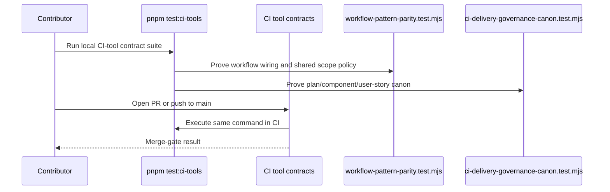

# CI Delivery Governance Component

Owned concern: canonical CI delivery governance semantics for required workflow
gates, local reproduction commands, and the absorbed delivery action-plan state.

This component turns the CI Delivery Governance Consolidated Action Plan into a
current architecture contract instead of leaving each wave as an open planning
assertion.

## Public API

| Surface                                          | Owner               | Contract                                                                                                               |
| ------------------------------------------------ | ------------------- | ---------------------------------------------------------------------------------------------------------------------- |
| `pnpm test:ci-tools`                             | root `package.json` | Runs the CI-tool contract suite over `tools/ci/*.test.mjs` and `tools/ci/test/*.test.mjs`.                             |
| `.github/workflows/ci.yml` `CI tool contracts`   | CI - Code Quality   | Required CI-tool contract lane for pull requests, pushes to `main`, and manual workflow runs.                          |
| `tools/ci/workflow-pattern-parity.test.mjs`      | CI governance tests | Semantic guard that proves the workflow still invokes `pnpm test:ci-tools` and shared scope policy emitters.           |
| `tools/ci/ci-delivery-governance-canon.test.mjs` | CI governance tests | Canonical absorption guard for the local component guide, user stories, Fowler analysis, and mandatory proposal state. |
| `docs/guides/testing-and-ci-capabilities.md`     | CI documentation    | Operator-facing command map for reproducing local and remote delivery gates.                                           |

Command/query rail:

| Rail                                | Type  | Bounded context                | DDD owner                              | Port / adapter                                             | Negative guard                                                                                                                                                    |
| ----------------------------------- | ----- | ------------------------------ | -------------------------------------- | ---------------------------------------------------------- | ----------------------------------------------------------------------------------------------------------------------------------------------------------------- |
| `ValidateCiDeliveryGovernanceCanon` | query | Repository delivery governance | `CiDeliveryGovernanceCanon` read model | `pnpm test:ci-tools` and `CI tool contracts` workflow lane | Fails when the plan claims an absorbed gate is still open, or when component docs lose public API, invariants, transitions, consumers, diagrams, or user stories. |

## Invariants

1. CI helper logic is merge-gated through the existing `CI - Code Quality`
   workflow; a parallel workflow surface is not introduced for the same intent.
2. The `CI tool contracts` lane runs `pnpm test:ci-tools`; workflow parity tests
   keep that wiring executable.
3. Shared scope decisions remain owned by `tools/ci/scope-config.mjs`,
   `tools/ci/emit-scope.mjs`, and `tools/ci/emit-workspace-matrix.mjs`.
4. Generated-doc single-writer policy remains owned by
   `docs/generated-docs-policy.json` and its checker, not by the CI delivery
   action plan text.
5. The mandatory proposal may carry residual opportunities, but it must not
   describe already-absorbed gates as unimplemented current work.

## Transitions

## Consumers

- CI maintainers use this component to decide whether delivery-governance work
  belongs in workflow wiring, shared scope tooling, docs governance, or
  planning state.
- Contributors use `pnpm test:ci-tools` as the local reproduction command for
  the CI-tool contract lane.
- Planning agents use the mandatory proposal only for residual work after the
  absorbed gates are checked against this component.
- Reviewers use the semantic tests to reject regressions that would otherwise
  look like harmless documentation drift.

## Fowler Analysis Summary

Improved patterns:

- Replaced advisory CI policy with an executable **Service Layer** around the
  `CI tool contracts` lane.
- Converged duplicated scope semantics behind shared scope emitters.
- Promoted generated-doc ownership into a named policy instead of treating
  broad generated outputs as incidental files.

Anti-patterns removed or bounded:

- **Duplicate semantics**: workflow-specific path lists are no longer the
  planning source of truth for already-shipped gates.
- **Documentation drift**: the action plan now distinguishes absorbed gates
  from residual opportunities.
- **Test-only confidence**: the new guard validates semantic component
  structure and proposal state, not only a thin workflow string.

Future opportunities remain in residual plan items such as the strict pre-push
type-check selector, lifecycle-policy automation, and any remaining
merge-hotspot reduction.
