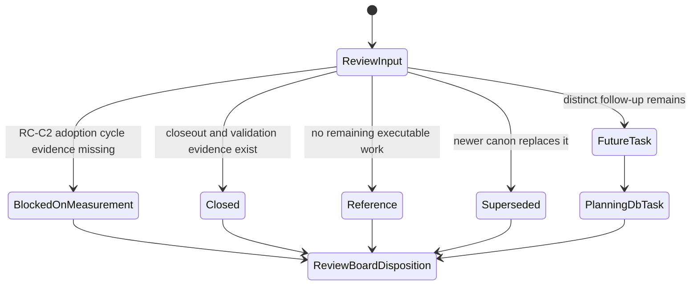
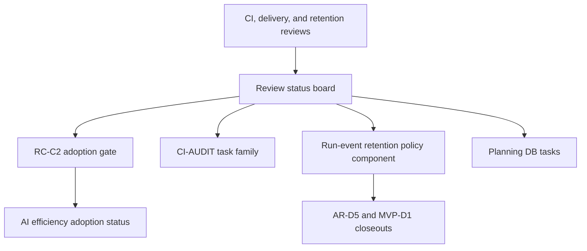

# CI Retention Review Canon Component

## Owned Concern

This component owns the semantic disposition of CI, delivery, and event
retention review documents. It prevents CI reviews, delivery observations, and
retention QA notes from becoming an implicit execution queue outside Planning
DB, component guides, and closeouts.

## Public API

- `RecordCiRetentionReviewCanon`: command that records a canonical disposition
  for a CI, delivery, or event-retention review input.
- `ClassifyCiRetentionReviewDisposition`: query that classifies a review input
  as `blocked-on-measurement`, `closed`, `reference`, `future-task`, or
  `superseded`.
- `Review status board`: operational read model that lists review disposition
  and canonical owner.
- `Event lifecycle and retention domain page`: domain entrypoint for retention
  review disposition and component ownership.
- `CI governance component index`: component entrypoint for review-canon
  maintainers.

## Invariants

- CI and delivery review prose cannot close `RC-C2`; only the canonical
  adoption log and `docs:ai-efficiency:check` can satisfy that gate.
- Event-retention review prose cannot change hot-retention semantics; those
  belong to the run-event retention policy component and ADR-0037 surfaces.
- A review with remaining work must link to a Planning DB task or explicitly
  state that an existing task/closeout already absorbed it.
- CI/build audit findings route through `CI-AUDIT-*` tasks or documented
  reference posture.
- Delivery and retention reviews remain rationale after closeout, not
  independent work queues.
- Review-board disposition, component guide, user stories, and buzón analysis
  must stay aligned.

## Transitions

## Consumers

- CI maintainers deciding whether a review finding changes local or remote
  gates.
- Delivery maintainers checking whether delivery observations are closed,
  blocked, or future work.
- Retention maintainers checking whether event-retention QA is owned by the
  retention policy component or a follow-up task.
- Planning stewards ensuring review documents do not bypass Planning DB.
- CI tools that execute `ci-retention-review-canon.test.mjs`.

## Command And Query Rail

| Rail                                   | Type    | DDD owner                                  | Surface                                              | Negative check                                                              |
| -------------------------------------- | ------- | ------------------------------------------ | ---------------------------------------------------- | --------------------------------------------------------------------------- |
| `RecordCiRetentionReviewCanon`         | command | CI retention review canon aggregate        | Planning DB task plus review status board            | Rejects orphan review work without task, closeout, or reference disposition |
| `ClassifyCiRetentionReviewDisposition` | query   | CI retention review disposition read model | Review board, component guide, retention domain page | Fails when a CI, delivery, or retention review lacks canonical disposition  |

## Semantic Fitness Function

`tools/ci/ci-retention-review-canon.test.mjs` validates the component contract,
not only file placement. It requires:

- a review-board disposition for CI, delivery, and retention reviews;
- a component guide with public API, invariants, transitions, consumers, rails,
  and semantic fitness-function sections;
- user stories for CI maintainer, delivery maintainer, retention maintainer,
  and planning steward personas;
- a Fowler analysis in `buzon/`;
- event-lifecycle domain navigation to the canon plan.

## Current Architecture

## Mature-System Comparison

Mature delivery systems do not let review prose substitute for delivery
controls. Measurement gates, CI components, retention policy components, and
Planning DB tasks each own one kind of authority. This component keeps those
authorities separated while preserving review rationale.
